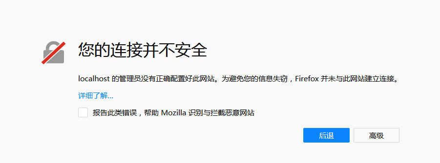
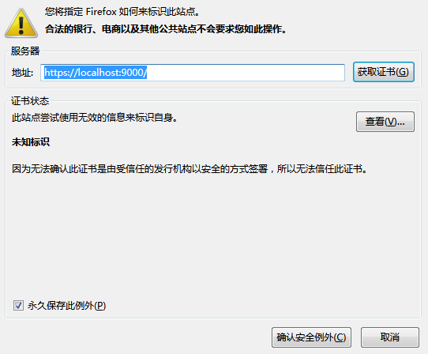
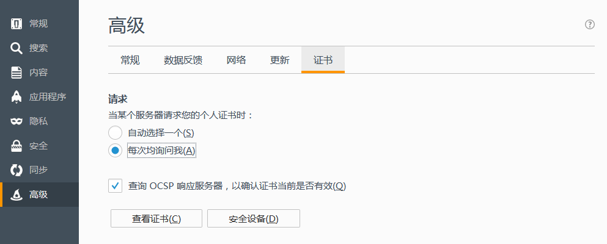
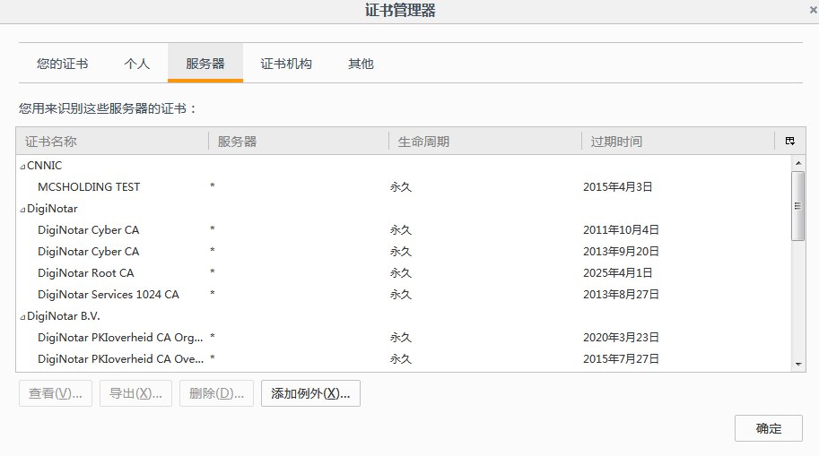

# 我无法通过 Firefox 使用本地文件链接和启动 Toolkit 应用程序

## 概述

在  中，动作菜单有时不显示可用 Toolkit 应用程序的列表，或者在使用本地文件链接时有时会出错，即使  Desktop 正在运行中。这是 Firefox 中的  Desktop 浏览器集成的疑难解答手册，希望对您有所帮助。我们为 [Chrome](./cant-use-file-linking-toolkit-app-chrome.md) 提供单独手册。

## 诊断问题

###  Desktop 是否正在运行？

是的，我们知道。您可能已经检查过了，但我们必须要问一下。:)

### 您是否正在使用防火墙软件？

确保没有防火墙软件阻止与 **localhost** 的连接或端口 **9000** 上的连接。

### Firefox 是否拒绝证书？

您可以浏览到 https://localhost:9000 来确认 Firefox 是否接受证书，这是  网站为了执行本地文件链接和启动 Toolkit 应用程序而尝试访问的网址。您通常会看到以下消息：

另一方面，如果您看到下面两条消息之一，则表示证书注册过程有问题：

## 如何修复“您的连接不安全”问题

您需要向 Firefox 浏览器添加一个例外，使证书获得接受。如果您刚刚访问了 **https://localhost:9000**，添加例外的最简单方法就是单击**高级**，然后单击**添加例外**按钮。将显示对话框。

**单击**获取证书**，然后选择**确定安全例外。您可以忽略证书不受信任的消息。这很正常，因为证书是由  Desktop 生成的，而不是由证书颁发机构生成。

您现在应该可以从您的  站点访问本地文件链接和启动 Toolkit 应用程序了。如果在添加例外后仍遇到问题，请访问我们的[支持站点](https://knowledge.autodesk.com/zh-hans/contact-support)以获取帮助。

## 如何修复“安全连接失败”问题

您需要单击**“打开菜单”**按钮并选取**“首选项”**。然后选取左侧的**“高级”**，并依次单击**“证书”**和**“查看证书”**。

在**“服务器”**部分中，单击任意项并开始键入 `localhost`，或者只是滚动，直到找到名为 **localhost:9000** 的条目。将其删除。然后，转到**“证书机构”**选项卡并再次键入 `localhost`。您还可以再次滚动，直到到达其下有 **localhost** 条目的 **Autodesk** 部分。可以删除 **localhost** 条目。完成后，单击**确定**，然后重新启动 Firefox。Firefox 重新启动后，请浏览至 **https://localhost:9000**。您现在应该看到以下消息：

此时，需要按照上面所述的步骤添加一个例外。

如果您所看到的屏幕不是这样，请访问我们的[支持站点](https://knowledge.autodesk.com/zh-hans/contact-support)以获取帮助。