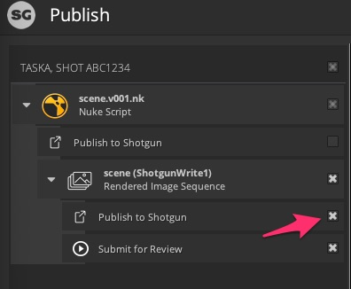

# 异常: 审核提交失败。无法渲染和提交与审核关联的场。

## 用例：

Nuke 中的“Submit for publish”从未起作用。

**问题 1：**
向上导航继承流的最佳方式是什么？我一直导航到“HookBaseClass”，然后有点迷路了。

我目前的问题是，想让“Submit for review”在 Nuke 中正常运行。

在 Nuke 的 SG 发布 GUI 中遇到以下错误：


    Traceback (most recent call last):

      File "C:\Users\STEVE\AppData\Roaming\Shotgun\bundle_cache\app_store\tk-multi-publish2\v2.4.1\python\tk_multi_publish2\api\plugins\publish_plugin_instance.py", line 282, in _handle_plugin_error

        yield

      File "C:\Users\STEVE\AppData\Roaming\Shotgun\bundle_cache\app_store\tk-multi-publish2\v2.4.1\python\tk_multi_publish2\api\plugins\publish_plugin_instance.py", line 198, in run_publish

        self._hook_instance.publish(settings, item)

      File "C:\Users\STEVE\AppData\Roaming\Shotgun\bundle_cache\app_store\tk-nuke\v0.12.5\hooks\tk-multi-publish2\basic\submit_for_review.py", line 272, in publish

        raise Exception("Review submission failed. Could not render and "

    Exception: Review submission failed. Could not render and submit the review associated sequence.

还会出现以下异常：

`'sg_publish_data' was not found in the item's properties. Review Submission for 'path/to/sequences/AB/AB_001/comp/work/images/AB_001_comp_v002_output/AB_001_comp_v002_output.%04d.jpg' failed. This property must be set by a publish plugin that has run before this one.`


因此，它在“publish_plugin_instance.py”中查找以下内容：


    _handle_plugin_error
        yield

    run_publish
        self._hook_instance.publish(settings, item)

我可以在本地 Appdata 文件夹中找到这些内容，但在主安装中没有，因此我假设我需要在“submit_for_review.py”中查找以弄清楚此问题。

查看此文件，我可以看到，它使用了来自继承链“HookBaseClass”更高层的项的设置和信息。

因此，在“submit_for_review.py”中查找“sg_publish_data”的设置位置，我看到第 225 行：`sg_publish_data = item.properties.get("sg_publish_data")`

**问题 2**
在上游哪里设置“item.properties”？我怀疑在 nuke collector.py 中，但“sg_publish_data”不在那里，而且也是“HookBaseClass”的子项

## 如何修复

### 简短的回答：

假设您没有添加自定义代码或对配置进行太多修改，只需确保已选中要提交以供审核的项的 `Publish to `



### 详实的回答：

首先，[这是发布器 API 的文档](https://developer.shotgunsoftware.com/tk-multi-publish2/)。在此将介绍解决此问题所涉及的大多数概念。下面是您的具体问题的细分。希望这样做也能帮助您调试未来的问题。

在上面的屏幕截图中，在 `ShorgunWrite1` 项下，您会看到两个 `plugins`。它们对应于配置中定义的插件。


这些插件按顺序运行，并作用于内存中的同一项。要找到问题的根源，您需要查看这两个插件的代码。通过查看 `hook` 设置，可以找出这些插件所在的位置。

对于第一个插件，由于我们查看的是 `tk-multi-publish2` 的设置，`{self}` 是指 `tk-multi-publish2`。因此
```
{self}/publish_file.py
```
可以在 tk-multi-publish2 应用文件夹下找到：


应用在文件系统中的位置取决于 `app_locations.yml` 的配置方式，但如果您未在其中更改任何内容，则可以在缓存文件夹中找到该应用。[下面介绍了如何查找缓存位置](https://developer.shotgunsoftware.com/zh_CN/7c9867c0/)（如果需要）。

对于第二个插件，挂钩路径为
```
{engine}/tk-multi-publish2/basic/submit_for_review.py
```
当在 Nuke 中时，我们要运行 `tk-nuke` 插件，因此要查找此发布挂钩，我们需要在 `tk-nuke` 下查找，它也应该位于您的缓存中。


现在，您知道在何处查找代码，您可以看到[第一个插件设置了预期存在于第二个插件中的值](https://github.com/shotgunsoftware/tk-multi-publish2/blob/a83e35dbf1a85eac7c3abd7e7f5509a42a8b8cf1/hooks/publish_file.py#L425)。

组合这两个插件的思路是，您要提交一些已经发布（并且不会更改）的内容以供审核。因此，工作流是先发布源文件，然后从源文件创建 SG 版本以供审核。版本也链接到发布。第一个插件执行文件发布并将信息存储在项中，以供第二个发布使用。

您提到了继承性，因此我也想澄清一下。我认为您在文档中遇到的是由配置驱动的挂钩继承性，而不是像您所认为的那样由 Python 继承性驱动的。

在 Python 文件中，您会看到所有挂钩都继承自 `HookBaseClass`。但是，配置中的挂钩机制允许您实际将这些基础挂钩视为混合，并将它们组合在一起，以在重用代码时获得所需的所有功能。您可以在 `tk-multi-publish2` 配置中看到此示例：

```
settings.tk-multi-publish2.nuke.shot_step:
  collector: "{self}/collector.py:{engine}/tk-multi-publish2/basic/collector.py"
```

此处定义的收集器在任何 Python 文件中都不存在。它实际上是 `tk-multi-publish2` 的 `collector.py` 和 `tk-nuke` 的 `collector.py` 的组合。

如果快速修复对您而言不够，并且您需要修改这些挂钩，请查看[自定义发布工作流视频](https://developer.shotgridsoftware.com/zh_CN/869a6fab/#shotgrid-toolkit-webinar-videos)。这是一个良好的开端。

[在社区中查看完整主题](https://community.shotgridsoftware.com/t/nuke-submit-for-review-py/10026)。

