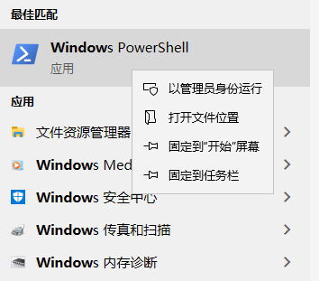
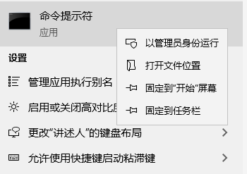

# [SSL: CERTIFICATE_VERIFY_FAILED] 证书验证失败: 无法获取本地颁发机构证书

## 用例

在 Windows 上，用户在使用 Python API 从 Amazon 上传和下载媒体时遇到问题。Python API 引发以下错误消息，说明了此问题：

```
shotgun_api3.shotgun.ShotgunFileDownloadError: Failed to open https://xxx.shotgunstudio.com/file_serve/attachment/xyz
<urlopen error [SSL: CERTIFICATE_VERIFY_FAILED] certificate verify failed: unable to get local issuer certificate (_ssl.c:1108)>
```
Amazon 在其后端更新了一些证书。浏览需要新证书的网页时，Windows 通常会刷新其证书存储。在未看到常规浏览活动的计算机上运行的独立 Python 脚本将不检索证书更新，这可能导致该计算机缺少相当多的证书更新。

## 如何修复

如果您对有问题的计算机具有 GUI 访问权限，只需播放当前存储在 S3 上的任何媒体，即可更新证书存储。此播放解决方案仅适用于 Chrome、Internet Explorer、Edge 或其他基于 Chromium 的浏览器。此播放解决方案在 Firefox 或 Safari 上不起作用，因为这些浏览器不使用 Windows 标准 API 进行证书验证。

对于此解决方案不起作用的用户，或者如果您有大量要更新的计算机（如 Deadline 渲染农场），我们还提供了一个脚本，该脚本会将缺失的证书添加到您的计算机中。[下面是我们共享的脚本的链接](https://developer.shotgridsoftware.com/zh_CN/c593f0aa/)。

对于 Windows 10 上的 PowerShell 或 Windows 7 上的 PowerShell 3 用户，您可以在计算机上以管理员身份运行以下脚本以获取新证书。



```
$cert_url = "https://www.amazontrust.com/repository/AmazonRootCA1.cer"
$cert_file = New-TemporaryFile
Invoke-WebRequest -Uri $cert_url -UseBasicParsing -OutFile $cert_file.FullName
Import-Certificate -FilePath $cert_file.FullName -CertStoreLocation Cert:\LocalMachine\Root
```

如果该命令起作用，您应该会看到以下内容：

```
   PSParentPath: Microsoft.PowerShell.Security\Certificate::LocalMachine\Root

Thumbprint                                Subject
----------                                -------
8DA7F965EC5EFC37910F1C6E59FDC1CC6A6EDE16  CN=Amazon Root CA 1, O=Amazon, C=US
```

这将使证书可用于运行该证书的计算机上的所有用户帐户。如果您没有管理员访问权限，可以使用以下命令更改最后一行：

```
Import-Certificate -FilePath $cert_file.FullName -CertStoreLocation Cert:\CurrentUser\Root
```

将仅为当前用户添加证书。

如果您是像我一样的老派人士，仍然痴迷于使用 `cmd.exe`，也可以使用 `certutil`。首先，您需要从 `https://www.amazontrust.com/repository/AmazonRootCA1.cer` 下载证书，并将其保存到计算机上的某个位置。

然后，在管理模式下启动命令提示符：



并执行以下行：

```
certutil -addstore root <path-to-the-cert>
```

这将使证书适用于所有用户帐户。如果您没有管理员访问权限，可以添加 `-user` 以像这样仅为当前用户安装证书

```
certutil -user -addstore root <path-to-the-cert>
```

## 相关链接

[在社区中查看完整主题](https://community.shotgridsoftware.com/t/certificate-verify-failed-error-on-windows/8860)