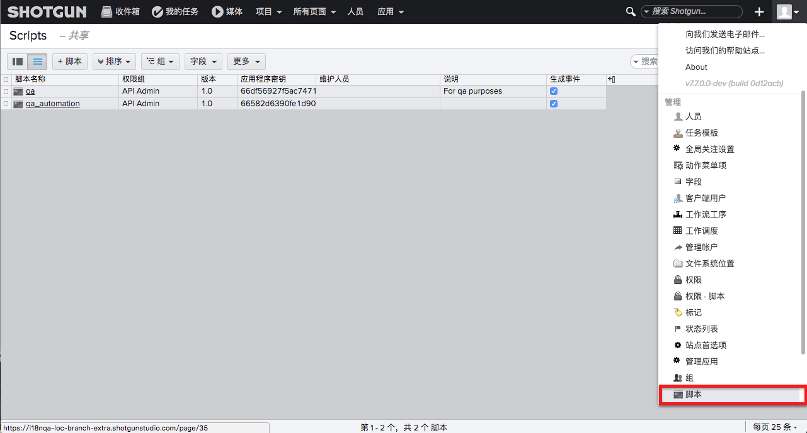
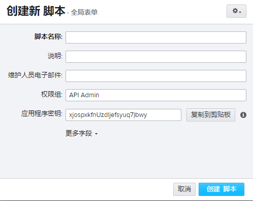

# 创建和管理 API 脚本

按照以下步骤创建新脚本：

1. 转到“管理”(Admin)菜单并选择“脚本”(Scripts)。  
   
2. 使用“+ 脚本”(+ Script)按钮创建新脚本。
3. 从应用程序密钥中获取值。您需要此值来启动与  的连接。  
   

   > **注意：**API 密钥作为密码处理，并且一经创建，即无法通过  Web 应用或 API 再次查看。确保先复制密钥，然后再继续。

4. 现在，可以使用脚本密钥来连接到 。请参见[我们的 API 文档中的“ 方法”](https://developer.shotgridsoftware.com/python-api/reference.html#shotgun-methods)，详细了解如何使用脚本连接到 。

> **提示：**如果出于某些原因需要重置脚本的应用程序密钥，将需要创建新的  脚本实体来执行此操作。首先将现有脚本重命名为“[My Script]—OLD”这样的名称，然后将其删除。创建新脚本。之所以需要重命名旧脚本，是因为  要求每个脚本具有唯一名称。

## 何时设置新脚本

可以记录脚本操作。对各个脚本密钥的使用越细化，就越容易跟踪哪个脚本正在进行调试更改。使用单独的脚本也有助于跟踪哪些脚本将受到对  站点所做更改的影响以及跟踪谁来维护脚本。