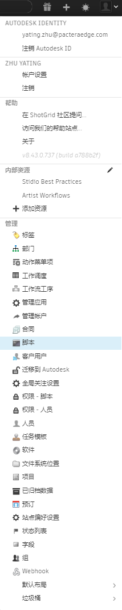

# API 概述

**注意：**有关  API 的详细信息，请参见我们的 [API 文档](http://developer.shotgridsoftware.com/python-api/)。

借助  Python 应用程序编程接口 (API)，用户可以轻松地将其工具与  集成。通过它您可以创建自动化流程，集成众多第三方软件包，并与工作室内的现有工具进行通信。由于各个工作室的需求迥异，因此  API 提供了强大的基础功能，并将大部分业务逻辑都留给您自己来处理。

API 使用 [Python](https://www.python.org/)（传媒和娱乐行业广泛使用的常见编程语言）构建而成。在您的  站点中可以免费使用 [Python API](https://github.com/shotgunsoftware/python-api)。

API 遵循 CRUD 模式，允许您的脚本对单个实体类型运行创建、读取、更新和删除操作。许多操作中都能够定义过滤器、要返回的列，以及对结果进行排序。

为了通过 API 与  服务器通信，您的脚本可以通过提供用户的凭据或利用脚本密钥向服务器进行身份认证。您可以从“脚本”(Scripts)页面（在“管理”(Admin)菜单中列出）生成新脚本密钥：

**提示：**单独注册脚本并让每个脚本具有各自的 API 密钥。这将有助于在[事件日志](https://help.autodesk.com/view/SGSUB/CHS/?guid=SG_Administrator_ar_data_management_ar_event_logs_html)中更准确地监视每个脚本和它们执行的动作。

## 常用的第一个项目

您可以在此处下载 API：[https://github.com/shotgunsoftware/python-api](https://github.com/shotgunsoftware/python-api)。 一些常用的第一个项目包括：

1. [创建版本并将其链接到镜头](http://developer.shotgridsoftware.com/python-api/cookbook/examples/basic_create_version_link_shot.html)。允许您自动提交新的渲染以供审核。
2. [上传缩略图](http://developer.shotgridsoftware.com/python-api/cookbook/examples/basic_upload_thumbnail_version.html)。无需手动添加，站点上的所有内容便可拥有最新的缩略图。
3. [将  与您的代码库（如 SVN）集成](http://developer.shotgridsoftware.com/python-api/cookbook/examples/svn_integration.html)。利用  对任何软件开发进行项目管理。

## 使用 API 无法完成的操作

* 访问或更改权限规则（出于安全原因）
* 读取或更改页面设置
* 访问各个页面或控件的过滤器或查询设置
* 与 UI 交互
* 添加、编辑或删除条件格式规则
* 创建或编辑查询字段

## 动作菜单项 (AMI)

如果编写要从  界面中轻松启动的脚本，可以通过 [AMI](https://developer.shotgridsoftware.com/zh_CN/67695b40/) 来完成。这些是可自定义的选项，右键单击一行数据时，这些选项显示在上下文菜单中。单击后，它们将向 Web 服务器或自定义浏览器协议处理程序发送上下文数据转存，然后您可以在其中运行自定义业务逻辑。

可以为不同实体设置不同的 AMI，并按项目或权限组限制对它们的访问。

## 事件触发器进程

在  中执行的每个操作（通过用户或 API 脚本）均会生成一个事件。[事件进程](https://github.com/shotgunsoftware/shotgunEvents)可以监视事件流，然后基于定义的条件执行特定的 API 脚本。一些示例包括：

* 基于上游任务状态自动更改下游任务状态。
* 数值变化时重新计算相关剪辑镜头时长字段。
* 在镜头设置为特定状态时执行文件打包和传输操作。

## 其他信息

有关  API 的详细信息，请参见以下文章：

* [通过 GitHub 下载  API](https://github.com/shotgunsoftware/python-api/)
* [ API 文档](http://developer.shotgridsoftware.com/python-api/)
* [ 开发人员列表（公共）](https://groups.google.com/a/shotgunsoftware.com/forum/?fromgroups#!forum/shotgun-dev)
* [ 事件进程示例代码](https://github.com/shotgunsoftware/shotgunEvents)
* [编写事件驱动的触发器](https://developer.shotgridsoftware.com/zh_CN/0d8a11d9/)
* [ 数据结构](https://help.autodesk.com/view/SGSUB/CHS/?guid=SG_Administrator_ar_get_started_ar_shotgun_schema_html)
* [API 最佳实践](https://help.autodesk.com/view/SGSUB/CHS/?guid=SG_Developer_dv_getting_started_dv_api_best_practices_html)

## 贡献和协作

您是否使用  制造了令人为之惊叹的工具并希望与其他用户共享？太棒了！我们有一个充满活力、生机勃勃、喜欢彼此共享和协作的[开发人员社区](https://community.shotgridsoftware.com/)。参与社区活动：

* 加入 [ 社区](https://community.shotgridsoftware.com/)。
* 将代码发布到 [GitHub](https://github.com/) 上（确保代码不特定于工作流，记录详尽，并且具有 .txt 或 .mdk 格式的自述文件）。
* 向开发人员列表发布链接和说明。开发人员社区和  开发人员将对其进行检查、提供反馈并予以表扬。

客户制作的工具和实现的集成总能为我们制造惊喜，并为我们提供了源源不断的创意灵感。快来展示您的实力吧！