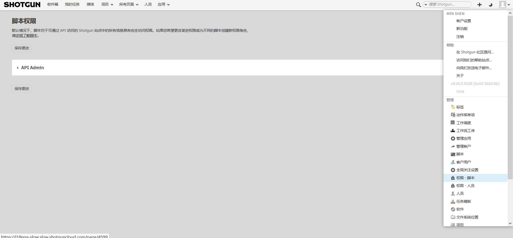
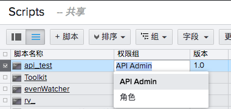

# API 用户权限组

可以为 API 用户创建单独的权限组，以便脚本和密钥可以具有不同的权限级别，就像“人员”(People)一样。

## 访问 API 用户页面

转到“管理”(Admin)菜单并选择“权限 - 脚本”(Permissions - Scripts)。

有关用法，请参见。

## 如何使用 API 用户权限组

在初始“API Admin”之外创建 API 权限组之后，可以将这些权限组用于 API 脚本。

1. 从“管理”(Admin)菜单中选择“脚本”(Scripts)。
2. 显示“权限组”(Permission Group)列并选择适当的权限组。  
   

## 示例

为什么要使用它呢？有许多可能的用法，下面这几种用法只是抛砖引玉：

**示例 1：**您希望将 API 密钥提供给工作室中某个不应具有完整管理员权限的人。

**示例 2：**您希望将只读 API 密钥提供给合作伙伴工作室，以执行从您的 {{ akn_product_name }} 数据库到对方 {{ akn_product_name }} 数据库的单向同步，并仅显示一个有限的实体集。

**示例 3：**您想要限制每个项目的 API 脚本。

1. 通过“管理员”(Admin)菜单导航至您的**“权限 - 脚本”(Permissions - Scripts)**页面，并创建一个新角色。 确保“仅查看分配的项目”(See Assigned Projects Only)高级权限处于启用状态。您还可以根据需要调整其他任何权限（例如，如果您希望他们对特定实体/字段仅具有读取权限）。
2. 通过“管理员”(Admin)菜单导航至**“脚本”(Scripts)**页面。显示“项目”(Projects)字段。在这里，您可以在“项目”(Projects)中输入脚本的限制范围。
3. 通过“权限组”(Permission Group)字段，确保将此脚本权限指定给在步骤 1 中创建的新角色。