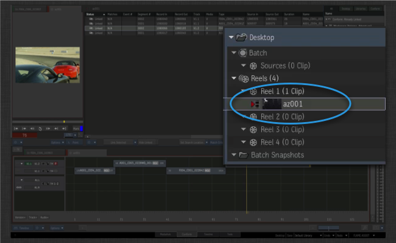
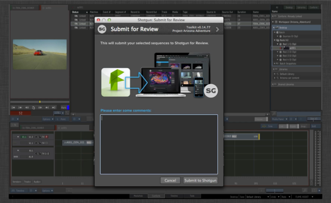

# Flame 审看

 Flame 审看应用让您可轻松将一个或多个场从 Flame 推送到  审看功能。

只需在要审核的一个或一组镜头序列上单击鼠标右键：

选择“ 审看”(ShotGrid Review)选项：

此时将显示一个 Toolkit 用户界面，您可以在其中添加审核注释：

单击“确定”(OK)后，将生成一个后台作业，所有处理都在后台进行。
将要执行的步骤包括：

- 将镜头序列作为 QuickTime 影片导出到磁盘。此导出按 Flame QuickTime 影片导出处理，您可以通过配置挂钩完全控制各种设置。

- 场处理完毕后，Toolkit 会检查  中是否有匹配的场。如果没有，将自动创建一个镜头序列。

- 生成一个审核版本，并将它与镜头序列关联。

- 最后，将 QuickTime 影片上传至该审核版本。

此过程支持音频轨道、转场等，并且采用“所见即所得”的方式。在  中，您可以用多种方式审看媒体，包括使用客户审核和  iPhone 应用。

## 自定义和设置

Flame 审核应用可进行以下几种不同的自定义：

- 您可以控制在  中使用哪种**实体类型**来表示 Flame 中的场。例如，如果您处理的是剧集内容，更合理的做法是将审看版本链接到  中的剧集，而不是场。

- 您可以自定义应用应该自动将哪些任务添加到  中新创建的项。这可以通过任务模板设置来实现，并且这样做可对创建的结构进行标准化设置。

- 通过挂钩，您可以对应用在 Flame 中生成 QuickTime 影片所用的 XML 预设进行完全控制。
