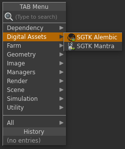
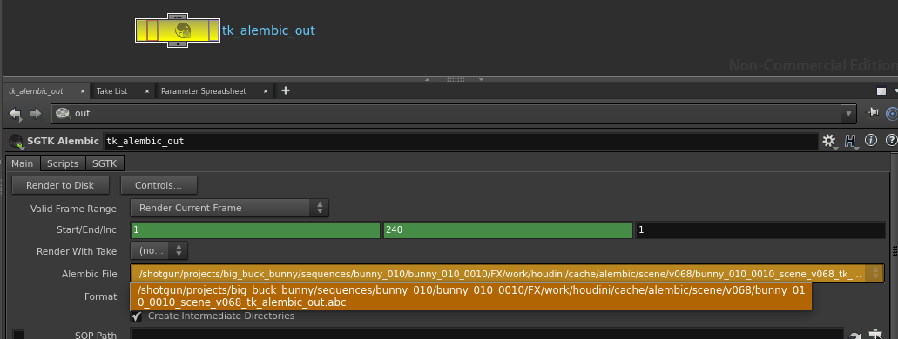

# Houdini Alembic 节点

Houdini Alembic 节点应用提供一个自定义的  Alembic 输出节点，通过它可轻松设置标准化的 Alembic 文件输出位置。您可以为每个环境配置它。

## 一般用法

要使用  Alembic 输出，请先将您的脚本另存为 Toolkit 工作文件，然后通过 Houdini 中的 TAB 菜单创建一个新节点。这将创建一个与普通 Alembic 输出节点类似的节点：

此节点可配置多个输出配置文件，每个配置文件使用一个不同的模板路径指定 Alembic 缓存在磁盘上的写入位置。

您不用手动输入路径，只需指定要使用哪个输出配置文件，节点便会自动计算路径的其余部分。您可以在用户界面中查看计算出的路径。

输出的 Alembic 文件分为不同版本，版本号始终遵循当前的 Houdini 场景文件版本，当您使用多发布进行发布时，版本会自动递增。

## 配置

Toolkit 的 Alembic 节点提供为一个环境配置指定多个输出配置文件的功能。下面是一个为节点配置多个配置文件的示例：

<pre>
  tk-houdini:
    apps:
      tk-houdini-alembicnode:
        location:
          name: tk-houdini-alembicnode
          type: app_store
          version: v0.2.2
        work_file_template: houdini_shot_work
        default_node_name: tk_alembic_out
        output_profiles:
          - name: For Publishing
            settings: {}
            color: [1.0, 0.5, 0.0]
            output_cache_template: houdini_shot_work_alembic_cache
          - name: Local Testing
            settings: {}
            color: [0.0, 0.5, 1.0]
            output_cache_template: houdini_shot_local_alembic_cache
</pre>

您可以使用输出配置文件通过 `color` 字段改变节点的外观，并可通过提供与 `settings` 字段中的参数匹配的键/值对，调整底层 Alembic 节点上的单个参数。最后，`output_cache_template` 字段驱动写入磁盘的 Alembic 缓存的输出路径。
