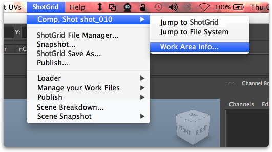
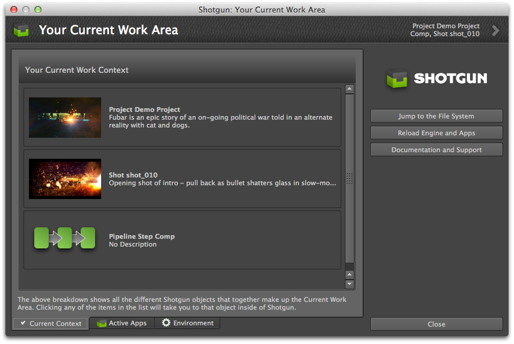
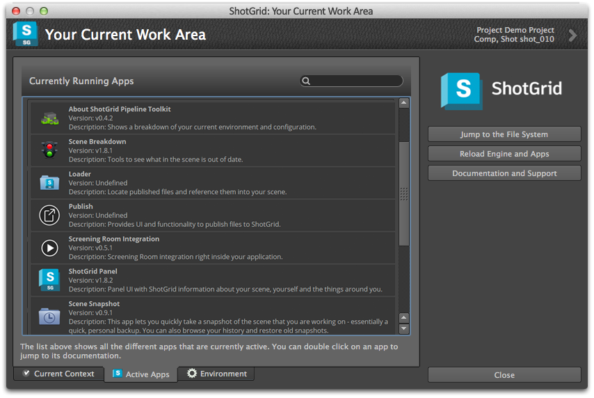
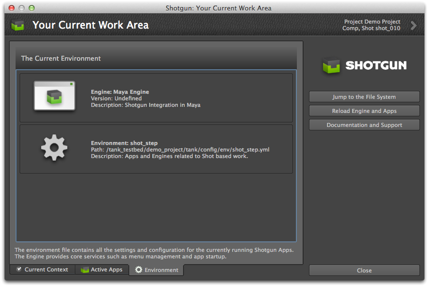

# 关于

此应用以图形方式显示当前工作区和当前环境中运行的所有应用的细分。您可以在上下文菜单中找到它：

## 重新加载所有应用

此应用提供一个方便的按钮，用来重新加载整个环境。当您在开发过程中想要试一下所做的某些代码更改时，此按钮可以派上用场。您不需要重新启动 Maya 或 Nuke，只要点击重新加载按钮即可！

除了重新加载功能，此应用还显示当前工作区及当前加载的所有应用的细分。

共有三个单独的视图：

## 当前工作区

此视图显示当前的镜头或资产，以及当前的任务等。如果双击列表中的任意项，系统将打开该项的  详细信息页面。

## 正在运行的应用

此视图显示当前正在运行的所有应用，以及它们的版本和说明。双击一个应用将启动该应用的文档页。

## 当前环境

此视图显示当前加载的环境文件和插件。这些信息对于调试很有用。
