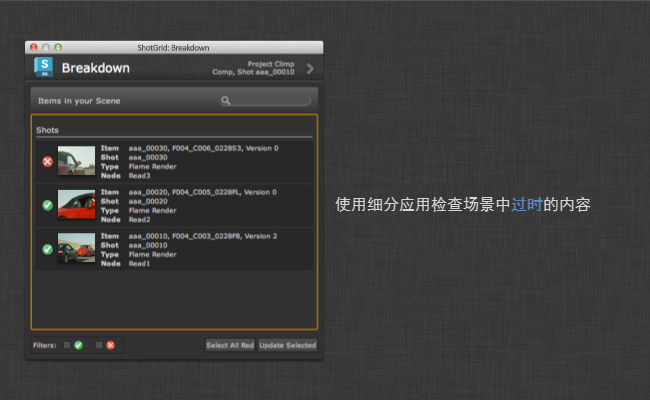

# 细分

场景细分应用会显示引用内容的列表，并告诉您哪些内容项已过期。您可以从  菜单访问它。



您可以选择一项或多项内容，然后单击更新选定项。这会使这些项使用最新版本的内容。

## 扫描场景

细分应用在扫描场景中的引用时，会调用一个特殊的扫描挂钩。此扫描挂钩将返回一个含有文件对应路径的节点列表。对于找到的每个引用，挂钩会返回文件路径，然后 tank 会查看该文件路径，并首先检查是否可将它识别为发布，如果可以识别为发布，则检查是否有更新的版本可用。

如果用户单击过期版本显示的更新按钮，应用将调用另一个挂钩来执行实际的更新工作。这意味着，通过自定义这些挂钩，可以相对简单地向细分中添加新的自定义节点。

## 访问  数据

如果您需要在挂钩中访问要进行更新的发布的  数据，操作起来很简单直接；只需调用 `find_publish` 即可从应用检索所有传入项的元数据，如下所示：

```python
class BreakdownHook(Hook):

    def update(self, items):
        """
        Perform replacements given a number of scene items passed from the app.

        Once a selection has been performed in the main UI and the user clicks
        the update button, this method is called.

        The items parameter is a list of dictionaries on the same form as was
        generated by the scan_scene hook above. The path key now holds
        the that each node should be updated *to* rather than the current path.
        """

        engine = self.parent.engine

        # resolve  data for all paths passed via the items dictionary
        sg_data = tank.util.find_publish(engine.sgtk,
                                         [i["path"] for i in items],
                                         fields=["id", "code", "version_number"])

        for i in items:
            node_name = i["node"]
            node_type = i["type"]
            new_path = i["path"]
            # now that each item is processed, it is easy to access the
            #  data via a dictionary lookup:
            sg_data = sg_data.get(i["path"])

            # once we have all our desired info and metadata, we can go ahead
            # and apply the update business logic.
            # [-business logic here-]

```

## API 访问

您可以使用 API 以编程方式访问细分应用。目前有以下方法：

### 显示细分用户界面

```
app_object.show_breakdown_dialog()
```

如果您想显示细分用户界面，请执行 `show_breakdown_dialog()` 方法。假设应用位于当前运行的环境的 `tk-multi-breakdown` 部分，我们可以像下面这样操作：

```
>>> import sgtk
>>> e = sgtk.platform.current_engine()
>>> e.apps["tk-multi-breakdown"].show_breakdown_dialog()
```

### 运行场景分析

```
items = app_object.analyze_scene()
```

您可以通过执行 `analyze_scene()` 方法，以编程方式运行场景分析逻辑。这将执行与构建场景内容项列表时细分用户界面所用完全相同的逻辑。

该方法将返回一个细分内容项列表。每个内容项由一个词典表示，词典包含若干个键来描述该内容项。方法只会检测到路径与 Toolkit 模板文件中的模板相对应的文件。文件不需要在  中以发布的形式存在，但是如果如此，此方法将返回它们的基本  发布元数据。

`node_name` 和 `node_type` 这两个键用于返回一个以 DCC 为中心的“地址”或表示方式，以便可以在 DCC 内识别路径。例如在 Maya 和 Nuke 中，此方法将返回节点名称和类型。此方法的逻辑在挂钩中执行，并且因 DCC 的不同而异。此方法会尝试连接 ，但是进行的调用次数是固定的，不受场景复杂性的影响。

下面的示例显示了返回的数据中的一个典型词典：

```
{'fields': {'Sequence': 'aaa',
            'Shot': 'aaa_00010',
            'Step': 'Comp',
            'eye': '%V',
            'height': 1556,
            'name': 'test',
            'output': 'output',
            'version': 1,
            'width': 2048},
 'template': <Sgtk TemplatePath nuke_shot_render_pub_mono_dpx>,

 'node_name': 'Read2',
 'node_type': 'Read',

 'sg_data': {'code': 'aaa_00010_test_output_v001.%04d.dpx',
             'entity': {'id': 1660, 'name': 'aaa_00010', 'type': 'Shot'},
             'id': 1424,
             'name': 'test',
             'published_file_type': {'id': 3,
                                     'name': 'Rendered Image',
                                     'type': 'PublishedFileType'},
             'task': {'id': 4714, 'name': 'Comp', 'type': 'Task'},
             'type': 'PublishedFile',
             'project': {'id': 234, 'name': 'Climp', 'type': 'Project'},
             'version_number': 1},
 }
```

**实用提示！**：如上面所见，每个内容项会返回一个 `template` 对象和一个 `fields` 词典来表示路径。如果您想查看内容项的实际原始路径，只需运行 `template_obj.apply_fields(fields_dict)` 即可。在此方法返回的其中一个内容项词典的上下文中，代码将为

```
breakdown_items = analyze_scene()
for item in breakdown_items:
   path = item["template"].apply_fields(item["fields"])
```

### 计算内容项的最高版本

```
highest_version = app_object.compute_highest_version(template, fields)
```

要知道内容项的最高版本，请使用 `compute_highest_version(template, fields)` 方法。`template` 和 `fields` 参数表示要分析的路径，该路径通常抓取自 `analyze_scene()` 方法的输出。使用细分应用时，包含版本号的模板键必须始终命名为 `{version}`。

这将执行磁盘扫描，以确定最高版本。此方法会返回在磁盘上找到的最高版本号。请参见下面的用法示例了解更多详细信息。

### 更新场景的内容项

```
app_object.update_item(node_type, node_name, template, fields)
```

要更新内容项，您可以使用 `update_item(node_type, node_name, template, fields)` 方法。`template` 和 `fields` 参数表示应更新至的路径。`node_name` 和 `node_type` 参数用于确定场景中的哪个节点需要修改。通常，这些值抓取自 `analyze_scene()` 方法的输出。

这样做类似于在细分用户界面中运行更新。实际的更新调用将分派给处理 DCC 特定逻辑的挂钩。请参见下面的用法示例了解更多详细信息。

### 细分 API 示例

下面是一个示例，说明了如何检索场景细分并更新所有未使用最新版本的内容项。

```
# find the breakdown app instance
import sgtk
engine = sgtk.platform.current_engine()
breakdown_app = engine.apps["tk-multi-breakdown"]

# get list of breakdown items
items = breakdown_app.analyze_scene()

# now loop over all items
for item in items:

    # get the latest version on disk
    latest_version = breakdown_app.compute_highest_version(item["template"], item["fields"])

    # if our current version is out of date, update it!
    current_version = item["fields"]["version"]
    if latest_version > current_version:

        # make a fields dictionary representing the latest version
        latest_fields = copy.copy(item["fields"])
        latest_fields["version"] = latest_version

        # request that the breakdown updates to the latest version
        breakdown_app.update_item(item["node_type"], item["node_name"], item["template"], latest_fields)

```
