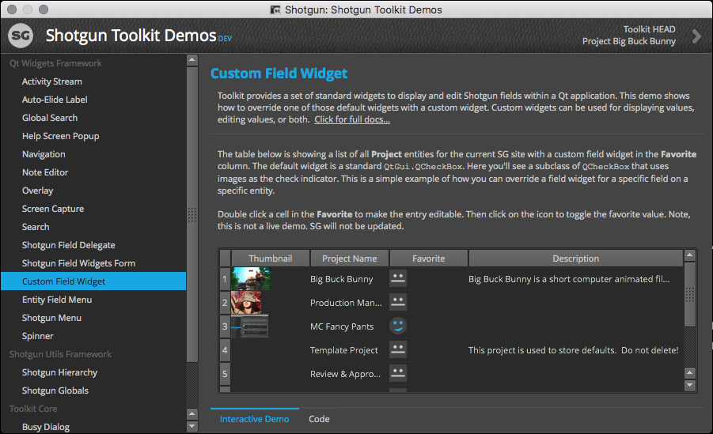
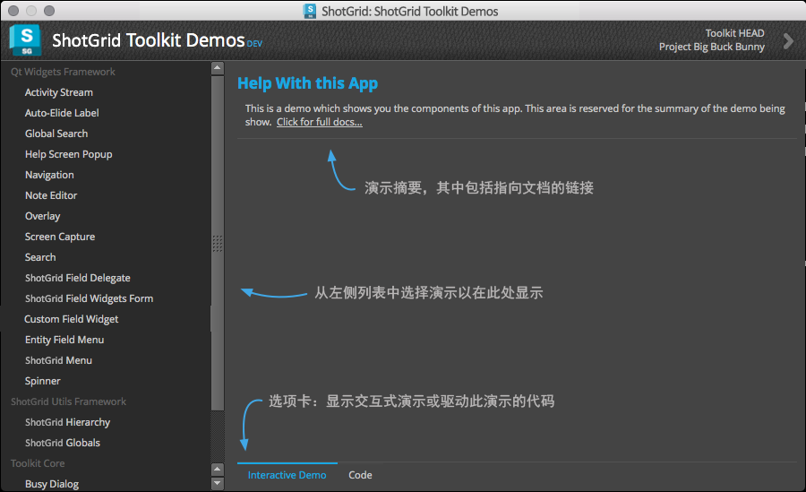

# 演示

本演示应用提供  原生开发平台组件的直观演示，包括  实用程序框架、Qt 控件框架和 Toolkit 核心。



本应用中展示的每项演示均包含一个可用的交互式用户界面，用以说明如何使用该原生平台的一个或多个组件。此外，运行的代码随时可复制并粘贴到您自己的应用中。



此应用使用起来非常简单。只需从左侧的列表中选择一项演示，然后在右侧与组件进行交互即可。有些演示很简单，只是显示 Qt 控件框架中的一个控件；有些演示则提供示例，说明通常如何在生产应用中组合使用  平台的各种组件。


随着新的组件加入平台，在时间允许的情况下，我们会相应添加新的演示。如果您知道某种常见的组件使用方式，或者希望看到某项演示，请通过[提交工单](https://support.shotgunsoftware.com/hc/zh-cn/requests/new)告知我们。

## 安装

要安装此演示应用，请运行以下命令：

```
tank install_app project tk-shell tk-multi-demo
```

安装后，可运行以下命令启动应用：

`./tank demos`
