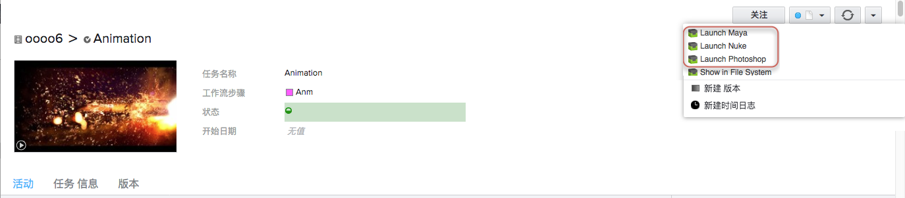

# 启动器应用

此应用提供了一个快捷方式，让您可轻松从  跳转至任何支持的应用程序。它会根据您的配置选择为  中的各种实体创建  动作项。

## 工作方式

当您在实体上单击鼠标右键或使用  动作菜单或配置菜单时， 会根据您的配置选项显示菜单项。

例如，下面这张屏幕截图来自一个站点，该站点的配置使用此应用三次，分别实现 Maya、Nuke 和 Photoshop 的菜单。



目前支持的应用程序和插件包括：

* 3DSMax
* Hiero
* Maya
* MotionBuilder
* Nuke
* Photoshop
* Mari
* Houdini
* Softimage
* Flame

### 启动时使用命令行参数

许多应用程序具有可调用的命令行选项，用于选择不同的应用程序版本（例如 Nuke 与 NukeX）或指定其他各种用法。  启动器应用针对每个操作系统有一个可进行这种配置的“args”设置。  例如，如果您在此设置中加入“--nukex”，启动器会将它添加到命令行启动，并运行 NukeX 而不是常规的 Nuke：

---FOLD---
启动 NukeX 示例

```yaml
launch_nuke:
  engine: tk-nuke
  extra: {}
  hook_app_launch: default
  hook_before_app_launch: default
  linux_args: '--nukex'
  linux_path: '@nuke_linux'
  location: {name: tk-multi-launchapp, type: app_store, version: v0.2.15}
  mac_args: '--nukex'
  mac_path: '@nuke_mac'
  menu_name: Launch Nuke
  windows_args: '--nukex'
  windows_path: '@nuke_windows'
```
---FOLD---

### 设置环境变量并自动化启动时的行为

应用程序常常需要设置某些环境变量、插件路径等，以便能在工作室的工作流中正常工作。启动器应用可通过“before_app_launch”这个挂钩帮助解决此问题。使用此挂钩，您可以定义一段代码，让它在应用程序每次启动时运行。默认情况下，“before_app_launch”这个挂钩只是一个简单的通道，不执行任何操作，但我们可以按照<a href='https://support.shotgunsoftware.com/entries/95442818#Using%20Hooks%20to%20customize%20App%20Behaviour'>此文档</a>中的说明改写它。

例如，如果您使用 <a href='https://www.zyncrender.com/'>Zync Render</a>，Zync Maya 插件目录需要同时包含在 $PYTHONPATH 和 $XBMLANGPATH 中。要让启动器应用设置这些环境变量，请按如下所示为“before_app_launch”挂钩更新几行代码：

---FOLD---
设置环境变量示例

```python
def execute(self, **kwargs):
    """
    The execute functon of the hook will be called to start the required application        
    """

    # Example to show how to set env vars on Maya launch

    # Append the desired path to the existing $PYTHONPATH to ensure
    # everything upstream still works
    os.environ["PYTHONPATH"] = os.environ["PYTHONPATH"] + os.pathsep + "~/Library/zync/zync-maya"

    # Set $XBMLANGPATH to the desired path, may need to append it as
    # with $PYTHONPATH if already defined in your pipeline
    os.environ["XBMLANGPATH"] = "~/Library/zync/zync-maya"
```
---FOLD---

您还可以使用“before_app_launch”自动化其他行为，包括  更新。例如，您可以按如下所示，配置启动器应用在每次启动时（当然前提是从任务进行启动）更新任务状态（在本例中更新为“正在进行”）：

---FOLD---
自动化任务状态更新示例

```python
def execute(self, **kwargs):
    """
    The execute functon of the hook will be called to start the required application        
    """

    # If there is a Task in the context, set its status to 'ip'

    if self.parent.context.task:
        task_id = self.parent.context.task['id']
        data = {
            'sg_status_list':'ip'
        }
        self.parent.shotgun.update("Task", task_id, data)
```
---FOLD---

您可以想象到，这其中有许多可能性，而启动器应用的目的在于提供工作流所需的灵活性。

### 启动尚无插件的应用程序

您还可以使用启动器应用启动尚无 Toolkit 插件的应用程序。在这种情况下，会在磁盘上为执行启动的镜头、任务或资产创建文件夹，然后启动应用程序。但是，应用程序启动后不会运行代码，应用程序内也不会出现  菜单。这意味着，您可以从  内启动 Toolkit 尚不支持的应用程序。

为此，需要为应用配置要启动的应用程序的路径，但保留插件选项为空字符串。

## 技术细节

### 3DSMax

此应用会自动向 3DSMax 命令行添加一个名为 `init_tank.ms` 的 MaxScript，3DSMax 会在引导过程中运行它。

3DSMax 引导时，会发生以下情况：

1. 3DSMax 将在启动时运行 `init_tank.ms`
1. `init_tank.ms` 确保有可用的 Python 解释器并运行 `tank_startup.py`
1. 使用  Toolkit 上下文 API，从  传递的实体 ID 将被转换为 Toolkit 上下文。
1. 启动适当的插件（通过 `tank.system.start_engine()`）并传入该上下文。插件将处理剩下的事情。

### Maya

此应用会向 Maya 注册一个 `userSetup.py` 自动启动脚本，Maya 会在引导过程中调用它。

Maya 引导时，会发生以下情况：

1. Maya 开始执行 `userSetup.py` 启动脚本
1. 使用  Toolkit 上下文 API，从  传递的实体 ID 将被转换为 Toolkit 上下文。
1. 启动适当的插件（通过 `tank.system.start_engine()`）并传入该上下文。插件将处理剩下的事情。

### MotionBuilder

此应用会向 MotionBuilder 注册一个 `init_tank.py` 自动启动脚本，MotionBuilder 会在引导过程中调用它。

MotionBuilder 引导时，会发生以下情况：

1. MotionBuilder 开始执行 `init_tank.py` 启动脚本
1. 使用  Toolkit 上下文 API，从  传递的实体 ID 将被转换为 Toolkit 上下文。
1. 启动适当的插件（通过 `tank.system.start_engine()`）并传入该上下文。插件将处理剩下的事情。

### Nuke

此应用会向 Nuke 注册一个 `menu.py` 自动启动脚本，Nuke 会在引导过程中调用它。

Nuke 引导时，会发生以下情况：

1. Nuke 开始执行 `menu.py` 启动脚本
1. 使用  Toolkit 上下文 API，从  传递的实体 ID 将被转换为 Toolkit 上下文。
1. 启动适当的插件（通过 `tank.system.start_engine()`）并传入该上下文。插件将处理剩下的事情。

### Photoshop

此应用会使用 Adobe Extension Manager 安装或确保已安装 Tank 插件。

Photoshop 引导时，会发生以下情况：

1. Photoshop 将开始执行 Tank 插件
1. 使用  Toolkit 上下文 API，从  传递的实体 ID 将被转换为 Toolkit 上下文。
1. 启动适当的插件（通过 `tank.system.start_engine()`）并传入该上下文。插件将处理剩下的事情。

#### 额外配置

如果您想使用此应用启动 Photoshop，需要在“extra”__部分提供四个配置值。下面是需要根据您的系统和安装位置做出调整的配置和合理的默认值：

```yaml
mac_python_path: "/usr/bin/python"
windows_python_path: "C:\\Python27\\python.exe"
mac_extension_manager_path: "/Applications/Adobe Extension Manager CS6/Adobe Extension Manager CS6.app"
windows_extension_manager_path: "C:\\Program Files (x86)\\Adobe\\Adobe Extension Manager CS6\\XManCommand.exe"
```
