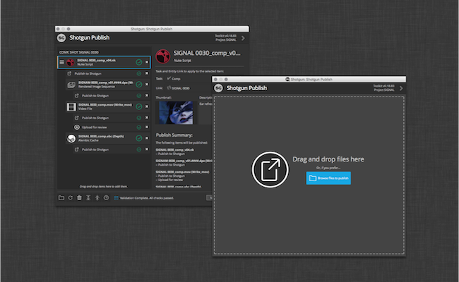

# 发布

## 概述

通过发布应用，美工人员可以发布他们的作品，以便其可供下游的美工人员使用。它支持在艺术家的内容创建软件中以传统方式发布工作流，以及在磁盘上单独发布任何文件。在内容创建软件中操作并使用基本  集成时，该应用将自动发现并显示项目以供艺术家发布。对于较复杂的生产需求，工作室可以编写自定义发布插件来推动美工人员工作流。

## 文档

发布器的完整文档位于[此处](https://developer.shotgridsoftware.com/zh_CN/d587be80/?title=Integrations+User+Guide#the-publisher)！

