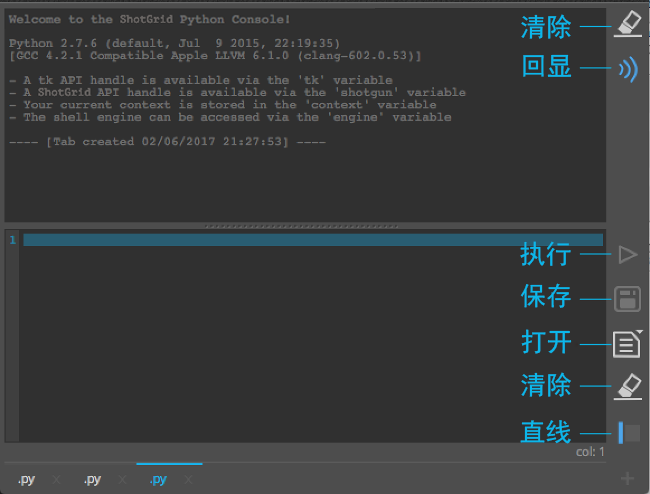
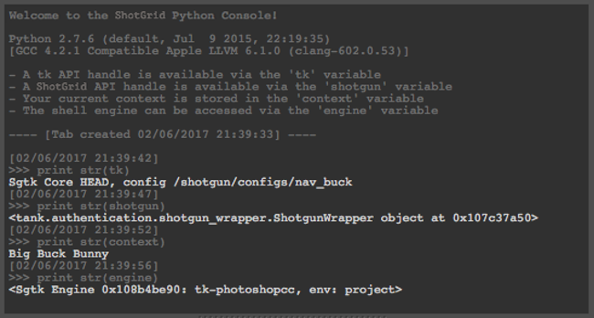

# Python 控制台

这是一个用在 DCC 中的 Python 控制台面板，它为不支持与 Python 解释器交互或者支持非常有限的 DCC 提供访问 Python 解释器的途径。

## 面板

安装后，该控制台将在 DCC 中注册为面板，并显示在  菜单中。在支持嵌入式 Toolkit 面板的应用（Maya、Nuke 和 Houdini）中，该控制台将显示在一个停靠的面板中。 当使用这些 DCC 的早期版本时，或在不支持面板的 DCC 中，该控制台只显示为一个常规的 Toolkit 对话框。

## 选项卡

Python 控制台会显示一个或多个选项卡，每个选项卡包含一个编辑器和一个输出窗口。单击右下角的 `+` 按钮可创建新选项卡。选项卡名称旁边有一个 `x` 按钮，单击此按钮可删除选项卡。双击选项卡本身将提示您为选项卡输入新名称。通过拖放，可重新排列选项卡。关闭 DCC 时，会保存这些选项卡的状态；下次启动 DCC 时，将恢复这些选项卡的状态。

### 编辑器

控制台有一个输入区域用来编辑 Python。该编辑器包含行号，会高亮显示光标当前所在行，并支持一些基本语法高亮显示。控制台会尝试使用 DCC 的配色，让编辑器有协调统一的观感。

支持缩进和取消缩进代码块。选择一行或多行并按 `tab` 以缩进四个空格，或按 `shift + tab` 取消缩进四个空格。它尝试将四个空格作为一个缩进量，因此将缩进/取消缩进距整个代码块最近的四个空格。

此外，还支持备注和取消备注代码块。选择一行或多行并按 `cmd + /`（对于 Mac）或按 `ctrl + /`（对于 Windows 和 Linux）。如果任何选定行在开头处都没有 `#`，则会向所有选定行添加一个。如果所有行都具有 `#`，则会将其移除。

### 输出

输出区域显示 Python 语句的执行结果。源 Python 命令回显功能默认已开启，并在输出中通过前缀 `>>>` 加以区分。每次执行还带有一个时间戳标记。界面上提供了一个开关用来关闭回显功能。语法和运行时错误以红色显示，并提供完整的堆栈跟踪，以方便调试。

## 按钮

### 输出

* **清除** - 清除输出浏览器的内容。
* **回显** - 在输出浏览器中开启/关闭回显执行命令的功能。

### 编辑器

* **执行** - 执行编辑器的内容
* **保存** - 将编辑器的当前内容保存到文件。
* **打开** - 在编辑器中打开文件。
* **清除** - 清除编辑器的内容。
* **行号** - 显示/隐藏当前选项卡的行号

## 全局参数

控制台中预先定义了一些 /Toolkit 全局参数，这与 [ Shell 插件](https://support.shotgunsoftware.com/hc/zh-cn/articles/219039898)中提供的参数类似。

* Tk API 句柄通过 `tk` 变量提供
*  API 句柄通过 `shotgun` 变量提供
* 当前上下文存储在 `context` 变量中
* Shell 插件可通过 `engine` 变量访问

## 外部源

应用随附一个挂钩，我们可以执行它来从外部位置加载 Python 源。这个挂钩称为 `external_sources_hook`，它需要执行一个称为 `get_external_source_actions` 的方法。这个方法应返回一个 `QActions` 列表，当被触发时，会向控制台添加新的选项卡（包含内容）。 应用随附了一个示例执行，该执行从 GitHub 为一系列预定义用户加载 Gist。挂钩返回的动作将显示在按住**“打开”(Open)**按钮时所显示的弹出菜单中。

## 热键

* 使用 `Ctrl + Enter` 执行选定项
* 使用 `Ctrl + T` 创建新选项卡
* 使用 `Ctrl + Shift + [` 或 `Ctrl + Shift + ]` 在选项卡之间导航
* 使用 `Ctrl + Wheel` 调整输入/输出的字体大小

**注意：**这些热键并非适用于所有 DCC。

## 其他说明

* 在某些早期版本的 DCC 中，Python 控制台如果在关闭会话时处于打开状态，可能会导致崩溃。我们认为这可能是某些早期版本的 PySide 的一个错误。较新版本的 DCC 捆绑了更新版本的 PySide，退出时不会发生崩溃。如果您在使用最新 DCC 版本时遇到此问题，请[提交工单](https://support.shotgunsoftware.com/hc/zh-cn/requests/new)，以便我们可以进一步调查。