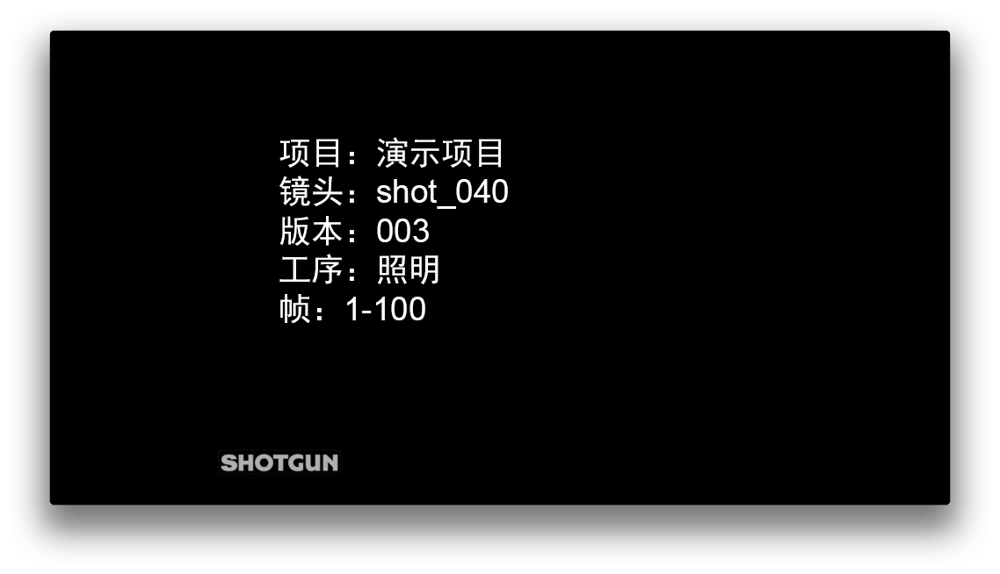
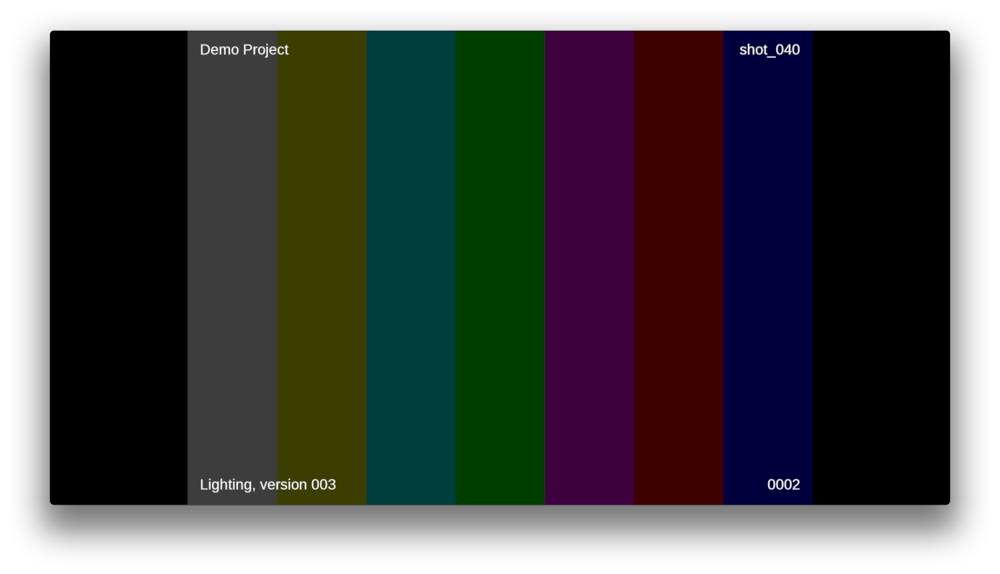

# 审核提交

## 如何使用此应用？

### 作为 API

此应用提供了一种模式以从多发布应用等其他应用内进行调用。

此模式基于图像序列创建 QuickTime 影片文件，然后将它们以版本形式提交至 ，以方便审核。生成的 QuickTime 影片文件将具有场记板信息和场景信息覆层。字体、徽标位置、影片压缩选项和场景信息覆层/场记板信息目前在默认挂钩中采取硬编码方式编写，因此建议您重新执行挂钩函数以调整行为。

下面是场记板信息和场景信息覆层当前的默认格式：





如果您想在自己的应用或挂钩中使用此应用，下面快速介绍了一种简单的方法。

- 从当前插件中获取 `tk-multi-reviewsubmission` 应用。我们可以在一个挂钩内通过调用 `self.parent.engine.apps.get('tk-multi-reviewsubmission')` 来做到这一点。
- 如果应用可用，调用 `render_and_submit_version()` 方法。

下面的示例显示了此应用在您的挂钩代码中的样子：

```python
review_submission_app = self.parent.engine.apps.get("tk-multi-reviewsubmission")
if review_submission_app:
    review_submission_app.render_and_submit_version(
        template,
        fields,
        first_frame,
        last_frame,
        sg_publishes,
        sg_task,
        comment,
        thumbnail_path,
        progress_cb,
        color_space
    )
```

您需要传递给 `render_and_submit_version` 的参数如下所示：

* `template`：一个模板，用于定义要发布的文件的所在位置
* `fields`：用来填写模板的字段
* `first_frame`：要处理的图像序列的第一帧
* `last_frame`：要处理的图像序列的最后一帧
* `sg_publishes`：要与版本链接的  已发布文件对象的列表。
* `sg_task`：要与版本链接的  任务链接词典。
* `comment`：要添加到版本说明中的文字。
* `thumbnail_path`：影片未上传至  时为版本使用的缩略图的路径（在配置中设置）。
* `progress_cb`：一个用于报告进度的回调。  此值的格式应为：`callback(percent, message)`
* `color_space`：输入帧所在的颜色空间。  在 Nuke 中，这是写入节点的颜色空间按钮的其中一个枚举值。

### 作为菜单项

此模式向 DCC 内的  菜单添加菜单项。 

此模式创建当前视口的快照，并将其作为版本草稿发送到  Create。然后，用户可以通过添加标注、文字或比较注释，在  Create 内扩展审核提交。

要将此功能添加到上下文，您需要：
* 设置 `display_name` 字段，使其显示在菜单项中。
* 将 `render_media_hook` 字段设置为挂钩，告知如何在 DCC 中渲染媒体（tk-photoshopcc 和 tk-maya 具有默认执行）
* 将 `submitter_hook` 字段设置为 `{self}/submitter_create.py`

如下所示：

```yaml
tk-multi-reviewsubmission:
  display_name: Send for review
  render_media_hook: '{self}/render_media.py:{self}/{engine_name}/render_media.py'
  submitter_hook: '{self}/submitter_create.py'
  location:
    type: app_store
    name: tk-multi-reviewsubmission
    version: v1.0.1
```
