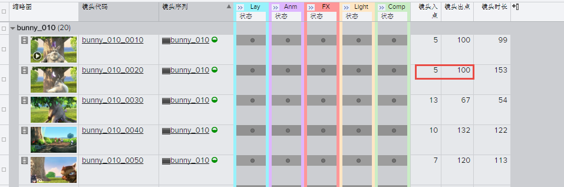
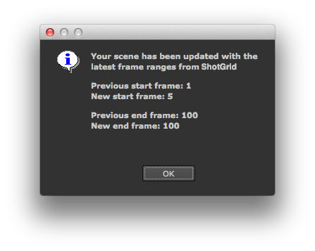
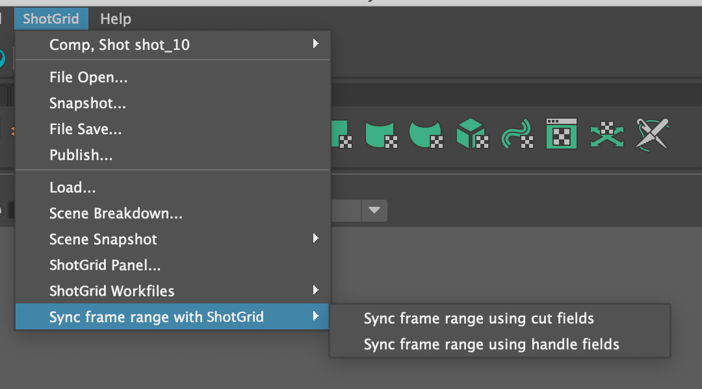

# 设置帧范围

此应用可帮助您管理当前打开的场景中的帧范围。您可以从  菜单中单击**“与  同步帧范围”(Sync Frame Range with ShotGrid)**菜单选项访问它。

当您单击它时， Toolkit 会检查与当前工作区关联的  实体（通常是镜头），并查找包含镜头入点帧和镜头出点帧信息的镜头入点和镜头出点字段。这些信息通常与镜头结合使用，在这种情况下，应用会使用  默认配置中定义的标准镜头入点和镜头出点字段。但是，我们完全可以配置应用，让它从其他字段提取帧范围。



当您运行此应用时，它会使用这些入点和出点信息更新当前场景，最后显示一条摘要消息：



## 多个  字段同步选项

您可以通过设置 `menu_name` 属性在  菜单中定义此应用的多个实例。这样，您可以定义多个菜单动作，以便同步不同的  字段。

要执行此操作，请为每个实例设置不同的应用实例名称 `menu_name` 以及输入帧和输出帧字段：

```yaml
tk-multi-setframerange_cuts:
  menu_name: Sync frame range using cut fields
  sg_in_frame_field: sg_cut_in
  sg_out_frame_field: sg_cut_out
  location: "@apps.tk-multi-setframerange.location"
tk-multi-setframerange_handles:
  menu_name: Sync frame range using handle fields
  sg_in_frame_field: sg_handle_in
  sg_out_frame_field: sg_handle_out
  location: "@apps.tk-multi-setframerange.location"
```
这些内容应该在  菜单中显示为单独的选项：



注意：这是 `v0.4.0` 版应用的新功能。

## 操作挂钩

在帧操作挂钩中处理用于获取当前场景帧范围或设置帧范围的软件特定逻辑。如果想要添加对新插件的支持或更改行为的实现方式，可以通过设置 `hook_frame_operation` 应用属性并实施自己的获取和设置逻辑来接管帧操作挂钩。

注意：这是 `v0.4.0` 版应用的新功能。