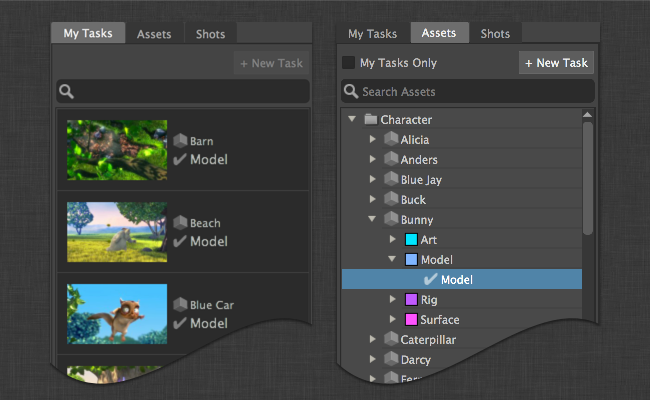
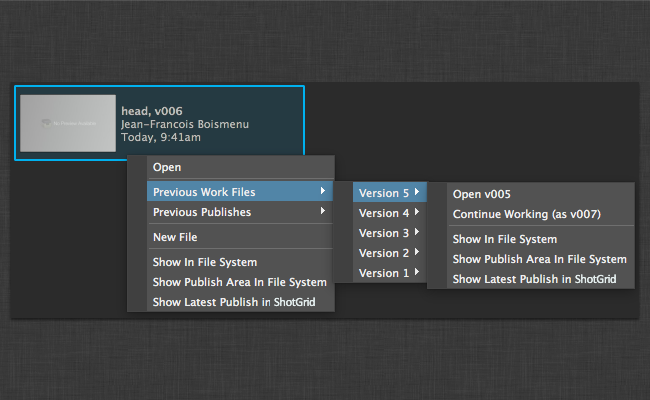
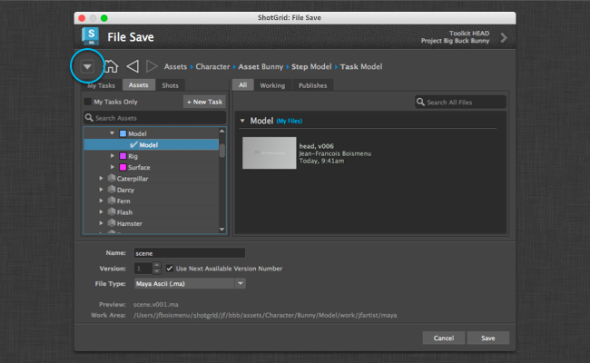
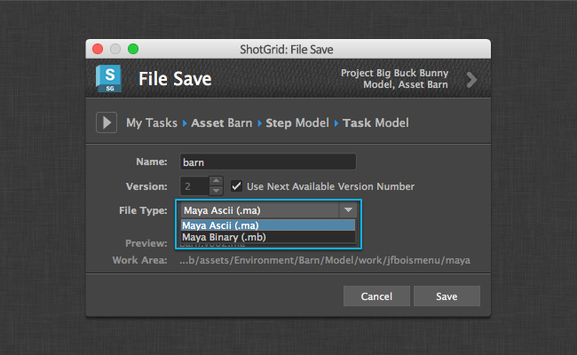
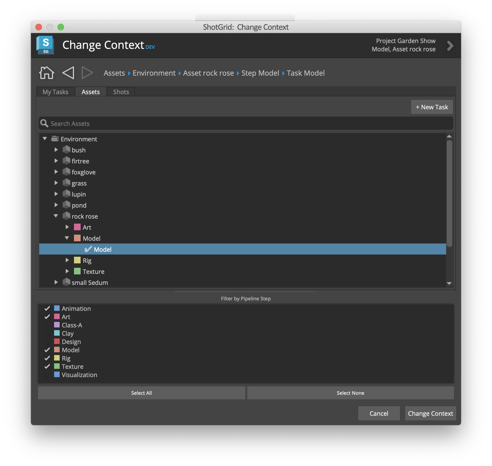
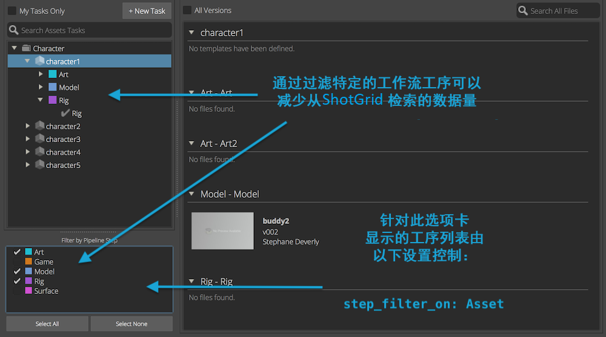
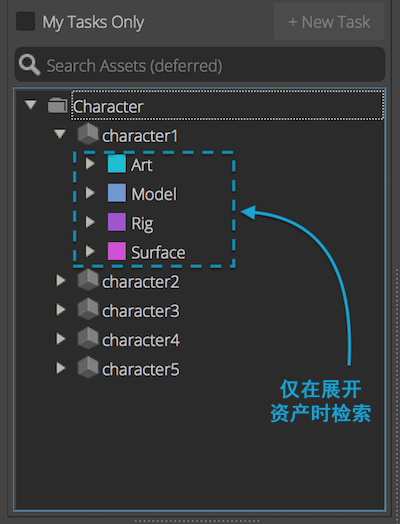

# Workfiles

## “File Open”对话框

### 在工作区中导航



主对话框分为两个部分。左侧是一系列选项卡。第一个选项卡名为“我的任务”(My Tasks)，显示分配给当前用户的所有任务。这个选项卡非常像  网站上的“我的任务”(My Tasks)页面。

另外，用户也可以使用实体选项卡浏览  实体。默认情况下，工作文件应用程序让用户可通过查看相应的选项卡，浏览与镜头或资产关联的任何任务。

整套选项卡全部可通过环境文件中的 `entities` 设置进行配置。

您可以通过在应用设置中设置 `show_file_open: true/false` 来禁用/启用此对话框。

### 查找文件


在右侧，您将看到与左侧选择的内容关联的工作文件和发布。使用“所有”(All)、“工作”(Working)和“发布”(Publishes)选项卡，可以一起或单独查看工作文件和发布。

### 访问先前版本



有两种方式可以访问先前版本。首先，用户可单击浏览器顶部的“所有版本”(All Versions)方框，这将展开版本并在浏览器中单独列出所有版本。另一个方法是在文件上单击鼠标右键，这样可以访问前 10 个版本。

### 用户沙盒


如果您的工作流配置使用了用户沙盒，默认情况下将只会看到当前用户的文件。如果用户想查看其他用户沙盒中的文件，可以使用顶部的按钮选取要显示哪个沙盒中的文件。

### 缩小结果


您可以通过键入文字来缩小任何视图中的结果。搜索将匹配任意项的名称。

## “File Save”对话框

默认情况下，“File Save”对话框让用户可在当前上下文中保存文件。应用程序将提示用户输入场景名称、版本号以及可选的文件扩展名（如果有的话），此时“保存”(Save)按钮将灰显。仅当应用程序确认了场景名称的下一个可用版本号时，右下角的“保存”(Save)按钮才会启用。

您可以通过在应用设置中设置 `show_file_save: true/false` 来禁用/启用此对话框。

### 在不同的上下文中保存文件



要在不同的上下文中保存文件，用户可单击对话框左上角的展开按钮，这将展开“File Save”对话框，让用户选择另一个要保存文件的上下文。

### 添加文件扩展名下拉列表



使用新的“File Save”对话框，可以选取保存文件的扩展名。要启用此功能，您需要调整工作流配置的 `templates.yml` 文件。首先，需要在 `templates.yml` 内的令牌列表中定义一个令牌。

```yaml
maya_extension:
    type: str
    choices:
        ma: Maya Ascii (.ma)
        mb: Maya Binary (.mb)
    default: ma
    alias: extension
```

`maya_extension` 是令牌的名称。`choices` 是下拉列表中将会显示的文件类型的词典。键（`ma` 和 `mb`）是此模板令牌可以具有的值。值（`Maya Ascii (.ma)` 和 `Maya Binary (.mb)`） 是可供 Toolkit 应用程序使用的用户界面友好的说明。`alias` 是工作文件应用程序需要的提示。它将告诉应用程序此令牌是一个扩展名，应显示在下拉列表控件中。

然后，可以将此令牌添加到任何 Maya 特定的模板中。

```yaml
maya_shot_work:
    definition: '@shot_root/work/maya/{name}.v{version}.{maya_extension}'
    root_name: 'primary'
```

## “Change Context”对话框



“Change Context”对话框与打开的对话框类似，只是它没有用于在右侧浏览文件的功能。您可以选择任务或实体，然后通过按“Change Context”按钮更改当前插件上下文。

您可以通过在应用设置中设置 `show_change_context: true/false` 来禁用/启用此对话框。

## 工序过滤

检索任务时，如果 `step` 包含在层次结构中，则可以通过工作流工序过滤减少从  检索的数据量：将仅检索链接到选定工序列表的任务。

选项卡中显示的工序列表由 `step_filter_on` 设置来控制。如果未设置此项，则将显示现有的所有工作流工序。

以下示例定义两个选项卡，分别显示资产的任务和镜头的任务：

```yaml
  - caption: Assets Tasks
    entity_type: Task
    step_filter_on: Asset
    filters:
    - [entity, type_is, Asset]
    hierarchy: [entity.Asset.sg_asset_type, entity, step, content]
  - caption: Shots Tasks
    entity_type: Task
    step_filter_on: Shot
    filters:
    - [entity, type_is, Shot]
    hierarchy: [entity.Shot.sg_sequence, entity, step, content]
```



## 延迟查询

为了获得更好的性能，构建实体树可以分为两个工序查询：
- 第一个查询用于从  检索记录并填充树的顶部。
- 第二个查询用于在用户展开树时检索子项。

在使用以下设置的情况下，将在启动应用时从  检索资产和镜头。然后，在树视图中选择或展开特定资产或镜头时，将仅检索链接到此资产或镜头的任务。

```yaml
  entities:
  - caption: Assets
    entity_type: Asset
    hierarchy: [sg_asset_type, code]
    filters:
    sub_hierarchy:
      entity_type: Task
      filters:
      link_field: entity
      hierarchy: [step]
  - caption: Shots
    entity_type: Shot
    filters:
    hierarchy: [sg_sequence, code]
    sub_hierarchy:
      entity_type: Task
      filters:
      link_field: entity
      hierarchy: [step]
```


