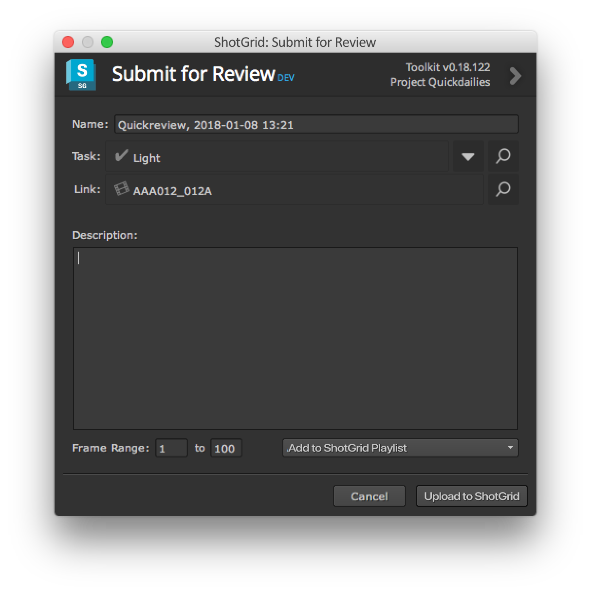
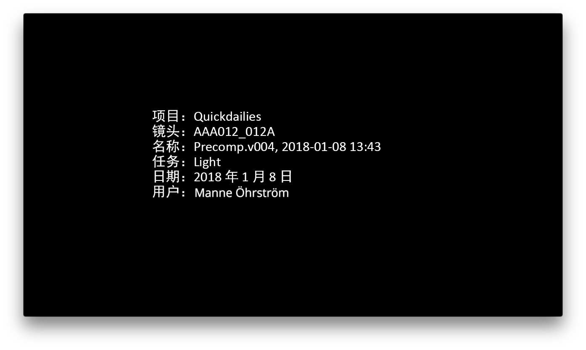
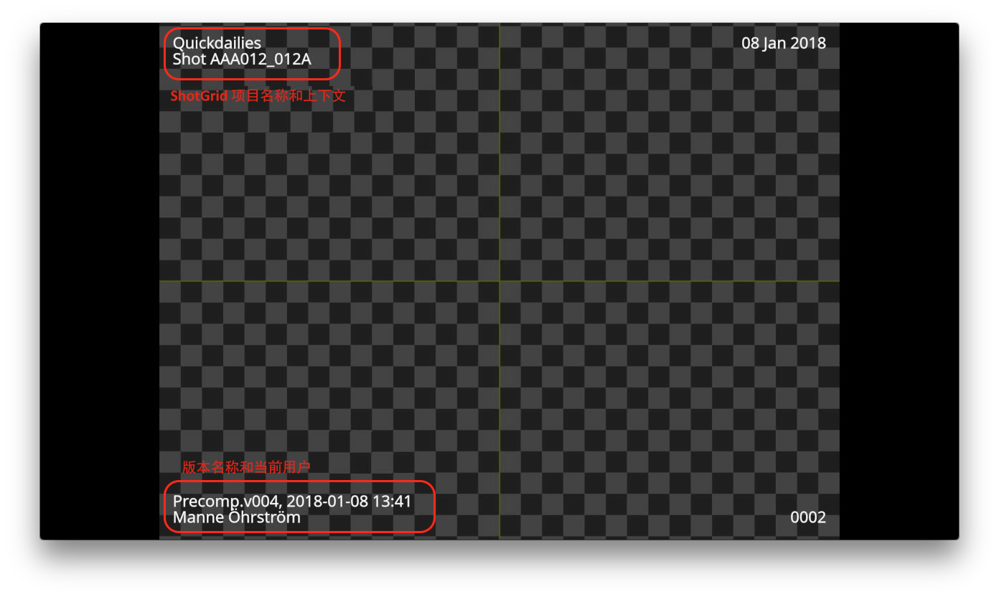

# Nuke Quickreview

使用 Quickreview 应用可以轻松地提交 Nuke 渲染以在  中进行审核。每次通过 Quickreview 提交时都会在  中创建一个**版本**。它显示为 Nuke 中的一个节点，位于  节点菜单中。只需创建一个新节点，将其附加到您的 Nuke 网络，双击该节点，然后单击“上传”(Upload)按钮。

您将看到以下 UI，通过它可以控制如何在  中创建您的版本：

可以控制以下项：

- 版本名称是基于当前加载的 Nuke 脚本预先填充的，可以根据需要进行调整。
- 与版本关联的实体链接和任务是基于当前上下文的，可以进行调整。
- 要提交的帧范围可以进行调整。
- 创建的版本可以添加到播放列表中。将会显示一个包含最近播放列表的下拉列表。

按“上传”(Upload)按钮后，将在 Nuke 中生成 QuickTime 影片，然后上传到 。上传后，将显示以下屏幕，您可以选择在 Nuke 中的内置  面板中或在 Web 悬浮播放器中显示版本。

## 场景信息覆层和场记板信息

默认情况下，应用将生成一个包含场记板信息和场景信息覆层的 QuickTime 影片：

## 自定义

审核提交的大多数方面都可以使用挂钩进行调整。可以在[此处](http://developer.shotgridsoftware.com/tk-nuke-quickreview)找到相关文档。

