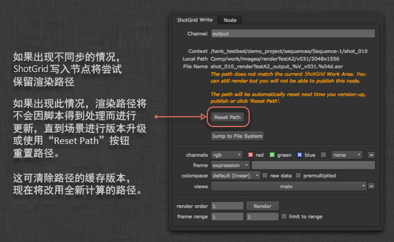

# Nuke 写入节点

Nuke 写入节点应用提供一个自定义的  写入节点，让您可轻松设置标准化的图像渲染位置。您可以为每个环境配置它。  除了路径以外，配置还将决定要使用的渲染格式。

## 一般用法

要使用  写入节点，可先将脚本另存为 Toolkit 工作文件，然后通过 Nuke 菜单创建一个新节点。此操作将创建一个与普通写入节点类似的节点：


您不用输入路径，只需指定输出名称，Toolkit 便会自动计算路径的其余部分。您可以在用户界面中查看计算得到的路径，并可单击“Show in File System”**按钮打开磁盘上的位置。渲染内容的写入位置取决于 Toolkit 的配置。

渲染内容将实施版本控制，版本号始终遵循当前的 Nuke 脚本版本，会在您使用多发布进行发布时自动递增。

## 重置渲染路径

写入节点会缓存当前路径，以便文件在 Toolkit 工作区外部打开时，路径仍然有效。  有时，这意味着路径可能会变得不同步和被“锁定”。  如果渲染路径被锁定，将无法发布使用此写入节点创建的渲染内容。

要重置渲染路径，请使用工作文件应用的“升级场景版本”命令升级场景的版本，或单独选择写入节点，然后在属性中单击**“Reset Path”**：



## 添加另一个写入节点配置文件

 写入节点封装了 Nuke 内置的写入节点，因此 Nuke 支持的任何格式均可用于此应用，并且通过配置可另外再添加节点。最简单的入门方法是使用您需要的参数设置一个简单的 Nuke 写入节点。
例如，我们假设您使用 LZW 压缩来保存 16 位 TIFF 文件。如果您在文本编辑器中查看自己的 Nuke 脚本，会发现写入节点将如下所示：

```
Write {
    file /Users/ryanmayeda/Desktop/test.%04d.tif
    file_type tiff
    datatype "16 bit"
    compression LZW
    checkHashOnRead false
    name Write1
    xpos -145
    ypos -61
}
```

上面的文本显示了您需要的参数名称和值各是什么。在本例中为 `datatype` 和 `compression`。接下来，转到环境配置（例如：`/path/to/pipeline/config/env/shot_step.yml`）并找到配置 `tk-nuke-writenode` 应用的部分。  在 `settings` 部分使用这两个参数添加另一个写入节点：

```yaml
tk-nuke-writenode:
  location: {name: tk-nuke-writenode, type: app_store, version: v0.1.6}
  template_script_work: nuke_shot_work
  ...
  write_nodes:
  - file_type: exr
    ...
  - file_type: dpx
    ...
  - file_type: tiff
    name: Mono Tif
    publish_template: nuke_shot_render_pub_mono_tif
    render_template: nuke_shot_render_mono_tif
    proxy_publish_template: null
    proxy_render_template: null
    settings: {datatype: 16 bit, compression: LZW}
    tank_type: Rendered Image
    tile_color: []
    promote_write_knobs: []
```

更新后的配置将在 Nuke 显示这个另外添加的  写入节点：


__注意：__请务必将任何新模板（例如 nuke_shot_render_mono_tif）添加到 `templates.yml` 文件中，该文件可在项目配置中找到 (`<configuration root>/config/core/templates.yml`)。

下面是另一个示例，显示了如何添加一个以 0.5 的压缩率和 4:2:2 的子采样率输出 JPEG 的  写入节点。此配置文件还使用了“promote_write_knobs”选项将 JPEG 质量旋钮提升到小控件的用户界面。这样，配置文件便可以设置图片质量的默认值，同时还能为用户提供滑块控件以自己更改该设置：

```yaml
tk-nuke-writenode:
  write_nodes:
    - file_type: jpeg
      name: Compressed JPEG
      publish_template: nuke_shot_render_pub_jpeg
      render_template: nuke_shot_render_jpeg
      proxy_publish_template: null
      proxy_render_template: null
      settings: {_jpeg_quality: 0.5, _jpeg_sub_sampling: "4:2:2"}
      tank_type: Rendered Image
      tile_color: []
      promote_write_knobs: [_jpeg_quality]
```

### 提升写入旋钮

如上面的配置文件示例中所示，封装的写入节点中的旋钮可以通过提升，显示在  写入节点的属性面板中。提升的写入旋钮在配置文件中定义，并以旋钮名称进行标识。有多个旋钮可以提升。

## 渲染农场集成

工作室使用运行作业管理工具（如 [Deadline](https://deadline.thinkboxsoftware.com/)，这些工具通常会在渲染时直接启动 Nuke）的渲染农场，这种情况很常见。由于这些工具不是以  可识别的方式（例如，通过 Desktop 或 `tank` 命令）启动 Nuke，因此， 写入节点没有运行所需的信息。我们提供了几种方式来消除此限制。

### 将  写入节点转换为标准 Nuke 写入节点

一个简单的解决方案是先将  写入节点转换为常规 Nuke 写入节点，然后再发送要渲染的脚本。有两个选项：1. 您可以启用并使用转换菜单选项；2. 您还可使用应用中的 API 转换方法。

#### 启用转换菜单选项

有一个名为 `show_convert_actions` 的配置选项，可以将其添加到应用设置的环境 yml 文件中。当您添加设置 `show_convert_actions: True` 时，“将 SG 写入节点转转为写入节点...”(Convert SG Write Nodes to Write Nodes...)**和“将写入节点转换回 SG 格式...”(Convert Write Nodes back to SG format...)**菜单选项将可用。


但是，如果定义了任何提升写入旋钮的  写入节点配置文件，则这些菜单选项将隐藏，即使 `show_convert_actions` 设置为 `True`。这是因为，目前转换回功能不支持提升的旋钮。

#### 使用 API 进行转换

在 `tk-nuke-writenode` 应用上可使用 `convert_to_write_nodes()` 方法执行此转换。

要将某个脚本中的所有  写入节点都转换为常规 Nuke 写入节点，请在 Nuke 中运行以下代码：

```python
import sgtk
eng = sgtk.platform.current_engine()
app = eng.apps["tk-nuke-writenode"]
if app:
    app.convert_to_write_nodes()
```

这将从场景中移除  写入节点，因此，我们建议的工作流是，为要渲染的脚本创建一个副本，对该副本执行转换，然后将副本提交到农场。场景中不再有任何 Toolkit 引用，因此在渲染农场上打开 Nuke 脚本时不需要 Toolkit。

**注意：**提供了对应的 `convert_from_write_nodes()` 方法，但为了确保数据完整性，建议仅将其用于调试，不应在您的工作流中使用。

### 使用 init.py 引导  Pipeline Toolkit 插件

Nuke 将运行在其插件路径中找到的任何 `init.py` 脚本。此方式是向 `init.py` 添加代码（从而执行 `tk-nuke` 插件的精简引导），以便  写入节点能够在渲染农场中按预期运行。

此工作流有几个步骤：首先，“实施前”提交脚本（在  可识别的 Nuke 会话中运行）获取将用于为农场作业设置环境的数据。然后，由渲染农场管理员设置用于在渲染农场中对  会话进行身份认证的其他环境变量。最后，将包含  引导代码的 `init.py` 放置在渲染农场中的 Nuke 会话将检测并运行它的位置，从而在会话中引导 `tk-nuke` 插件，以及允许  写入节点正常运行。

#### 1. 实施前提交脚本

此方法假定艺术家在  可识别的 Nuke 会话中提交农场作业。在提交时，应运行以下代码。此代码将从当前 Nuke 会话中提取环境信息（如 Toolkit 上下文、工作流配置 URI、Toolkit 核心 API 位置等）来填充一个词典，该词典将传递给渲染作业以用来设置环境变量。

```python
# Populating environment variables from running Nuke:
# http://developer.shotgridsoftware.com/tk-core/platform.html#sgtk.platform.create_engine_launcher
current_engine = sgtk.platform.current_engine()
launcher = sgtk.platform.create_engine_launcher(
     current_engine.sgtk,
     current_engine.context,
     current_engine.name
)

# Get a dictionary with the following keys:
# SHOTGUN_SITE: The  site url
# SHOTGUN_ENTITY_TYPE: The  Entity type, e.g. Shot
# SHOTGUN_ENTITY_ID: The  Entity id, e.g. 1234
environment = launcher.get_standard_plugin_environment()

# Get the current pipeline config descriptor
environment["SHOTGUN_CONFIG_URI"] = os.path.join(current_engine.sgtk.configuration_descriptor.get_uri(),"config")

# Get the current tk-core installation path
environment["SHOTGUN_SGTK_MODULE_PATH"] = sgtk.get_sgtk_module_path()
```

收集了此信息后，可以将其传递给渲染提交工具。根据所用的渲染农场管理系统，此过程会有所不同。有关如何编写渲染提交脚本的详细信息，请参见您的农场管理系统文档。

#### 2.  身份认证

引导 API 的 ToolkitManager 需要脚本用户才能初始化。在我们的示例中，我们假定您的站点名称、脚本用户和脚本密钥以环境变量的形式存在于农场计算机上。通常，这是由渲染农场管理员管理的。下面是我们的代码需要的环境变量名称以及示例值：

```
SHOTGUN_SITE = “https://mysitename.shotgunstudio.com”
SHOTGUN_FARM_SCRIPT_USER = “sg_api_user”
SHOTGUN_FARM_SCRIPT_KEY = “xxxxxxxxxxxxxxxxxxxxxxxxxxxxxxxxxxxxxxxxxxxxxxxxxxxxxxx”
```

有关身份认证的详细信息，请参见[开发人员文档](http://developer.shotgridsoftware.com/tk-core/authentication.html)。

**有关保护脚本用户安全的注意事项：**建议锁定您在农场中使用的脚本用户，以使其没有管理员级别的权限。[您可在此处详细了解 API 用户权限。](https://support.shotgunsoftware.com/hc/zh-cn/articles/219376228)

#### 3. init.py 脚本

目前，Toolkit 环境数据是从渲染提交工具传递过来的，身份认证数据在渲染农场计算机上的环境变量中。在渲染作业中引导 Toolkit 的最后一部分是将以下示例 `init.py` 代码放置在 Nuke 的插件路径中，以便 Nuke 在启动时启动它。（有关更多详细信息，请参见 [Foundry 提供的有关启动脚本的文档](http://docs.thefoundry.co.uk/nuke/63/pythondevguide/startup.html)。）

```python
# This script shows how a Toolkit as a plugin approach could be used to bootstrap
# Toolkit in Nuke on the render farm.
# http://developer.shotgridsoftware.com/tk-core/bootstrap.html#bootstrapping-toolkit

import sys
import os

# If your render nodes can access the same tk-core install location as
# artist workstations, retrieve its path from the environment and ensure
# it is in the PYTHONPATH
TK_CORE_PATH = os.environ["SHOTGUN_SGTK_MODULE_PATH"]
if TK_CORE_PATH not in sys.path:
    sys.path.append(TK_CORE_PATH)

# If your render nodes don’t have access to the Toolkit Core API in the same filesystem location as artist workstations, you have to make sure that it is available in the PYTHONPATH, so that render nodes can import it. An easy way
# to install tk-core in a centralized location is with pip. You can read more
# about it here:
# http://developer.shotgridsoftware.com/tk-core/bootstrap.html#installing-the-sgtk-module-using-pip

import sgtk

# Authenticate using a pre-defined script user.
sa = sgtk.authentication.ShotgunAuthenticator()

# Here we retrieve credentials from environment variables, assuming a script user
# will be used when rendering. This should be typically be handled by your render
# farm administrators.
SG_SITE_URL = os.environ["SHOTGUN_SITE"]
SG_SCRIPT_USER = os.environ["SHOTGUN_FARM_SCRIPT_USER"]
SG_SCRIPT_KEY = os.environ["SHOTGUN_FARM_SCRIPT_KEY"]
user = sa.create_script_user(
    api_script=SG_SCRIPT_USER,
    api_key=SG_SCRIPT_KEY,
    host=SG_SITE_URL
)

# Start up a Toolkit Manager with our script user
mgr = sgtk.bootstrap.ToolkitManager(sg_user=user)

# Set the base pipeline configuration from the environment variable:
mgr.base_configuration = os.environ["SHOTGUN_CONFIG_URI"]

# Disable  lookup to ensure that we are getting the Pipeline
# Configuration defined in SHOTGUN_CONFIG_URI, and not a dev or override
# Pipeline Configuration defined in .
mgr.do_shotgun_config_lookup = False

# Set a plugin id to indicate to the bootstrap that we are starting
# up a standard Nuke integration
mgr.plugin_id = "basic.nuke"

# Retrieve the Toolkit context from environment variables:
# SHOTGUN_SITE: The  site url
# SHOTGUN_ENTITY_TYPE: The  Entity type, e.g. Shot
# SHOTGUN_ENTITY_ID: The  Entity id, e.g. 1234
sg_entity = mgr.get_entity_from_environment()

# Now start up the Nuke engine for a given  Entity
nuke_engine = mgr.bootstrap_engine("tk-nuke", entity=sg_entity)
```

如果您的配置比此示例复杂，或要使用 `-t` 标志而不是使用 Nuke (`.nk`) 脚本将 Python 脚本传递到命令行，则您可能需要扩展此脚本。

#### Deadline 特定的步骤

Deadline 可能会在渲染时将 Nuke 脚本复制到一个临时位置。这会导致 Toolkit 出现问题，因为这种情况下文件已不在 Toolkit 识别的磁盘位置。要禁用此行为并从原始位置加载脚本，请执行以下操作：

1. 在 Deadline 中，导航到“Tools > Configure Plugin”（在超级用户模式下）
2. 禁用“Enable Path Mapping”选项

## 技术细节

应用提供以下 API 方法：

### get_write_nodes()

返回当前场景中所有  写入节点的列表。

`list` app.get_write_nodes()

**参数和返回值**

* **返回值：**`list` - 在场景中找到的 Toolkit 写入节点的列表。

**示例**

```python
>>> import sgtk
>>> eng = sgtk.platform.current_engine()
>>> app = eng.apps["tk-nuke-writenode"]
>>> nodes = app.get_write_nodes()
```

### get_node_name()

返回指定的写入节点的名称。

`string` get_node_name(`node` 节点)

**参数和返回值**

* `node` **node** - 要查询的写入节点。
* **返回值：**`string` - 节点名称。

**示例**
```python
>>> import sgtk
>>> eng = sgtk.platform.current_engine()
>>> app = eng.apps["tk-nuke-writenode"]
>>> nodes = app.get_write_nodes()
>>> app.get_node_name(nodes[0])
```

### get_node_profile_name()

获取指定的写入节点使用的配置文件的名称。

`string` get_node_profile_name(`node` 节点)

**参数和返回值**

* `node` **node** - 要查询的写入节点。
* **返回值：**`string` - 配置为此写入节点定义的配置文件名称。

**示例**
```python
>>> import sgtk
>>> eng = sgtk.platform.current_engine()
>>> app = eng.apps["tk-nuke-writenode"]
>>> nodes = app.get_write_nodes()
>>> app.get_node_profile_name(nodes[0])
```

### get_node_render_path()

获取指定的写入节点渲染图像的路径。

`string` get_node_render_path(`node` 节点)

**参数和返回值**

* `node` **node** - 要查询的写入节点。
* **返回值：**`string` - 此节点的渲染路径。

**示例**
```python
>>> import sgtk
>>> eng = sgtk.platform.current_engine()
>>> app = eng.apps["tk-nuke-writenode"]
>>> nodes = app.get_write_nodes()
>>> app.get_node_render_path(nodes[0])
```

### get_node_render_files()

获取指定的写入节点已渲染的所有图像文件的列表。

`list` get_node_render_files(`node` 节点)

**参数和返回值**

* `node` **node** - 要查询的写入节点。
* **返回值：**`list` - 此写入节点渲染的图像文件的列表。

**示例**
```python
>>> import sgtk
>>> eng = sgtk.platform.current_engine()
>>> app = eng.apps["tk-nuke-writenode"]
>>> nodes = app.get_write_nodes()
>>> app.get_node_render_files(nodes[0])
```

### get_node_render_template()

获取配置中定义的一个模板，该模板决定指定的写入节点将渲染图像写入哪个位置。

`template` get_node_render_template(`node` 节点)

**参数和返回值**

* `node` **node** - 要查询的写入节点。
* **返回值：**`template` - 此节点配置使用的渲染模板。

**示例**
```python
>>> import sgtk
>>> eng = sgtk.platform.current_engine()
>>> app = eng.apps["tk-nuke-writenode"]
>>> nodes = app.get_write_nodes()
>>> app.get_node_render_template(nodes[0])
```

### get_node_publish_template()

获取配置中定义的一个模板，该模板决定指定的写入节点将渲染图像发布至哪个位置。

`template` get_node_publish_template(`node` 节点)

**参数和返回值**

* `node` **node** - 要查询的写入节点。
* **返回值：**`template` - 此节点配置使用的发布模板。

**示例**
```python
>>> import sgtk
>>> eng = sgtk.platform.current_engine()
>>> app = eng.apps["tk-nuke-writenode"]
>>> nodes = app.get_write_nodes()
>>> app.get_node_publish_template(nodes[0])
```

### get_node_proxy_render_path()

获取指定的写入节点渲染代理图像的路径。

`string` get_node_proxy_render_path(`node` 节点)

**参数和返回值**

* `node` **node** - 要查询的写入节点。
* **返回值：**`string` - 此节点的代理渲染路径。

**示例**
```python
>>> import sgtk
>>> eng = sgtk.platform.current_engine()
>>> app = eng.apps["tk-nuke-writenode"]
>>> nodes = app.get_write_nodes()
>>> app.get_node_proxy_render_path(nodes[0])
```

### get_node_proxy_render_files()

获取指定的写入节点已渲染的所有代理图像文件的列表。

`list` get_node_proxy_render_files(`node` 节点)

**参数和返回值**

* `node` **node** - 要查询的写入节点。
* **返回值：**`list` - 此写入节点渲染的代理图像文件的列表。

**示例**
```python
>>> import sgtk
>>> eng = sgtk.platform.current_engine()
>>> app = eng.apps["tk-nuke-writenode"]
>>> nodes = app.get_write_nodes()
>>> app.get_node_proxy_render_files(nodes[0])
```

### get_node_proxy_render_template()

获取配置中定义的一个模板，该模板决定指定的写入节点将代理渲染图像写入哪个位置。

如果指定的节点未配置代理渲染模板，将返回常规渲染模板。

`template` get_node_proxy_render_template(`node` 节点)

**参数和返回值**

* `node` **node** - 要查询的写入节点。
* **返回值：**`template` - 此节点配置使用的代理渲染模板。

**示例**
```python
>>> import sgtk
>>> eng = sgtk.platform.current_engine()
>>> app = eng.apps["tk-nuke-writenode"]
>>> nodes = app.get_write_nodes()
>>> app.get_node_proxy_render_template(nodes[0])
```

### get_node_proxy_publish_template()

获取配置中定义的一个模板，该模板决定指定的写入节点将代理渲染图像发布到哪个位置。

如果指定的节点未配置代理发布模板，将返回常规发布模板。

`template` get_node_proxy_publish_template(`node` 节点)

**参数和返回值**

* `node` **node** - 要查询的写入节点。
* **返回值：**`template` - 此节点配置使用的代理发布模板。

**示例**
```python
>>> import sgtk
>>> eng = sgtk.platform.current_engine()
>>> app = eng.apps["tk-nuke-writenode"]
>>> nodes = app.get_write_nodes()
>>> app.get_node_proxy_publish_template(nodes[0])
```

### get_node_published_file_type()

获取配置中定义的一个发布文件类型，为指定的写入节点渲染的图像创建发布文件时，将使用此类型。

`string` get_node_published_file_type(`node` 节点)

**参数和返回值**

* `node` **node** - 要查询的写入节点。
* **返回值：**`string` - 此节点配置使用的发布文件类型。

**示例**
```python
>>> import sgtk
>>> eng = sgtk.platform.current_engine()
>>> app = eng.apps["tk-nuke-writenode"]
>>> nodes = app.get_write_nodes()
>>> app.get_node_published_file_type(nodes[0])
```

### generate_node_thumbnail()

为指定的写入节点生成缩略图。  此方法会将镜头序列中间的一帧渲染到一个临时文件 (.png)，最大尺寸为 800x800 像素。  当不再需要此文件时，调用程序负责清理此文件。

`string` generate_node_thumbnail(`node` 节点)

**参数和返回值**

* `node` **node** - 要查询的写入节点。
* **返回值：**`string` - 渲染的缩略图图像在磁盘上的路径。

**示例**
```python
>>> import sgtk
>>> eng = sgtk.platform.current_engine()
>>> app = eng.apps["tk-nuke-writenode"]
>>> nodes = app.get_write_nodes()
>>> app.generate_node_thumbnail(nodes[0])
```

### reset_node_render_path()

将指定的写入节点的渲染路径重置为与当前脚本一致。

`None` reset_node_render_path(`node` 节点)

**参数和返回值**

* `node` **node** - 要查询的写入节点。
* **返回值：**`None` - 不返回任何值。

**示例**
```python
>>> import sgtk
>>> eng = sgtk.platform.current_engine()
>>> app = eng.apps["tk-nuke-writenode"]
>>> nodes = app.get_write_nodes()
>>> app.reset_node_render_path(nodes[0])
```

### is_node_render_path_locked()

判断指定的写入节点的渲染路径是否已锁定。

`bool` is_node_render_path_locked(`node` 节点)

**参数和返回值**

* `node` **node** - 要查询的写入节点。
* **返回值：**`bool` - 渲染路径锁定时返回 True，否则返回 False。

**示例**
```python
>>> import sgtk
>>> eng = sgtk.platform.current_engine()
>>> app = eng.apps["tk-nuke-writenode"]
>>> nodes = app.get_write_nodes()
>>> app.is_node_render_path_locked(nodes[0])
```

### convert_to_write_nodes()

将在当前脚本中找到的所有  写入节点转换为常规 Nuke 写入节点。其他 Toolkit 信息将存储在名为“tk_*”的用户旋钮上。

`None` convert_to_write_nodes()

**示例**
```python
>>> import sgtk
>>> eng = sgtk.platform.current_engine()
>>> app = eng.apps["tk-nuke-writenode"]
>>> app.convert_to_write_nodes()
```

### convert_from_write_nodes()

将之前从  写入节点转换而来的所有常规 Nuke 写入节点转换回  写入节点。

`None` convert_from_write_nodes()

**示例**
```python
>>> import sgtk
>>> eng = sgtk.platform.current_engine()
>>> app = eng.apps["tk-nuke-writenode"]
>>> app.convert_from_write_nodes()
```

### process_placeholder_nodes()

将任何占位符节点转换为完整的  写入节点。这主要用于在 Nuke 中首次打开脚本时转换由 Hiero Toolkit 脚本导出器创建的占位符节点。

`None` process_placeholder_nodes()

**示例**
```python
>>> import sgtk
>>> eng = sgtk.platform.current_engine()
>>> app = eng.apps["tk-nuke-writenode"]
>>> app.process_placeholder_nodes()
```
