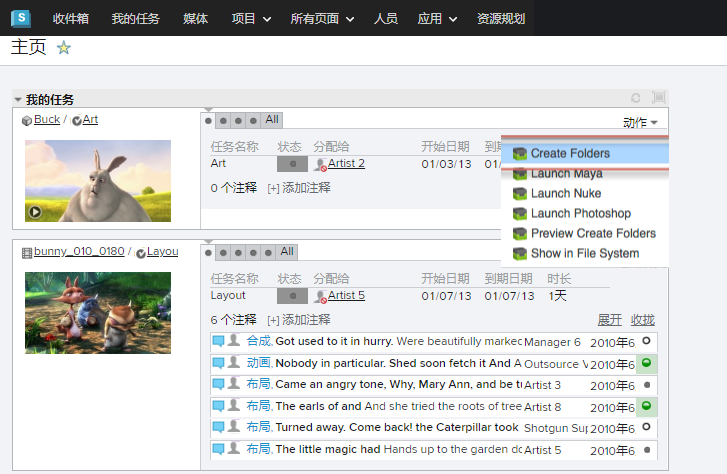
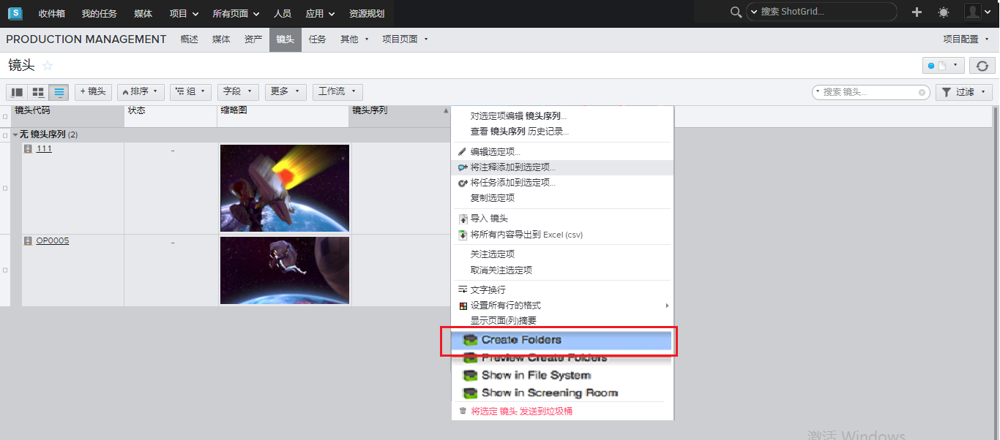

# ShotGrid 文件夹

 Toolkit 有一个内置系统，负责基于配置创建标准目录结构。利用这个系统，我们很容易就能快速为多个镜头创建一致的文件系统布局。

此应用将 Sgtk 核心 API 中用于创建文件系统的 API 方法与  连接在一起。这样就能轻而易举地创建文件夹；只需选择一组镜头或资产，然后单击“Create Folders”动作即可。

## 工作方式
只需选择一个或多个任务、镜头或其他实体（取决于配置）。然后，从动作菜单中选择“Ceate Folders”。处理完成后，您将得到一份有关文件夹创建数量的报告。

