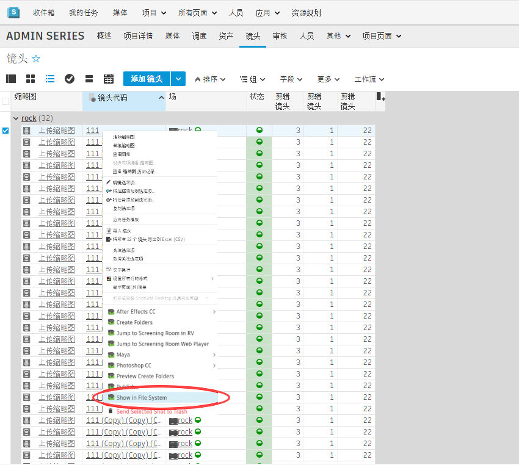

# ShotGrid 启动文件夹

启动文件夹应用是一个  实用工具，它让您可以从  跳转到文件系统中。

## 工作方式
启动文件夹应用让您可以从  跳转到文件系统中。您可以为  实体类型（如镜头、资产和场）注册该应用。激活后，它将显示在“动作”(Action)菜单中：

您可以在  中选择一个或多个条目，当单击该菜单动作时，将启动一个标准文件浏览器（在 Windows 上将启动资源管理器，在 Mac 上将启动 Finder，等等）。

