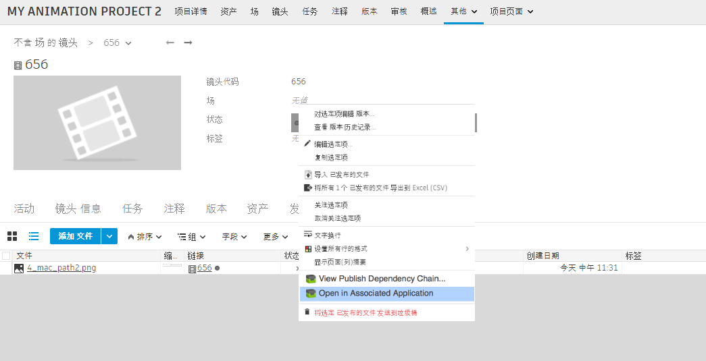

# ShotGrid 启动发布

此应用向  中的“已发布的文件”(Published File)实体添加一个“在关联应用程序中打开”(Open in Associated Application)动作。这让您可以轻松打开已发布的文件：只需导航到该文件，在文件上单击鼠标右键，然后选择动作即可。

此应用让您可轻松为不同文件配置不同的应用启动顺序 -- 所有这些都在一个挂钩内完成。它还会将图像序列发送至查看器（如 RV）。挂钩无法识别的文件将发送至操作系统级别的应用。