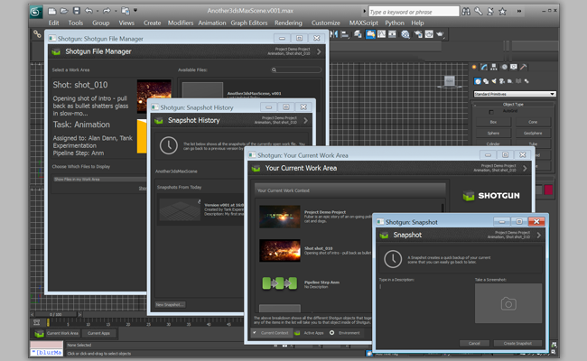

# 3dsMax Plus

 3ds Max Plus 插件在 3ds Max 应用程序与  Pipeline Toolkit 之间提供桥接。该插件支持 PySide 和所有多应用，这意味着您可以在 3ds Max 中运行我们的标准应用 - 也可以在 Maya 和 Nuke 等中运行的相同应用。该插件使用 3ds Max Plus Python API。




## 支持的应用程序版本

此插件已经过测试，已知可支持以下应用程序版本：



## 文档

此插件借助 Max Plus 的 Python 支持将  Pipeline Toolkit (Sgtk) 与 3D studio Max 连接在一起。


## 安装和更新

### 将此插件添加到  Pipeline Toolkit

如果您想将此插件添加到 Project XYZ 中名为 asset 的环境中，请执行以下命令：

```
> tank Project XYZ install_engine asset tk-3dsmaxplus
```

### 更新至最新版本

如果您已在某个项目中安装了此应用，要获取最新版本，可运行 update 命令。您可以导航到该特定项目随附的 tank 命令，并在该项目中运行它：

```
> cd /my_tank_configs/project_xyz
> ./tank updates
```

或者，也可以运行您的工作室的 tank 命令并指定项目名称，指示该命令要对哪个项目运行更新检查：

```
> tank Project XYZ updates
```


## 协作和代码演进

如果您可以获取  Pipeline Toolkit，意味着也可以获取我们在 GitHub 中存储和管理的所有应用、插件和框架的源代码。欢迎根据实际需要演进和完善这些内容，以它们为基础做进一步的独立开发，修改它们（以及向我们提交 Pull 请求！），或者只是随手玩一玩，简单了解它们的构建方式和 Toolkit 的工作原理。您可以访问此代码库 (https://github.com/shotgunsoftware/tk-3dsmaxplus)。

## 特殊要求

需要安装  Pipeline Toolkit 核心 API 版本 v0.19.18 或更高版本才能使用此功能。
