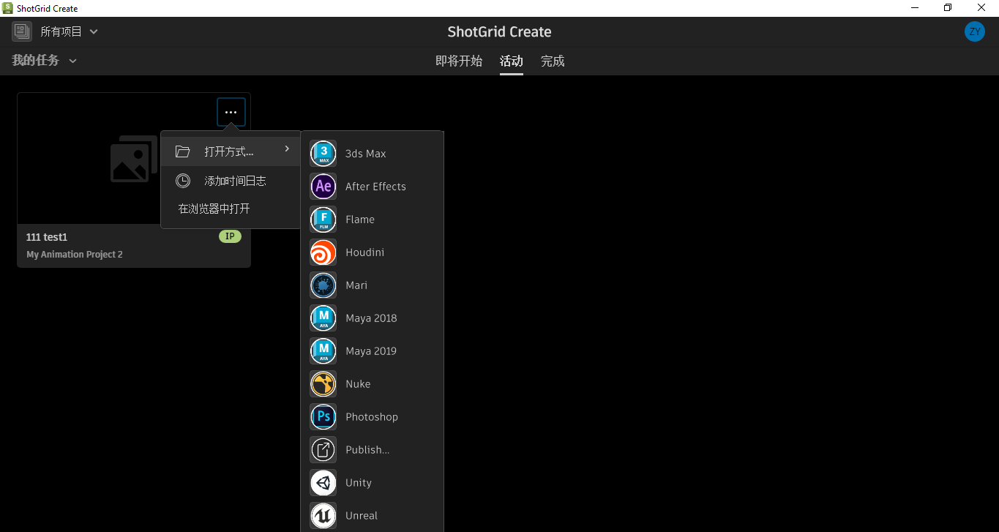

#  Create

Desktop2 插件是运行在 [ Create](https://help.autodesk.com/view/SGSUB/CHS/?guid=SG_Supervisor_Artist_sa_create_sa_intro_create_html) 应用程序内部的插件。它用于从  Create 启动 DCC 以及通过浏览器集成从  Web 应用程序启动 DCC。

tk-desktop2 插件支持 Toolkit 与  Create 的集成。 Create 支持 Toolkit 用户熟悉的功能，包括 [DCC 启动](https://help.autodesk.com/view/SGSUB/CHS/?guid=SG_Supervisor_Artist_sa_create_sa_create_artists_html#launching-your-creative-apps)。




## 安装和更新

### 将此插件添加到  Pipeline Toolkit

如果您想将此插件添加到 Project XYZ 和名为 asset 的环境中，请执行以下命令：

```
> tank Project XYZ install_engine asset tk-desktop2
Updating to the latest version
```

如果您已在某个项目中安装了此应用，要获取最新版本，可运行 `update` 命令。您可以导航到该特定项目随附的 tank 命令，并在该项目中运行它：

```
> cd /my_tank_configs/project_xyz
> ./tank updates
```

或者，也可以运行您的工作室的 `tank` 命令并指定项目名称，指示该命令要对哪个项目运行更新检查：

```
> tank Project XYZ updates
```

## 协作和代码演进
	
如果您可以获取  Pipeline Toolkit，意味着也可以获取我们在 GitHub 中存储和管理的所有应用、插件和框架的源代码。欢迎根据实际需要演进和完善这些内容，以它们为基础做进一步的独立开发，进行更改（以及向我们提交 Pull 请求！）或者只是随手玩一玩，简单了解它们的构建方式和 Toolkit 的工作原理。您可以通过 https://github.com/shotgunsoftware/tk-desktop2 访问此代码库。

## 特殊要求

需要安装  Pipeline Toolkit 核心 API 版本 v0.19.1 或更高版本才能使用此功能。

## 修复  集成错误

您的用户将收到以下错误消息：*无法初始化集成。ValueError -  中的本地主机证书数据无效! 请与支持人员联系。*此错误消息指示，当您的  实例未配置为使用  Toolkit 集成时，他们尝试访问  Toolkit 功能。 

要防止用户访问  Toolkit 并看到错误消息，请启用环境变量 `SHOTGUN_CREATE_DISABLE_TOOLKIT_INTEGRATION`。此环境变量完全禁用 Create 中的  Toolkit 集成。

如果错误地启用了此环境变量，则禁用它应该可以恢复  Toolkit 集成。
