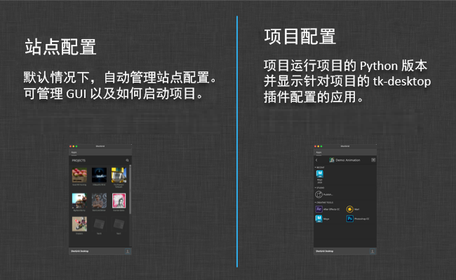

# Desktop

tk-desktop 插件是一个让您易于运行 Toolkit 应用的应用程序。它是一个基于系统托盘的窗口，通过它可轻松上手使用 Toolkit，为 Toolkit 设置项目，以及访问项目的工作流。

## 站点配置和项目配置



当您启动 Desktop 应用程序时，它会为站点配置启动 tk-desktop 插件。 此配置的管理通常是自动的，但是我们也可以禁用自动管理，自己控制环境中的一切。

Toolkit 的一个基本原则是，各个项目可以完全彼此隔离。 通常，这是为了确保一个项目的更改不会对另一个项目造成不利影响（临近交付时可能出现这种情况）。为了提供这种项目隔离机制，Desktop 插件确保无论您何时使用某个特定项目的命令，都将在专为这个项目初始化的单独 Python 解释器中运行它们。

当您单击一个项目时，后台会启动一个 Python 解释器。此 Python 解释器是为该项目配置的解释器，启动时将为该项目初始化 tk-desktop。 插件的这个实例会与图形用户界面通信，指示可以启动什么命令。

当您单击一个命令时，后台运行的 Python 进程会负责启动该命令。 这样，您便可以（例如）在一个项目上运行 Python 2.6，在另一个项目上测试 Python 2.7。

## 注册自定义面板

具有[基于面板的 UI](http://developer.shotgridsoftware.com/tk-core/platform.html#sgtk.platform.Engine.show_panel) 的 Toolkit 应用执行时将自动停靠在 Desktop 内的选项卡中。

如果您有基于面板的应用（如  面板）并希望它在  Desktop 中显示为选项卡，只需将其配置为在启动时运行。Desktop 在其站点上下文模式下启动时（此时它显示所有项目），它将启动注册为自动启动的所有项。如果其中任何项是面板，则这些项将会停靠。这些项按其在配置中定义的顺序进行处理，该顺序即表示选项卡顺序。

例如，如果您希望  面板在  Desktop 中显示为选项卡，则为您的站点级环境添加以下配置：

```yaml
tk-desktop:
  apps:
    tk-multi-shotgunpanel:
      actions_hook: ...
      action_mappings: ...
      location: ...
  location: ...
  run_at_startup:
    - { app_instance: "", name: Apps }
    - { app_instance: tk-multi-shotgunpanel, name: "" }
```

请注意，特殊的 `Apps` 条目控制默认 `Apps` 选项卡应显示的位置（按照选项卡顺序）。
