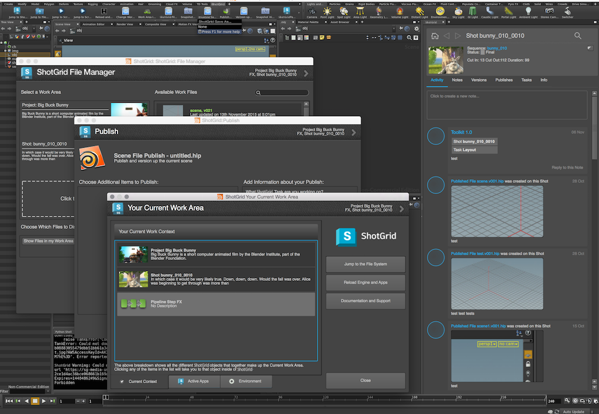

# Houdini

 Houdini 插件包含一个用于在 Houdini 中集成  应用的标准平台。




# 应用开发人员须知

## 支持的平台

 Houdini 插件目前支持在 Windows、Linux 和 OS X 平台运行

## 支持的应用程序版本

此插件已经过测试，已知可支持以下应用程序版本： 



## PySide

对于先前的 Houdini 版本（13 及更早），需要安装 PySide 的外部版本。在 Windows 上，我们已经捆绑了一个兼容的 PySide 版本，该版本可支持 Houdini 运行的 Python。在 Linux 上，Houdini 使用系统 Python（依据https://www.sidefx.com/docs/houdini12.0/hom/），而系统 Python 需要具有 PySide 或 PyQt 支持。

## 菜单加载


自 Houdini 15 起，Side Effects 引入了一个动态菜单系统，因此插件现在支持在上下文切换时重建  菜单。 

在 Houdini 14 及更早的版本中， 菜单在 Houdini 启动前生成，并且在整个会话期间是静态的。因此，菜单中注册的 Toolkit 命令不会随上下文变化而更新。

##  工具架


发布版本 **v0.2.4** 为插件引入了一个动态的  工具架。此工具架将所有注册的应用命令显示为工具按钮。按钮将按照与菜单命令大致相同的顺序显示。

使用 `enable_sg_shelf` 设置可在环境内开启此工具架。如果使用不支持动态菜单的 Houdini 版本（14 或更早的版本），使用工具架时可能还要关闭  菜单。通过将 `enable_sg_menu` 设置设定为 `false`，可以做到这一点。

要启用通过工具架切换上下文的功能，您还需要在插件配置中向 `tk-multi-workfiles` 应用的 `sg_entity_types` 设置添加实体类型。

 工具架的相关设置看起来如下所示：

```yaml
tk-houdini:
  apps:
    # ... other app definitions
    tk-multi-workfiles:
       # ... other app settings
       sg_entity_types: [Shot, Asset] # allow context switching to Shots or Assets
       # ... other app settings
  enable_sg_shelf: true
  enable_sg_menu: false
  # ... other engine settings
```

启用  工具架后，您需要手动将它添加到 Houdini 内部的一个工具架集。 


 工具架添加到工具架集后，在两次 Houdini 会话之间将留在该工具架集中，并会随  上下文的变化动态更新。 

## 面板

自 **v0.2.8** 起，插件增加了对嵌入式 Toolkit 面板的支持。

面板支持目前需要使用 Houdini 版本 **15.0.272** 或更新版本，以便面板正确嵌入。在支持的 Houdini 版本中，注册的面板将以窗格形式显示在窗格菜单中。

在先前的 Houdini 版本中，注册面板将显示为对话框。SESI 可能会将某些问题修复向后移植到 Houdini 14 的较新内部版本中。当出现这种情况时，我们会使嵌入式面板也支持这些版本。 

## 具有 OTL 的应用

 Houdini 插件让您可轻松加载应用程序随附的 OTL。如果您编写的应用使用 OTL，只需将这些 OTL 放入名为 **otls** 的文件夹，插件便会自动将它们加载到会话中：


然后，您可以通过常用的 Houdini 方法轻松访问您的节点。

**警告！！**请注意，虽然 OTL 用起来可能很方便，但如果您想在场景中创建持久性节点，使用 OTL 往往并不合适。这是因为一旦将 OTL 放入场景，就在该场景与 OTL 代码之间建立了依赖关系。这样，不仅需要在每次加载场景时都加载  Toolkit，还需要小心管理代码，确保代码的任何更新都不会影响场景中使用的旧 OTL。

## 在 OS X 上通过终端进行启动调试

在 OS X 上为 `tk-houdini` 插件开启 `debug_logging` 功能，并不会将所有调试消息都发送至终端。这是因为默认情况下，[`tk-multi-launchapp`](https://github.com/shotgunsoftware/tk-multi-launchapp) 应用使用 `open` 命令启动可执行文件。这样并不会从终端生成一个新的子进程，而是使用 OS X 的启动服务在别处创建一个新进程。因此，不会显示日志语句。即使在用户默认桌面的 Houdini 中保存一个 Python Shell，似乎也不会在启动时显示调试语句。启动后，嵌入式 Python Shell 会显示调试日志记录语句，但是启动期间的可用输出存在差异。如果您需要在插件启动期间访问调试日志记录语句，可以进行两处更改。

首先，更改测试配置中的 `houdini_mac` 路径（临时），将其指向 Houdini 应用包内的可执行文件。例如：

```yaml
#houdini_mac: /Applications/Houdini 15.0.272/Houdini Apprentice.app
houdini_mac: /Applications/Houdini\ 15.0.272/Houdini\ Apprentice.app/Contents/MacOS/happrentice
```

接下来，可以在测试配置的 `config/hooks` 目录中为 `tk-multi-launchapp` 应用的 `app_launch` 挂钩创建一份副本，并在 `config/env/includes/app_launchers.yml` 文件中指向该副本：

```yaml
launch_houdini:
  defer_keyword: ''
  engine: tk-houdini
  extra: {}
  hook_app_launch: app_launch    # <----- use a custom app_launch hook
  hook_before_app_launch: default
  icon: '{target_engine}/icon_256.png'
  linux_args: ''
  linux_path: '@houdini_linux'
  location: {name: tk-multi-launchapp, type: app_store, version: v0.6.6}
  mac_args: ''
  mac_path: '@houdini_mac'
  menu_name: Launch Houdini
  versions: []
  windows_args: ''
  windows_path: '@houdini_windows'
```

然后，只需修改启动逻辑，直接启动可执行文件即可。例如，您可以针对目录（应用程序包）保留旧的行为，在其他情况下直接执行命令。示例如下： 

```python
        elif system == "darwin":
            # on the mac, the executable paths are normally pointing
            # to the application bundle and not to the binary file
            # embedded in the bundle, meaning that we should use the
            # built-in mac open command to execute it
            if os.path.isdir(app_path):
                cmd = "open -n \"%s\"" % (app_path)
                if app_args:
                    cmd += " --args \"%s\"" % app_args.replace("\"", "\\\"")

            # not a directory, execute directly
            else:
                cmd = "%s %s" % (app_path, app_args.replace("\"", "\\\""))
```

下次在终端中通过 `tank` 运行 `launch_houdini` 时，应该可以得到所有调试输出信息。完成测试后，别忘了还原路径并撤消所做的应用启动更改。祝您调试顺利！
