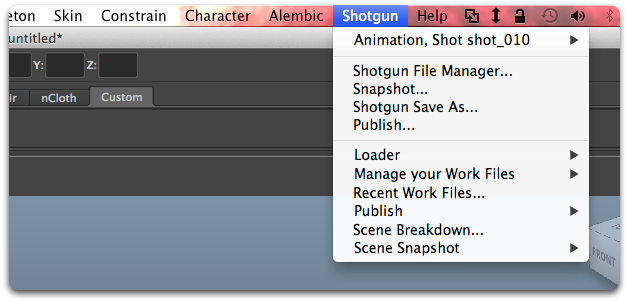

# Maya

 Maya 插件包含一个用于在 Maya 中集成  应用的标准平台。它采用轻量型设计，操作简单直观，并会向 Maya 菜单栏中添加一个  菜单。



## 支持的应用程序版本

此插件已经过测试，已知可支持以下应用程序版本：



请注意，此插件也许（甚至非常有可能）支持更新的发行版本，但是尚未正式在这些版本中进行测试。

## PySide

 Maya 插件包含一个 PySide 安装，必要时会激活此安装。

## Maya 项目管理

 Maya 插件在每次启动时，都会将 Maya 项目设置为指向此插件的设置中定义的位置。这意味着，当您打开新文件时，项目也可能会发生变化。我们可以使用模板系统，在配置文件中配置有关基于文件设置 Maya 项目的详细信息。

## 安装和更新

将此插件添加到  Pipeline Toolkit
如果要将此插件添加到 Project XYZ 和名为 asset 的环境，请执行以下命令：

```
> tank Project XYZ install_engine asset tk-maya
```

### 更新至最新版本

如果您已在某个项目中安装了此应用，要获取最新版本，可运行 `update` 命令。您可以导航到该特定项目随附的 tank 命令，并在该项目中运行它：

```
> cd /my_tank_configs/project_xyz
> ./tank updates
```

或者，也可以运行您的工作室的 tank 命令并指定项目名称，指示该命令要对哪个项目运行更新检查：

```
> tank Project XYZ updates
```

## 协作和代码演进

如果您可以获取  Pipeline Toolkit，意味着也可以获取我们在 GitHub 中存储和管理的所有应用、插件和框架的源代码。欢迎根据实际需要演进和完善这些内容，以它们为基础做进一步的独立开发，修改它们（以及向我们提交 Pull 请求！），或者只是随手玩一玩，简单了解它们的构建方式和 Toolkit 的工作原理。您可以访问此代码库 (https://github.com/shotgunsoftware/tk-maya)。


