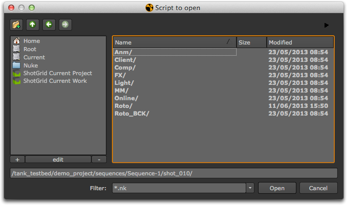
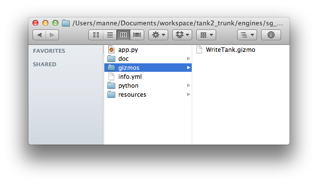
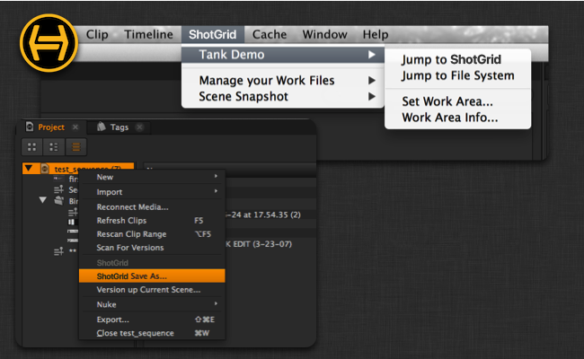
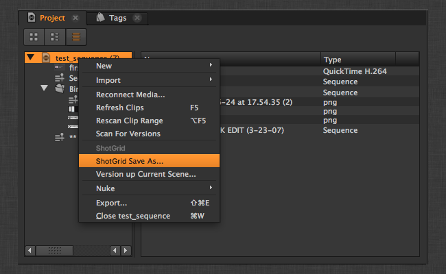
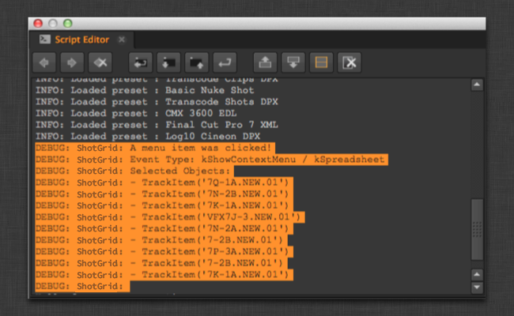

# Nuke

 Nuke 插件包含一个用于在 Nuke、Nuke Studio 和 Hiero 中集成  应用的标准平台。它采用轻量型设计，操作简单直观，并会向 Nuke 中添加一系列新功能。

它会在 Nuke 中创建一个 ** 菜单**，上面显示各种菜单项：


它会在 Nuke 中创建一个 ** 节点菜单**，上面显示各种菜单项：


它会向文件对话框中添加  快捷方式，以便可轻松跳转至文件系统的不同位置：



您可以使用 `favourite_directories` 设置，基于当前环境中的模板路径添加自己的快捷方式。该设置应为词典列表，每个列表项表示一个新的收藏夹目录。下面是一个可使用的格式示例：（也可以不指定图标，方法是提供 "" 值。）

```yaml
  favourite_directories:
  - display_name: "Shot Publish Path"
    template_directory: "shot_publish_area_nuke"
    icon: "icons/custom_publish_icon.png"
  - display_name: "Shot Work Path"
    template_directory: "shot_work_area_nuke"
    icon: "icons/custom_work_icon.png"
```

对于定义的每个根目录，会自动添加一个“ Current Project”收藏夹。您可以使用 `project_favourite_name` 设置来自定义名称，也可以将此值设置为空字符串 `''`，禁用这些收藏夹。


***

_注意：目前，Nuke 8.0 在 CentOS 6.5 这个特定版本上运行时存在一个错误，会导致 Nuke 在运行 Toolkit 时发生崩溃。其他版本的 CentOS 不受影响。The Foundry 已知晓此问题（错误号 43766）。如果您遇到此问题，请联系我们，我们可以尝试帮助您以变通方法暂时绕过此问题，直到 Nuke 在以后的更新中修复它。_


## 应用开发人员须知

### 上下文跟踪

 Nuke 插件会在加载文件时自动切换上下文。文件加载后，插件会查看该文件，并尝试从中解析上下文。

### 具有自定义小控件的应用

 Nuke 插件让您可轻松处理自定义小控件 (Gizmo)。如果您编写的应用使用自定义小控件，只需将这些小控件放入名为 **gizmos** 的文件夹，插件便会自动将该位置添加到 nuke 路径：



然后，您可以通过“创建节点”功能轻松访问小控件：

* `nuke.createNode("WriteTank")`



### 创建节点的应用

对于会创建自定义 Nuke 节点的应用，需要小心对待。我们建议不要使用小控件，因为它们需要在场景与小控件代码之间建立依赖关系。可以将自定义节点另存为 Nuke 文件，然后将它们导入场景：

```python
    group_node_script = os.path.join(self.disk_location, "resources", "my_group_node.nk")
    group_node = nuke.nodePaste(group_node_script)
```

任何从应用内调用节点的代码均可直接使用返回的实例。

任何需要从组内部调用应用的代码，在调用时要特别小心，以确保代码的向后兼容性。我们建议您遵循以下做法：

应用启动时，将应用句柄注册为 Nuke 命名空间的一部分：

```python
    def init_app(self):

        nuke.tk_nuke_nameofmyapp = self
```

如果您在组节点上有一个按钮，并且想调用某段  应用代码，当找不到  Toolkit 时，请尝试以正常方式提示失败。下面的代码与一个 Python 按钮关联，该按钮属于应用可以创建的组节点：

```python
# have to gracefully support the case when
# sgtk is not in the system at all!
import nuke
try:
  app = nuke.tk_nuke_nameofmyapp
  app.do_something_v1(nuke.thisNode())
except:
  nuke.warning("Could not do XYZ! Most likely Sgtk is not currently active.")
```

如果您更改了应用的行为，只需在应用回调时保持版本号递增，这样您的应用代码就能同时支持新旧两种行为。

## 在 Hiero 内使用  Nuke 插件

 Nuke 插件还用于构建在 Hiero 内运行的可感知  的集成。

通过它，您可以在应用程序中的一些位置放置  应用动作，比如在主菜单栏上的特定  菜单中和不同 Hiero 面板中的各种右键单击上下文菜单中。



### 如何配置 Hiero 菜单

由于 Hiero 有多种不同的菜单，因此，用于配置菜单项放置位置的选项要比诸如 Maya 或 Nuke 等应用程序中更多。 Nuke 插件的 Hiero 工作流配置可能如下所示：

```yaml

  tk-hiero:
    location: {name: tk-nuke, type: app_store, version: v0.6.9}
    debug_logging: false

    timeline_context_menu:
    - {app_instance: tk-hiero-openinshotgun, keep_in_menu: false, name: Open in Shotgun, requires_selection: true}

    spreadsheet_context_menu:
    - {app_instance: tk-hiero-openinshotgun, keep_in_menu: false, name: Open in Shotgun, requires_selection: true}

    bin_context_menu:
    - {app_instance: tk-multi-workfiles, keep_in_menu: false, name: " Save As...", requires_selection: true}
    - {app_instance: tk-multi-workfiles, keep_in_menu: false, name: "Version up Current Scene...", requires_selection: true}
    - {app_instance: tk-multi-snapshot, keep_in_menu: false, name: "Snapshot...", requires_selection: true}
    - {app_instance: tk-multi-snapshot, keep_in_menu: false, name: "Snapshot History...", requires_selection: true}
    - {app_instance: tk-multi-publish, keep_in_menu: false, name: "Publish Project...", requires_selection: true}

    menu_favourites:
    - {app_instance: tk-multi-workfiles, name: Shotgun File Manager...}
```

大多数插件都有一个 `menu_favourites` 选项，这是一个列表，您可以在这里指定要放在  主菜单上的“快捷方式”。除此以外，特定于 Hiero 的配置还有三个特殊部分：

- `timeline_context_menu` 表示在时间线编辑器中的视频片段上单击鼠标右键时弹出的菜单。
- `spreadsheet_context_menu` 表示在电子表格编辑器中的选定项上单击鼠标右键时弹出的菜单。
- `bin_context_menu` 表示在 bin 编辑器中的选定项上单击鼠标右键时弹出的菜单，您可以在该菜单上看到所有不同的项目和媒体。

要向这些菜单中添加菜单项，只需确保配置中定义的 `name` 字段与应用在自己菜单中显示的内容一致即可。

#### 需要用到当前场景概念的应用

某些 Toolkit 应用需要用到默认场景或默认项目的概念。例如，快照应用知道如何为当前场景拍摄快照。但是，与 Maya 或 Nuke 不同，Hiero 没有当前场景的概念。在 Hiero 中，可以同时打开多个项目。因此，您常常需要在挂钩中添加特殊的逻辑，帮助应用（比如快照应用）识别用户正在单击哪个项目。在本文档接下来的部分，我们将对此加以说明。

### 应用开发人员须知

因为 Hiero 没有当前项目的概念，我们加入了更强大的工具，让应用很容易就能识别用户在 Hiero 内单击了什么对象。 Hiero 插件为此加入了两个方法：


#### get_menu_selection()

返回最近一次单击菜单操作选中的 Hiero 对象的列表。
此列表可能包含各种类型的内容项。要了解哪种方法到底返回了什么内容，可开启调试日志记录功能 - 此功能会将具体的过程打印出来。

下面是返回的各种对象的示例：

- 在 bin 视图中选择一个项目：[hiero.core.Bin](https://learn.foundry.com/hiero/developers/2.0/hieropythondevguide/api/api_core.html#hiero.core.Bin)
- 在 bin 视图中选择一个内容项：[hiero.core.BinItem](https://learn.foundry.com/hiero/developers/2.0/hieropythondevguide/api/api_core.html#hiero.core.BinItem)
- 选择轨道：[hiero.core.TrackItem](https://learn.foundry.com/hiero/developers/2.0/hieropythondevguide/api/api_core.html#hiero.core.TrackItem)

`list` engine_object.get_menu_selection()

**参数和返回值**

* **返回值：**Hiero 对象列表

**示例**

获取最近一次单击操作选中的对象，确保选中的只有一个对象，并且此对象是有效的 Hiero 项目。 例如，当您想在 Hiero 中触发某个项目的保存、加载或发布操作时，此设置非常有用。

```python
# get the menu selection from the engine
selection = engine_obj.get_menu_selection()

if len(selection) != 1:
    raise TankError("Please select a single Project!")

if not isinstance(selection[0] , hiero.core.Bin):
    raise TankError("Please select a Hiero Project!")

project = selection[0].project()
if project is None:
    # apparently bins can be without projects (child bins I think)
    raise TankError("Please select a Hiero Project!")
```

#### HieroEngine.get_menu_category()

返回上次发生单击菜单操作的用户界面区域。此命令不太可能会用到 - 当您希望应用命令根据调用它时所在的菜单做出不同行为时，可能需要使用此命令。

`area_enum` engine_object.get_menu_category()

**参数和返回值**

返回以下常量之一：

- `HieroEngine.HIERO_BIN_AREA`
- `HieroEngine.HIERO_SPREADSHEET_AREA`
- `HieroEngine.HIERO_TIMELINE_AREA`
- `None`（表示未知或未定义）

#### 如何配置挂钩以支持 Hiero

为 Hiero 配置的多用应用通常需要判断用户单击的是哪个项目。例如，`tk-multi-workfiles` 应用需要对项目执行“ 另存为”操作。因此，我们向 Hiero 中的 bin 菜单添加了 Tank Save As 命令，这样用户便可在 bin 视图中的项目上单击鼠标右键并选择“另存为”(Save As)**选项。



插件配置将如下所示：

```yaml
bin_context_menu:
- {app_instance: tk-multi-workfiles, keep_in_menu: false, name: " Save As...", requires_selection: true}
```

现在，在应用本身中，每个插件需要配置一个挂钩，用来处理诸如保存和加载这样的场景事件。 对于 Maya 或 Nuke 这样的应用程序，通常只要进行保存、加载等操作即可。
但是对于 Hiero，则需要首先判断用户实际单击的是哪个项目。上面示例中的挂钩代码将如下所示：

```python
class SceneOperation(Hook):
    """
    Hook called to perform an operation with the
    current scene
    """

    def execute(self, operation, file_path, context, **kwargs):
        """
        Main hook entry point

        :operation: String
                    Scene operation to perform

        :file_path: String
                    File path to use if the operation
                    requires it (e.g. open)

        :context:   Context
                    The context the file operation is being
                    performed in.

        :returns:   Depends on operation:
                    'current_path' - Return the current scene
                                     file path as a String
                    'reset'        - True if scene was reset to an empty
                                     state, otherwise False
                    all others     - None
        """

        if operation == "current_path":
            # return the current script path
            project = self._get_current_project()
            curr_path = project.path().replace("/", os.path.sep)
            return curr_path

        elif operation == "open":
            # open the specified script
            hiero.core.openProject(file_path.replace(os.path.sep, "/"))

        elif operation == "save":
            # save the current script:
            project = self._get_current_project()
            project.save()

        elif operation == "save_as":
            project = self._get_current_project()
            project.saveAs(file_path.replace(os.path.sep, "/"))

        elif operation == "reset":
            # do nothing and indicate scene was reset to empty
            return True

        elif operation == "prepare_new":
            # add a new project to hiero
            hiero.core.newProject()


    def _get_current_project(self):
        """
        Returns the current project based on where in the UI the user clicked
        """

        # get the menu selection from the engine
        selection = self.parent.engine.get_menu_selection()

        if len(selection) != 1:
            raise TankError("Please select a single Project!")

        if not isinstance(selection[0] , hiero.core.Bin):
            raise TankError("Please select a Hiero Project!")

        project = selection[0].project()
        if project is None:
            # apparently bins can be without projects (child bins I think)
            raise TankError("Please select a Hiero Project!")

        return project
```

#### 使用调试日志记录功能查看菜单事件

如果您想知道单击某个选择项时 Hiero 返回哪些对象，只需开启插件调试模式即可。 在脚本编辑器中，可以看到每次单击操作选择的对象的摘要信息：



