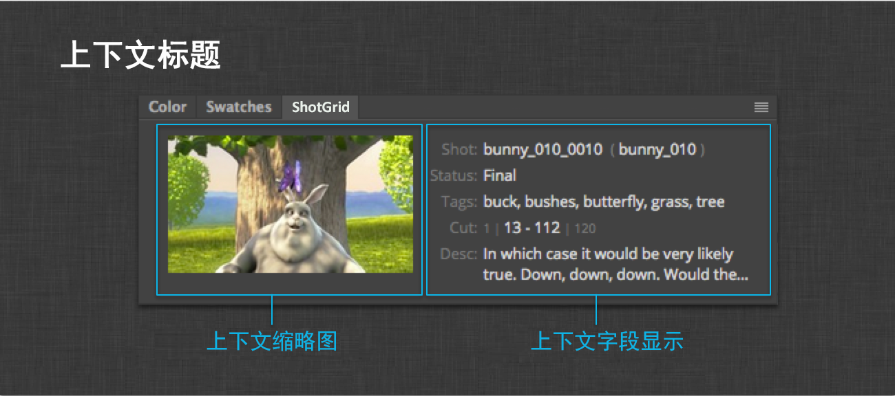

# Photoshop

 Photoshop CC 插件提供一个用于在 Photoshop CC 工作流中集成  的标准平台。它包含一个标准  Pipeline Toolkit 插件并依赖于 [tk-framework-adobe](https://github.com/shotgunsoftware/tk-framework-adobe) (CEP)。

启用后，Photoshop CC 中将出现一个 **** 面板。此面板显示有关当前  上下文以及该上下文中安装的应用注册的各种命令的信息。


## 界面概述

 扩展面板采用与原生 Photoshop CC 面板相同的配色和基本布局。面板有五个部分组成：


1. **上下文标题** - 当前上下文的缩略图和字段。
2. **收藏工具架** - 用于显示当前上下文中最常用的应用。
3. **命令列表** - 当前上下文的所有未收藏命令。
4. **上下文菜单** - 其他与上下文相关的命令和调试工具。
5. **日志记录控制台** - 一个控制台叠加层，显示调试的日志记录输出。

## 安装

 Photoshop CC 插件在安装方面遵循与其他  集成相同的协议。有关安装插件和应用的信息，请参见[管理 Toolkit](https://support.shotgunsoftware.com/hc/zh-cn/articles/219033178) 文章。此外，您还可以参考[默认 Toolkit 配置](https://github.com/shotgunsoftware/tk-config-default2)，以它为例了解如何配置集成。

## 启用扩展

安装此扩展后，需要通过 Photoshop CC 中的扩展菜单启动它。


此操作只需要做一次，之后  扩展面板便可一直留在 Photoshop CC 布局中，后续启动时不必再启用。

启用后，在以后启动时，扩展面板将在引导  集成期间显示一个正在加载屏幕。

此屏幕通常会持续显示几秒钟，待当前上下文确定后再显示命令。

## 界面组成部分

以下部分概述了  Photoshop CC 集成的组成部分。

### 上下文标题

上下文标题是一个可自定义的区域，可显示有关当前  上下文的信息。



上下文由当前激活的文档决定。插件确定上下文后，标题会更新并显示上下文的缩略图字段详情。这些字段信息由一个挂钩来控制。有关如何对字段的显示进行自定义的信息，请参见下面的**上下文字段显示挂钩** 部分。

另外还要注意的是，由于 Photoshop CC 是一个多文档界面，上下文（因此也包括  扩展）会随着您切换激活文档而更新。艺术家要理解这种行为，特别是当同时在多个  上下文中工作时，明白这一点非常重要。

### 收藏工具架

收藏工具架与 Maya 和 Houdini 等其他  DCC 集成中提供的菜单收藏夹类似。在界面的这个部分，用户随手即可访问最常用的 Toolkit 应用，并可按照上下文标题轻松找到应用。


此工具架以按钮的形式显示收藏的命令，将鼠标移至这些按钮时，按钮从灰色变为彩色，同时顶部的标签中显示它们的名称。将鼠标悬停在按钮上方时，将显示它们的工具提示。

单击其中一个按钮，将触发回调，执行注册的命令。

有关如何指定命令收藏夹的详细信息，请参见下面的**工具架收藏夹**部分。

### 命令列表

命令列表显示当前上下文注册的其他“常规”命令。


通常，工作流配置内安装的应用会注册一个或多个命令，这些命令将显示在这里。如果命令未标识为收藏项，也未被指定为上下文菜单命令，它们将显示在此处。

命令列表中按钮的行为与收藏工具架中按钮的行为类似。唯一真正的区别在于它们以列表的形式显示，并且其图标右侧带有完整名称。

### 上下文菜单

所有注册为上下文菜单命令的命令将显示在  扩展面板的上下文菜单中。


与其他命令区域一样，这些命令会随上下文一起变化。诸如 **Jump to ** 和 **Jump to Filesystem** 这样的命令将始终位于此处。

### 日志记录控制台

日志记录控制台同时显示来自 CEP Javascript 解释器和 Toolkit Python 进程的所有日志记录输出。


当扩展遇到任何需要技术支持的问题时，日志记录控制台的输出就变得极为有用，这些信息可帮助  技术支持团队调试问题。

## 配置和技术细节

以下部分对集成中技术性更强的一些方面进行了概述，以帮助您根据自己工作室工作流的具体需求来配置集成。

### PySide

 Photoshop CC 插件依赖于 PySide。请参见有关[安装 Pyside](http://pyside.readthedocs.io/en/latest/installing/index.html) 的官方说明。

### CEP 扩展

扩展本身与插件捆绑在一起，插件会在首次启动 Photoshop CC 时自动安装扩展。扩展安装在美工人员的本地计算机上，位于操作系统特定的标准 CEP 扩展目录中：

```shell
# Windows
> C:\Users\[user name]\AppData\Roaming\Adobe\CEP\extensions\

# OS X
> ~/Library/Application Support/Adobe/CEP/extensions/
```

每次启动 Photoshop CC 时，插件引导代码会对照计算机上安装的扩展版本，检查随插件捆绑的扩展版本。这意味着，当插件更新后，假设它随附了一个新的扩展版本，已安装的扩展会自动更新为新捆绑的版本。

### 配置收藏夹

我们可以配置**收藏工具架**，让它显示已安装应用的任何注册命令。要执行此操作，只需向环境配置的 `tk-photoshopcc` 部分添加 `shelf_favorites` 设置即可。示例如下：

```yaml
shelf_favorites:
    - {app_instance: tk-multi-workfiles2, name: File Save...}
    - {app_instance: tk-multi-workfiles2, name: File Open...}
    - {app_instance: tk-multi-publish, name: Publish...}
    - {app_instance: tk-multi-snapshot, name: Snapshot...}
```

设置的值是一个词典列表，每个词典指定了配置中安装的一个应用提供的一个注册命令。`app_instance` 键标识了一个特定的已安装应用，`name` 键则与该应用注册的命令的显示名称一致。在上面的示例中，您可以看到四个收藏的命令：`tk-multi-workfiles2` 应用的“File Open”和“File Save”对话框，以及 Toolkit 的“发布”(Publish)和“Snapshot”标准对话框。这四个命令现在将显示在收藏工具架中。

### 上下文字段显示挂钩

插件随附了一个挂钩，用来控制面板的**上下文标题**部分显示的字段。我们可以改写挂钩中的两个方法来自定义显示的内容。

第一个方法是 `get_entity_fields()` 方法。此方法接受一个表示当前  上下文的实体类型。返回的值应该是要为该实体查询并显示的各个字段的列表。插件自己负责异步查询数据。

从  查询到数据后，会调用挂钩中的第二个方法。此方法是 `get_context_html()` 方法，它接受上下文实体词典，其中填充有 `get_entity_fields()` 方法指定的查询字段。返回的值应该是一个字符串，该字符串包含带格式的 HTML，用以显示查询到的实体字段。

[默认的挂钩执行](https://github.com/shotgunsoftware/tk-photoshopcc/blob/master/hooks/context_fields_display.py)对于了解这些方法都需要什么来说是一个很好的参考。

要注意的是，插件始终会显示实体的缩略图（如果有的话）。

### Photoshop API

插件向 Python 公开了适用于 Photoshop CC 的 Javascript API。单击[此处](http://wwwimages.adobe.com/content/dam/Adobe/en/devnet/photoshop/pdfs/photoshop-cc-javascript-ref-2015.pdf)可查看此 API 的完整文档。

Photoshop API 对象被公开为 `engine.adobe`。下面的示例说明怎样才能从 Toolkit 应用和挂钩内直接操纵 Photoshop DOM。标准 Toolkit 应用还包含有关如何与 Photoshop 文档进行交互的可行示例。

#### 示例
加载文件：

```python
f = adobe.File('/Path/To/File.jpeg')
adobe.app.load(f)
```

将标尺单位设置为像素 (PIXELS)：

```python
pixels = adobe.Units.PIXELS
adobe.app.preferences.rulerUnits = pixels
```

使用默认选项将当前文档导出为 Web 格式：

```python
temp_thumb_file = adobe.File(out_path)
save_for_web = adobe.ExportType.SAVEFORWEB
export_options = adobe.ExportOptionsSaveForWeb()
adobe.app.activeDocument.exportDocument(temp_thumb_file, save_for_web, export_options)
```

将每个层导出为单独的文件：

```python
doc = adobe.app.activeDocument
layers = doc.artLayers
layers = [layers[i] for i in xrange(layers.length)]
original_visibility = [layer.visible for layer in layers]

save_for_web = adobe.ExportType.SAVEFORWEB
export_options = adobe.ExportOptionsSaveForWeb()

for layer in layers:
    layer.visible = False

for layer in layers:
    layer.visible = True
    out_file = adobe.File("c:/layer.%s.jpg" % str(layer.name))
    doc.exportDocument(
        out_file,
        save_for_web,
        export_options,
    )
    layer.visible = False

for (i, layer) in enumerate(layers):
    layer.visible = original_visibility[i]
```

### 环境变量

为了辅助调试，有一组环境变量可用来更改插件的某些默认值：

`SHOTGUN_ADOBE_HEARTBEAT_INTERVAL` - Python 的心跳检测间隔（以秒为单位，默认为 1 秒）。如果设置了旧的环境变量 `SGTK_PHOTOSHOP_HEARTBEAT_INTERVAL`，此变量也有效。

`SHOTGUN_ADOBE_HEARTBEAT_TOLERANCE` - 退出前允许出现的心跳检测错误的数量（默认值为 2）。如果设置了旧的环境变量 `SGTK_PHOTOSHOP_HEARTBEAT_TOLERANCE`，此变量也有效。

`SHOTGUN_ADOBE_NETWORK_DEBUG` - 在输出日志记录时包含附加的网络连接调试消息。如果设置了旧的环境变量 `SGTK_PHOTOSHOP_NETWORK_DEBUG`，此变量也有效。

`SHOTGUN_ADOBE_PYTHON` - 启动插件时使用的 Python 可执行文件的路径。如果不设置，将使用系统的 Python。如果 Photoshop 是从某个 Python 进程启动（如  Desktop 或通过 tk-shell 插件），则 Photoshop 集成将使用该进程使用的 Python。

注意：其他环境变量存在于 Adobe 框架中。有关详细信息，请参见[开发人员文档](https://developer.shotgunsoftware.com/tk-framework-adobe/)。

### 应用开发人员须知

* 因为 Python 进程与 Photoshop CC 进程彼此分离，所以插件内部会进行一些处理，让应用窗口以尽可能整洁的方式显示在 Photoshop 窗口之上。此项设置需要注意的一点是，默认选项是为 `QFileDialog` 使用原生操作系统窗口。如果您开发的是与此插件一起使用的应用，要确保将此选项设置为不使用原生对话框。 [请参见 tk-multi-pythonconsole 应用中关于此选项的示例](https://github.com/shotgunsoftware/tk-multi-pythonconsole/blob/master/python/app/console.py#L218)。
