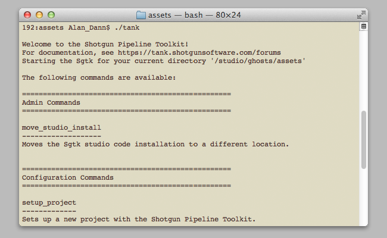

# Shell

 Shell 插件可处理命令行的交互，并与随核心 API 一起分发的 `tank` 命令紧密集成。当您在终端中执行 `tank` 命令时，Toolkit 会启动该插件来负责应用的执行。

有关 tank 命令的详细信息，请参见[高级 Toolkit 管理文档](https://developer.shotgridsoftware.com/zh_CN/425b1da4/?title=Advanced+Toolkit+Administration#using-the-tank-command)。



## 安装和更新

### 将此插件添加到  Pipeline Toolkit

如果您想将此插件添加到 Project XYZ 中名为 asset 的环境中，请执行以下命令：


```
> tank Project XYZ install_engine asset tk-shell
```

### 更新至最新版本

如果您已在某个项目中安装了此应用，要获取最新版本，可运行 `update` 命令。您可以导航到该特定项目随附的 tank 命令，并在该项目中运行它：

```
> cd /my_tank_configs/project_xyz
> ./tank updates
```

或者，也可以运行您的工作室的 `tank` 命令并指定项目名称，指示该命令要对哪个项目运行更新检查：

```
> tank Project XYZ updates
```

## 协作和代码演进

如果您可以获取  Pipeline Toolkit，意味着也可以获取我们在 GitHub 中存储和管理的所有应用、插件和框架的源代码。欢迎根据实际需要演进和完善这些内容，以它们为基础做进一步的独立开发，修改它们（以及向我们提交 Pull 请求！），或者只是随手玩一玩，简单了解它们的构建方式和 Toolkit 的工作原理。您可以通过 https://github.com/shotgunsoftware/tk-shell 访问此代码库。