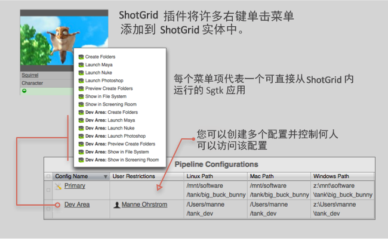

# 



 插件用来管理可以从  内启动的应用。有时，我们称这些 Toolkit 应用为“动作”**。它们通常以菜单项的形式显示在  内的菜单上。

## 使用  Pipeline Toolkit 动作

 主页上列出了这些动作：


另外，您也可以在标准  上下文菜单上找到这些动作，在对象或选择内容上单击鼠标右键即可显示上下文菜单：


单击某个动作，将立即开始处理操作。应用完成处理后，通常会显示一条包含状态信息的消息，如果动作未正常运行，则会显示错误消息。

## 为  开发应用

开发在  内运行的应用非常简单！如果您不熟悉应用开发的一般流程，请访问平台文档库阅读相关的介绍资料。在这部分，我们将只介绍应用开发流程中特定于  的方面！

自 Core v0.13 起，所有多用应用都可以与  插件一起使用。从技术上讲， 插件与其他插件没有太大区别，但还是有些细微差异：

* 如果想在  插件中执行基于 QT 的应用，需要在标准 Python 环境中手动安装 PySide 或 PyQt。
* 在  插件中，可根据用户所属的权限组向用户显示动作。例如，如果想向  动作菜单添加某个命令，并且只希望管理员才能看到该命令，就可以使用此功能。

一个样式简单、仅对管理员可见的  应用如下所示：

```python
from tank.platform import Application

class LaunchPublish(Application):

    def init_app(self):
        """
        Register menu items with 
        """        
        params = {
            "title": "Hello, World!",
            "deny_permissions": ["Artist"],
        }

        self.engine.register_command("hello_world_cmd", self.do_stuff, params)


    def do_stuff(self, entity_type, entity_ids):
        # this message will be displayed to the user
        self.engine.log_info("Hello, World!")    
```

## 安装和更新

### 将此插件添加到  Pipeline Toolkit

如果您想将此插件添加到 Project XYZ 中名为 asset 的环境中，请执行以下命令：

```
> tank Project XYZ install_engine asset tk-shotgun
```

### 更新至最新版本

如果您已在某个项目中安装了此应用，要获取最新版本，可运行 `update` 命令。您可以导航到该特定项目随附的 tank 命令，并在该项目中运行它：

```
> cd /my_tank_configs/project_xyz
> ./tank updates
```

或者，也可以运行您的工作室的 tank 命令并指定项目名称，指示该命令要对哪个项目运行更新检查：

```
> tank Project XYZ updates
```

## 协作和代码演进

如果您可以获取  Pipeline Toolkit，意味着也可以获取我们在 GitHub 中存储和管理的所有应用、插件和框架的源代码。欢迎根据实际需要演进和完善这些内容，以它们为基础做进一步的独立开发，修改它们（以及向我们提交 Pull 请求！），或者只是随手玩一玩，简单了解它们的构建方式和 Toolkit 的工作原理。您可以通过 https://github.com/shotgunsoftware/tk-shotgun 访问此代码库。

## 特殊要求

需要安装  Pipeline Toolkit 核心 API 版本 v0.19.5 或更高版本才能使用此功能。