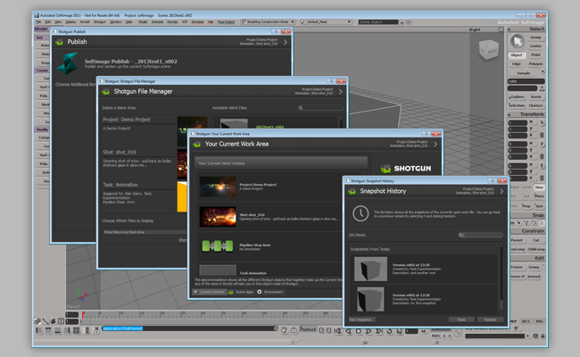

# Softimage

> **警告：**自 2021 年 2 月 13 日起，Softimage 插件已停止使用。[请在此处了解详细信息](https://community.shotgridsoftware.com/t/end-of-life-for-softimage-support-on-february-13th-2021/10694)。



 Softimage 插件在  Pipeline Toolkit 应用与 Softimage 之间架起了一座桥梁。它包含 PySide/Qt 分发，因此，可以使用 Python 和 PySide 编写在插件内部运行的应用。本文档讨论的是较高级的配置设置。

 Softimage 插件包含一个用于在 Softimage 中集成  应用的标准平台。插件支持常见的应用套件，提供自动文件管理功能、定义明确的工作区/发布工作流、快照功能等。

加载插件后，Softimage 主菜单栏中将出现一个  菜单：


## 支持的应用程序版本

此插件已经过测试，已知可支持以下应用程序版本：2012、2013。 请注意，此插件也许（甚至非常有可能）支持更新的发行版本，但是尚未正式在这些版本中进行测试。

可用的 Toolkit 命令将显示在这里。

请注意， Softimage 插件目前还是 Beta 版，存在一些已知问题 - 请参见下文的完整列表。

## 应用开发人员须知

### 支持的平台

 Softimage 插件目前在 Windows 上支持 Softimage 2012 和 2013，在 Linux 上支持 Softimage 2013。

Softimage 2014 目前在 Linux 上不受支持，并且虽然它可以在 Windows 上运行，但是仍存在一些不稳定问题，因此绝对不建议使用！

### PySide

#### Windows

在 Windows 上，可以配置 Softimage 使用内置 Python 分发版或外置分发版 - 请参见 http://download.autodesk.com/global/docs/softimage2013/en_us/userguide/index.html?url=files/userprefs528.htm,topicNumber=d30e797817 进一步了解详细信息。

插件捆绑了多个 PySide & Qt 版本，以适应 Softimage Python 的版本：Softimage 2012 (Python 2.6 x64)、Softimage 2013 (Python 2.6 x64) 和 Softimage 2014 (Python 2.7 x64)。但是，如果您使用外部 Python 分发版，还要务必提供 PySide 和 Qt 的二进制兼容版本。

这里提供一个获取 Windows PySide 分发版的优秀资源：http://www.lfd.uci.edu/~gohlke/pythonlibs/

#### Linux

在 Linux 上，Softimage 必须使用内置的 Python 版本。对于 Softimage 2013，需要预置的 PySide 和 Qt 分发版，并由 [tk-framework-softimageqt](https://github.com/shotgunsoftware/tk-framework-softimageqt) 提供。此分发版使用 GCC 4.1.2 构建，适用于 Python 2.5.2，Softimage 2013 使用的也是这个版本。

因为 Linux 有众多不同的分发版，所以无法保证这个版本适用于所有人。如果有必要，可自行重建这些版本，以保证正常使用。有关如何构建版本的完整详情，可以下面框架随附的 README 中找到：

https://github.com/shotgunsoftware/tk-framework-softimageqt/tree/master/resources/pyside121_py25_qt485_linux

### 已知问题 (Windows)

#### Softimage 2014 不稳定

尽管插件在 Windows 上可以在 Softimage 2014 中运行，但是有些已知问题尚未经过完全测试。打开“发布”(Publish)对话框会导致 Softimage 崩溃！

#### Softimage 2014 中存在 SSL 错误

随 Softimage 2014 分发的 `_ssl.pyd` 文件包含一个已知错误，可能导致启动速度变慢。我们建议您备份此文件，然后使用 Maya 2014 中的 `_ssl.pyd` 文件覆盖此文件，以解决这些问题。如果您需要更多这方面的帮助或建议，请随时联系 Toolkit 支持团队。

#### 窗口父子关系

创建 Qt 窗口时如果不创建父窗口，并且不使用插件的 `show_modal` 或 `show_dialog` 方法的话，这些 Qt 窗口将无法正确与 Softimage 主应用程序建立父子关系。

### 已知问题 (Linux)

#### 缺少 ssl 和 sqlite3 库

除了需要特别具体的 PySide 版本以外（详情见上文），Softimage 还缺少  Python API 和 Toolkit 需要的 ssl 和 sqlite3 库。

我们已在 `tk-multi-launchapp` 应用中包含了这些库，该应用还会在启动 Softimage 前将它们添加到 LD_LIBRARY_PATH 和 PYTHONPATH。同样，如果您遇到这方面的问题，可以在下面应用随附的 README 中找到如何为您的系统构建这些库的详细说明：

https://github.com/shotgunsoftware/tk-multi-launchapp/blob/master/app_specific/softimage/linux/lib/README

#### libX11 中存在分段错误。

Linux 上的 Softimage 包含一个可选补丁，用来解决某些 Linux 分发版的速度问题。具体详情如下：

http://xsisupport.com/2011/01/19/the-case-of-the-slow-2011-startup-on-fedora-14/

此补丁指示 Softimage 使用位于以下位置的另一版本的 libX11 库：

/usr/Softimage/Softimage_2013/Application/mainwin/mw/lib-amd64_linux_optimized/X11

如果您使用此补丁，在 Qt 调用 libX11 库时可能会遇到分段错误（调用堆栈中出现 SIGSEGV），导致频繁崩溃。这是因为此补丁的 libX11 库版本非常旧，与构建 Qt 所用的版本不兼容。

要解决此问题，需要使用与 Softimage 补丁版本兼容的 libX11 版本构建一个新的 Qt 版本...

#### libssl 中存在分段错误

如果您使用的是最新版本的 openssl，而该版本不是使用正确的 GCC 版本 (4.1.2) 构建，当使用  API 时，您可能会遇到分段错误 (SIGSEGV)。

这不是 Qt/PySide 特有的问题，但这里值得一提，因为它是第二大最常见的问题！

请参见：

https://github.com/shotgunsoftware/tk-multi-launchapp/blob/master/app_specific/softimage/linux/lib/README

了解有关如何为 Softimage 2013 构建兼容 openssl 版本的说明。

#### 窗口父子关系

目前，在 Linux 上，Toolkit 窗口与 Softimage 主应用程序窗口不存在父子关系。作为一种变通的解决方法，它们创建后会被置于最顶层，但这种做法有时意味着会遮挡其他窗口（特别是确认对话框）。

如果 Softimage 看起来失去响应，请试着移动任何打开的 Toolkit 窗口，看看后面是否藏着某个对话框！

#### Softimage/Toolkit 移动窗口后发生冻结现象

您会发现，当移动某个无模式对话框（例如  文件管理器）时，Softimage 和该对话框的内容都会冻结/挂起。这个问题与 Qt 消息队列当前的执行方式有关，但遗憾的是，我们暂时还未找到替代的解决方案！

目前简单的变通方法是，当出现这种情况时，只要在 Softimage 主视口中单击鼠标，就会发现一切重新恢复正常。

## 安装和更新

### 将此插件添加到  Pipeline Toolkit

如果您想将此插件添加到 Project XYZ 中名为 asset 的环境中，请执行以下命令：

```
> tank Project XYZ install_engine asset tk-softimage
```

### 更新至最新版本

如果您已在某个项目中安装了此应用，要获取最新版本，可运行 `update` 命令。您可以导航到该特定项目随附的 tank 命令，并在该项目中运行它：

```
> cd /my_tank_configs/project_xyz
> ./tank updates
```

或者，也可以运行您的工作室的 `tank` 命令并指定项目名称，指示该命令要对哪个项目运行更新检查：

```
> tank Project XYZ updates
```

## 协作和代码演进

如果您可以获取  Pipeline Toolkit，意味着也可以获取我们在 GitHub 中存储和管理的所有应用、插件和框架的源代码。欢迎根据实际需要演进和完善这些内容，以它们为基础做进一步的独立开发，修改它们（以及向我们提交 Pull 请求！），或者只是随手玩一玩，简单了解它们的构建方式和 Toolkit 的工作原理。您可以通过 https://github.com/shotgunsoftware/tk-softimage 访问此代码库。

## 特殊要求

需要安装  Pipeline Toolkit 核心 API 版本 v0.14.56 或更高版本才能使用此功能。