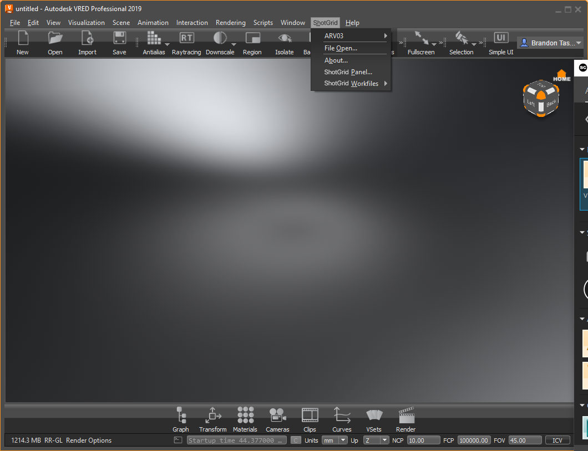

# VRED

 VRED 插件包含一个用于在 VRED 中集成  应用的标准平台。它采用轻量型设计，操作简单直观，并会向 VRED 菜单中添加一个  菜单。

## 支持的应用程序版本

此插件已经过测试，已知可支持以下应用程序版本： 



请注意，此插件也许（甚至非常有可能）支持更新的发行版本，但是尚未正式在这些版本中进行测试。

## 应用开发人员须知

### VRED 项目管理

 VRED 插件在每次启动时，都会将 VRED 项目设置为指向此插件的设置定义的位置。这意味着，当您打开新文件时，项目也可能会发生变化。可以使用模板系统，在配置文件中配置有关如何基于文件设置 VRED 项目的详细信息。

## 使用 tk-vred

此  集成支持 VRED 产品系列（Pro 和 Design）。

当 VRED 打开时， 菜单（VRED 插件）会添加到菜单栏中。

### “File Open”和“File Save”

使用“我的任务”(My Tasks)和“资产”(Assets)选项卡可以查看您的所有已分配任务，并浏览资产。 在右侧，使用这些选项卡可以查看所有文件、与左侧选定内容关联的工作文件或已发布文件。

### 发布(Publish) 
发布(Publish)：打开“发布”(Publish)对话框以将文件发布到 ，然后供下游艺术家使用。有关 VRED 发布的详细信息，请[参见此处](https://github.com/shotgunsoftware/tk-vred/wiki/Publishing)。

### 加载器(Loader) 
加载(Load)：打开内容加载器应用，并附有解释其工作原理的教学幻灯片。要查看有关 VRED 加载的详细信息，请[参见此处](https://github.com/shotgunsoftware/tk-vred/wiki/Loading)。

### Scene Breakdown 
Scene Breakdown：打开“Scene Breakdown”对话框，其中显示“已参考”文件（及其链接）的列表，以及场景中过时或使用备用版本的 PublishedFile 的内容。
