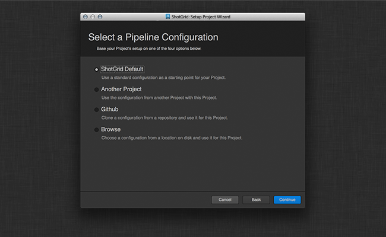

# Toolkit 管理用户界面框架

管理用户界面框架实现了一个环境来容纳打包 Toolkit 管理命令的标准用户界面。

目前只有一个针对 setup_project 命令的界面。

## SetupProjectWizard API 参考



这是一个 QWizard 执行，它将引导用户在 Toolkit 的  实例中按步骤设置项目。要使用此向导程序，只需创建一个类实例，传入要设置的项目（采用标准  API 实体词典形式）和要设置父子关系的窗口。

```python
adminui = sgtk.platform.import_framework("tk-framework-adminui", "setup_project")
setup = adminui.SetupProjectWizard(project, parent)
dialog_result = setup.exec_()
```

此操作将运行向导程序，并返回一个标准的 QDialog 接受 (Accepted) 或拒绝 (Rejected) 值。

### SetupProjectWizard 构造函数

初始化 SetupProjectWizard。  这是 QtGui.QWizard 的一个子类。

```python
SetupProjectWizard()
```
