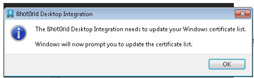
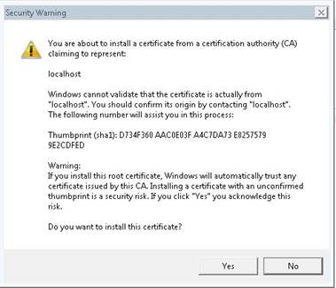

# Toolkit 桌面服务器框架

桌面服务器框架提供相关功能来支持  本地文件链接和 Toolkit 集成功能。它提供一个本地 Websocket 服务器，该服务器会以安全的方式侦听  网站发出的需要访问桌面的动作请求。

对于本地文件链接，这些请求让  能够从 Web 界面访问本地文件路径，并且在收到请求时，能够直接从  页面打开这些文件。
对于 Toolkit，它们让  能够判断给定的实体注册了哪些工作流动作，并执行这些动作。

## 如何让桌面集成正常运行

要让这些  功能正常工作，某些支持的桌面集成必须运行。
[此页面](https://support.shotgunsoftware.com/hc/zh-cn/articles/219030858)介绍了  如何与您的桌面进行集成的各种选项。“Websocket 服务器”部分介绍了此框架提供的功能。

###  Desktop

此框架随  Desktop 捆绑提供，可在[这里](https://support.shotgunsoftware.com/hc/zh-cn/articles/219040668#Downloading%20Shotgun%20Desktop)下载。 Desktop 运行时，会自动启动 Websocket 服务器。如果  Desktop 已运行，您的设置过程即告完成。

### 配置服务器

您可以将浏览器集成设置存储在配置文件中。可以通过设置环境变量 `SGTK_BROWSER_INTEGRATION_CONFIG_LOCATION` 指定此配置文件。有关如何配置本地服务器的更多详细信息，可参考我们的[示例文件](https://github.com/shotgunsoftware/tk-framework-desktopserver/blob/master/app/config.ini.example)。

### 删除证书

如果您想删除之前创建的证书，可以运行 `python certificates.py --remove` 命令。

## 通过封装器启动

默认情况下，服务器使用操作系统的默认方式来启动命令（相当于 Linux 上的“xdg-open”、OS X 上的“打开”和 Windows 上的“运行”）。 如果您想使用自己的封装器来启动文件，可以设置 **SHOTGUN_PLUGIN_LAUNCHER** 环境变量，使它指向你的自定义封装器。 如果设置了该环境变量，系统将会调用封装器，同时路径是它唯一的参数。

## 证书

当您第一次运行服务器时，它会生成建立安全连接所需的证书。 这些证书存储在您计算机的本地，绝不会对外公开。
使用证书，可以建立 Websocket 所需的加密连接，而且即使所有通信都在本地（从您的浏览器到服务器），加密连接也是必要的； 的 Websocket 通信永远不会面向 Internet 公开。

证书向系统注册时，您会看到如下所示的对话框。
单击“确定”(OK)继续注册。






使用  Desktop 时，生成的证书存储在以下位置：

**OS X**：~/Library/Caches/Shotgun/desktop/config/certificates<br/>
**Windows**：%AppData%\Shotgun\desktop\config\certificates<br/>
**Linux**：~/.shotgun/desktop/config/certificates<br/>

## 安全设置 - 本地  安装

默认情况下，Websocket 服务器设置为在端口 9000 上侦听托管的  站点。
如果您运行的是本地  服务器，需要更新  服务器的配置，以便可以从您的 Websocket 服务器进行连接。

运行  Desktop 时，您需要设置一个 ```config.ini``` 文件，该文件与  二进制文件位于同一个位置。有关此文件需要位于何处的详细说明，请参见[此处](https://support.shotgunsoftware.com/hc/zh-cn/articles/219040668#Advanced%20Installation%20Topics)。

此文件内有一个部分用来控制 Websocket 服务器的功能。
典型的配置如下所示：

```ini
[BrowserIntegration]
low_level_debug=0
port=9000
enabled=1
whitelist=*.shotgunstudio.com
```

## 疑难解答

在 Linux 平台上，该服务器增加了对 libffi 的依赖。  如果 Desktop 在启动时崩溃，并且日志中包含未找到 libffi 的消息，您需要安装此软件包。

如果您在设置期间遇到任何问题，请访问我们的[支持站点](https://knowledge.autodesk.com/zh-hans/contact-support)。如果运行服务器时遇到问题，请在 **config.ini** 文件中将 **debug** 设置为 **1**，并包含 Desktop 的日志文件。

日志文件可在以下位置找到：

**OS X**：~/Library/Logs/Shotgun/tk-desktop.log<br/>
**Windows**：~\%APPDATA%\Shotgun\tk-desktop.log<br/>
**Linux**：~/.shotgun/tk-desktop.log<br/>
