<!-- omit in toc -->
# 集成用户手册

在本手册中：
- [简介](#introduction)
- [Desktop 快速入门](#getting-started-with-desktop)
   - [Desktop 安装](#installation-of-desktop)
   - [自主托管时登录或在代理服务器后台登录](#logging-in-when-self-hosted-or-behind-a-proxy-server)
      - [身份认证和浏览器集成](#authentication-and-browser-integration)
   - [系统托盘](#the-system-tray)
   - [项目浏览器](#the-project-browser)
   - [命令启动器](#the-command-launcher)
   - [控制台](#the-console)
- [启动应用程序](#launching-applications)
- [面板](#the-panel)
   - [概述](#overview)
   - [UI 详细信息](#ui-details)
      - [活动流](#the-activity-stream)
      - [创建和回复注释](#creating-and-replying-to-notes)
      - [注释、版本、发布和任务](#notes-versions-publishes-and-tasks)
      - [“信息”(Info)选项卡](#the-info-tab)
      - [搜索](#searching)
      - [动作](#actions)
      - [当前工作区和主页区域](#the-current-work-area-and-the-me-area)
      - [当前工作区](#current-work-area)
- [发布器](#the-publisher)
   - [概述](#overview-1)
   - [界面组件和概念](#interface-components-and-concepts)
   - [基本工作流](#basic-workflow)
      - [在内容创建软件中发布](#publishing-within-content-creation-software)
      - [发布项目和任务](#publish-items-and-tasks)
         - [上下文](#context)
         - [验证](#validation)
         - [多文档工作流](#multi-document-workflows)
      - [单机发布](#stand-alone-publishing)
      - [发布类型](#publish-types)
         - [单机](#standalone)
         - [3ds Max](#3ds-max)
         - [Houdini](#houdini)
         - [Maya](#maya)
         - [Nuke](#nuke)
         - [Nuke Studio](#nuke-studio)
         - [Photoshop CC](#photoshop-cc)
- [加载器](#the-loader)
   - [概述](#overview-2)
   - [树视图](#the-tree-view)
   - [导航](#navigation)
   - [查看发布](#looking-at-publishes)
   - [将一个或多个发布添加到场景中](#bringing-one-or-multiple-publishes-into-your-scene)
   - [使用早期发布](#working-with-older-publishes)
   - [相关审核](#associated-review)
- [高级功能](#advanced-functionality)
- [致谢](#acknowledgments)

## 简介

 集成可将  引入到您的内容创建工具中。使用  集成时，您将能够轻松启动软件，使用面板来跟踪  中与您的任务相关的注释和数据，并使用发布器和加载器来跟踪文件并将其带入到场景中。艺术家将有权从应用内直接访问与其任务相关的所有  数据，以及其项目上的所有任务。他们可以回复注释、播放版本、发布文件，以及加载同事发布的文件。

要获得  集成的最新更新，请订阅[发行说明](https://community.shotgridsoftware.com/tags/c/pipeline/6/release-notes)。

## Desktop 快速入门

** Desktop** 应用是集成的核心。该软件应用程序将  体验延伸到本地计算机，让您可以轻松访问  数据、启动应用程序，并直接从您的计算机上运行工作流集成工具。

**运行 Toolkit 经典还是自定义安装？**


 集成可自动安装。 如果您是希望安装**经典** Toolkit 配置的高级客户，或者您拥有**自定义** Toolkit 安装程序并希望通过 **Desktop 安装向导**进行安装，请参见[管理员手册](https://developer.shotgridsoftware.com/zh_CN/8085533c/)以了解如何执行相关操作。

### Desktop 安装

您可以在“应用”(Apps)菜单中下载  Desktop。

按照提示进行操作，然后选择下载适用于 Mac、Windows 还是 Linux 的 Desktop。

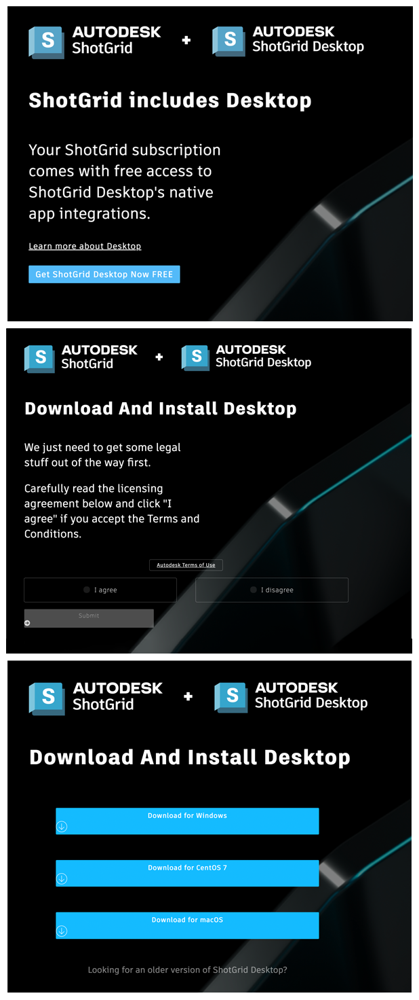

### 自主托管时登录或在代理服务器后台登录

*注意：如果您是自主托管的或使用代理服务器，则需要使用以下有关登录的内容。这不是默认行为。*

如果您是自主托管的或使用代理服务器，则首次打开 Desktop 时，浏览器将提示您提供证书。这样做的目的是连接  与 Desktop 应用。如果您无法正确设置证书，请查看我们针对 [Firefox](https://developer.shotgunsoftware.com/zh_CN/d4936105/) 与 [Chrome 和其他浏览器](https://developer.shotgunsoftware.com/zh_CN/95518180/)提供的疑难解答文档。

您只需更新一次安全证书列表。请注意，只有 Mac 和 Windows 显示证书提示，Linux 不显示。

设置完毕以后，您需要登录到您的  站点。

如果使用代理，则需要进行一些额外的配置。有关如何执行该操作的说明，请参见[管理员手册](https://developer.shotgridsoftware.com/zh_CN/8085533c/#toolkit-configuration-file)。

#### 身份认证和浏览器集成

Desktop 提供的服务支持  Web 应用程序与您的计算机交互。这样可启用[本地文件链接](https://help.autodesk.com/view/SGSUB/CHS/?guid=SG_Administrator_ar_data_management_ar_linking_local_files_html)和软件启动等功能。出于安全原因，您必须以浏览器中同一  站点上的同一用户身份登录 Desktop。如果您使用其他用户登录或登录到其他站点，Desktop 将提示您切换帐户。如果切换，它将重新启动并提示您输入相应的凭据。

### 系统托盘

应用程序启动时，将在系统托盘中显示为一个图标。要显示窗口，请单击该图标。默认情况下，窗口将固定到系统托盘中，这意味着当窗口失去焦点时将自动隐藏。

您可以从用户菜单中选择“Undock from Menu”或通过拖动其标题来取消固定窗口。窗口取消固定后，它看起来像一个常规窗口，当失去焦点时将不再隐藏。

当窗口取消停靠时，可以通过单击关闭按钮将其隐藏。要再次显示，请单击系统托盘图标。

### 项目浏览器

应用的第一个主视图是项目浏览器。在此，您将看到  实例中的所有项目。最近访问的项目将首先列出。

在窗口右下角附近，您将看到  帐户的缩略图。这是用户菜单，从中可以执行许多操作，如停靠和取消停靠窗口、使其始终位于其他窗口之上、显示记录控制台。

在窗口的顶部，可以单击放大镜图标以显示搜索框。在此框中键入内容，会将所示项目列表筛选至仅显示那些包含您键入的字母的项目。

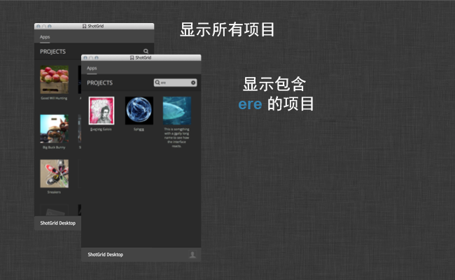

单击一个项目会转到该项目的命令启动器视图，从中可以启动可供该项目使用的工具。

### 命令启动器

选择某个项目之后会转到该项目的命令启动器。此窗口会将可供该项目使用的所有工具和应用程序显示为按钮网格。只需单击按钮，即可启动对应的应用程序。应用程序将在项目特定环境中运行，如果  有相应集成，您将看到列出所有可用工具的  菜单。

### 控制台

您可以通过用户菜单启动控制台。自启动项目以来的所有记录将在此处显示。如果您遇到错误，错误的详细信息也应在此处显示。

如果右键单击控制台，将显示标准编辑菜单，您可以在控制台中选择所有文本、复制选择或清除文本。

## 启动应用程序

启动  Desktop 并选择一个项目后，该程序将扫描您的操作系统的标准应用程序目录。Desktop 将显示[我们拥有其相应集成的任何应用程序](https://www.shotgridsoftware.com/integrations/)的启动器。如果您有同一软件的多个版本，启动器将给出一个包含所有可用版本的下拉列表。单击启动器图标将启动最新版本。

您可以在  Desktop 中直接启动 Maya 和 Nuke 等应用程序，也可以通过  直接启动它们。无论是哪种方式，都可从应用程序内访问  集成。

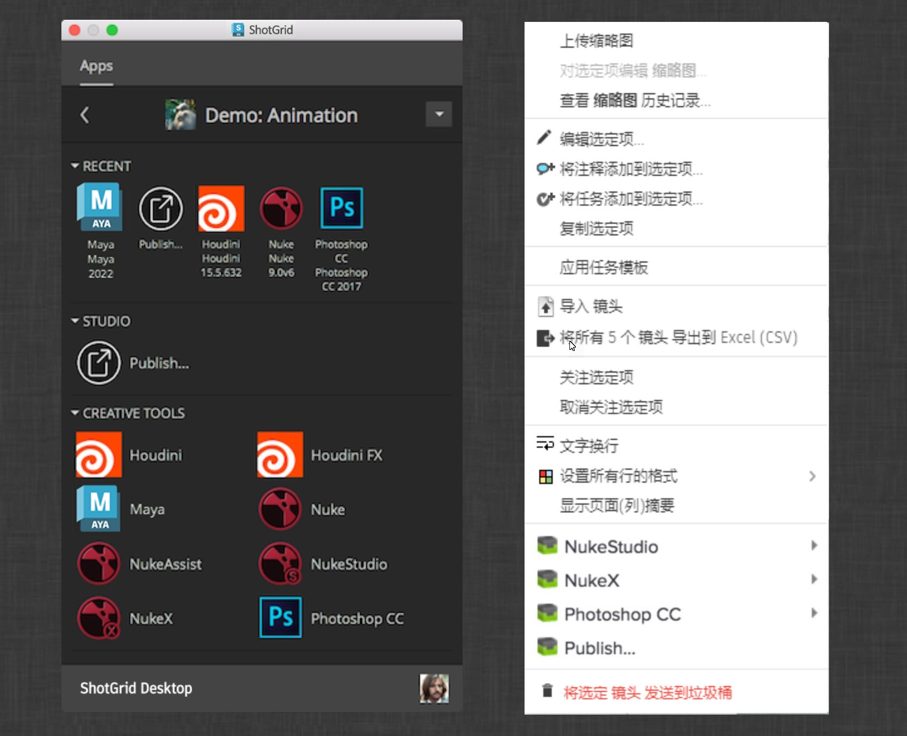

除了现有配置，工作室通常还需要其他配置。工作室可能具有位于非标准文件系统位置的软件或本地不支持的软件的内部插件。在  Web 应用中可以轻松配置这些情况。有关详细信息，请参见[管理员手册](https://developer.shotgridsoftware.com/zh_CN/8085533c/)。

如果您没有看到所需应用，请查看[管理员手册中有关在  Desktop 中配置软件的章节](https://developer.shotgridsoftware.com/zh_CN/8085533c/)。

## 面板

### 概述

从 Desktop 或  启动应用程序后，将显示  面板。 面板是小型轻量版 ，可直接在艺术家的应用程序（如 Maya 和 Nuke）中运行。通过该面板可以快速访问  信息，而无需离开您正在使用的应用程序。您可以轻松访问当前任务相关信息，还可以通过  即时访问活动流、注释、任务、版本和发布。您可以播放发送给团队其他成员审核的版本，回复注释，创建新任务，以及搜索  站点。

### UI 详细信息

 面板包含几个主 UI 元素。在顶部可以看到一个 _工具栏_，其中包含用于导航和搜索的按钮。工具栏正下方是 _详细信息区域_ ，列出您当前正在查看的项目的相关信息。此详细信息区域可供配置，因此，如果您要显示自定义字段或对您的工作流特别重要的数据，只需简单操作就可以在此处显示这些信息。最后，您会发现一些 _内容选项卡_ 。这些选项卡均显示  数据列表，通过它们可以在  面板内轻松导航，快速浏览发布等内容，检查版本，或查看何人分配到链接至当前焦点的任务。

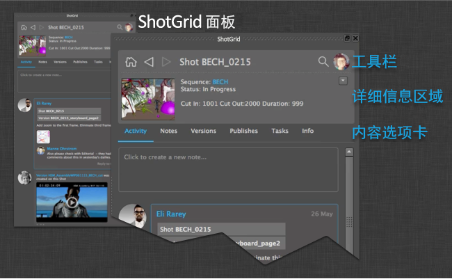

如果应用程序中的集成支持停靠，则  面板将无缝地停靠在 UI 中。在其他应用程序中，面板将显示为常规窗口。

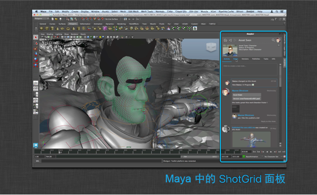

下面简要概述了  面板中可供使用的不同选项卡和功能。

#### 活动流

活动流的工作方式与  中的活动流一样 - 显示您所查看的对象中以及围绕这些对象进行的所有操作：

* 创建注释的用户
* 提交以供审核的版本
* 工作流创建的发布。

您可以直接通过活动流添加新注释，还可以回复现有注释。附件会自动显示，单击附件将显示较大的预览。

请注意，上传文件后，您可能会看到一个占位符图标。在最终缩略图可用后，手动刷新面板可显示出来。

#### 创建和回复注释

借助  面板可轻松创建或回复注释。只需导航至活动流或注释详细信息页面，然后单击 _“创建注释”(create note)_ 或 _“回复注释"(reply to note)_ 。此时将显示一个对话框，您可以在其中键入注释文本。如果您希望将注释发送给特定人员，可以使用 `@name` 表示法 - 这会自动将此人添加到注释的“收件人”(TO)字段。

#### 注释、版本、发布和任务

“注释”(Notes)、“版本”(Versions)、“发布”(Publishes)和“任务”(Tasks)选项卡的工作方式均相同 - 显示与您正在查看的当前项目有关联的数据。您可以双击某个项目以聚焦该项目。一旦导航至某个 _发布_ ，即可查看该发布的依存关系。如果您的工作流要跟踪从属关系信息，则该功能非常有用，此外，您还可以即时了解资产的互连方式。

#### “信息”(Info)选项卡

如果在其他选项卡上找不到要查找的内容，请尝试导航到“信息”(Info)选项卡。此选项卡包含适用于您聚焦的实体的大多数  字段，您可以单击蓝色超链接以导航到其他  位置。

#### 搜索

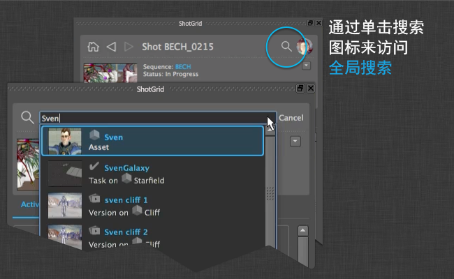

如果要快速导航到  中的其他位置或对象，可以使用内置的搜索功能。这类似于  Web 应用程序中的全局搜索功能。只需键入您要查找的内容的名称或说明。键入三个或更多字符后，将看到结果显示。

#### 动作

借助  面板，您还可以使用  数据在场景中运行操作。与加载器类似，面板的动作系统能够轻松注册代码段并通过浏览器某一项上的菜单触发该代码段。您可以从详细信息区域和列表处访问各动作。详细信息区域中的动作按钮也包含一些方便的内置功能，可快速跳转到  和刷新当前视图。

#### 当前工作区和主页区域

左上角的图标可导航到您的当前工作区。该工作区通常显示您当前正在处理的任务，通过它您可以快速访问注释，审核版本，并查看与当前处理的工作相关的其他信息。这也是  面板启动时聚焦的位置。

在右上角，您将看到一个显示当前用户缩略图的按钮。此按钮将转到一个页面，其中显示当前用户的相关信息。这包括

* 您已提交的所有发布和版本
* 分配给您的任务
* 您参与的或其中的注释与您相关（例如，与分配给您的任务相关的注释）的所有注释对话。

#### 当前工作区

当您开始处理任务时，您可以使用面板来设置当前工作区。然后，当您发布您的作品时，它将与您在  中的当前任务相关联。

## 发布器

### 概述

通过发布应用，美工人员可以发布他们的作品，以便其可供下游的美工人员使用。它支持在艺术家的内容创建软件中以传统方式发布工作流，以及在磁盘上单独发布任何文件。在内容创建软件中操作并使用基本  集成时，该应用将自动发现并显示项目以供艺术家发布。对于较复杂的生产需求，工作室可以编写自定义发布插件来推动美工人员工作流。

以下各部分介绍了发布器 UI 和基本集成工作流。有关根据工作室特定需求自定义发布器的信息，请参见[发布器开发手册](http://developer.shotgridsoftware.com/tk-multi-publish2/)。

### 界面组件和概念

可从本地文件系统上的任意位置拖放文件。使用浏览按钮可打开文件浏览器，选择一个或多个要发布的文件。

左侧的项目树状图显示了将发布的文件。顶层项目可以包含相关的子项目，例如从工作文件中生成的渲染或缓存。每个项目下有一个或多个发布任务，这是发布时要执行的动作。

项目本身都分组到上下文标题下，表明发布文件将要关联的  上下文。

如果有多个顶层项目，则将显示摘要项目，概述将发布的项目和将执行的动作。

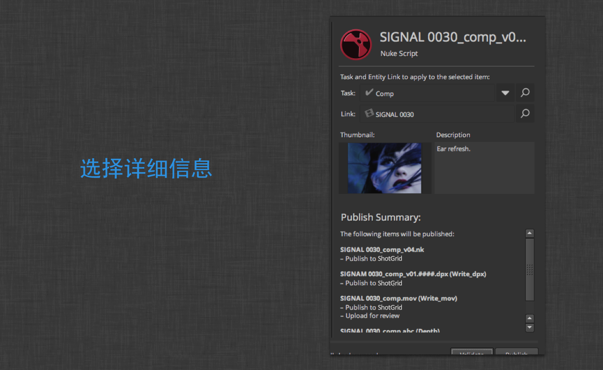

选择一个项目后，界面的右侧将显示该项目的详细信息。这包括目标上下文以及发布的缩略图和说明。还包括该项目和所有子项目的摘要。

界面底部的左侧有一系列工具按钮。这些按钮包括：

* **浏览(Browse)**：浏览要发布的文件
* **刷新(Refresh)**：刷新发布项目列表
* **删除(Delete)**：从列表中删除所选项目
* **展开(Expand)**：展开列表中的所有项目
* **收拢(Collapse)**：收拢列表中的所有项目
* **文档(Documentation)**：打开工作流文档

中间是状态标签。在发布器进行验证并执行发布任务时，状态标签将更新。单击后，您会看到“Progress Details”叠加。

最右侧是**“验证”(Validate)**和**“发布”(Publish)**按钮。“验证”(Validate)按钮将对所有项目和任务执行初始验证过程，以确保其处于可发布状态。“发布”(Publish)按钮将发布列表中的项目。

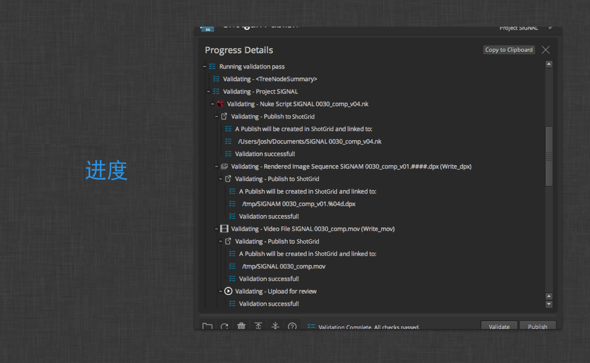

“Progress Details”叠加将显示列表中项目的集合、验证和发布的输出。

使用“Copy to Clipboard”按钮，用户可以轻松共享发布日志。出现验证或发布错误时，该日志消息可能包括一个动作按钮，引导用户获取其他信息，在某些情况下甚至可以进行即时修复。

### 基本工作流

发布应用的目的是，让美工人员将自己的作品提供给其他美工人员使用。在  中，发布文件意味着在  中创建包含待发布文件相关信息（包括路径、版本号、艺术家信息、 相关上下文等）的记录。在  中跟踪文件后，其他用户可以通过[加载器](#the-loader)应用来使用它。

基本  集成提供了两种方式在工作流中使用发布应用：单机发布和在内容创建软件中发布。以下各部分概括介绍了这两种不同情况下的工作流。

#### 在内容创建软件中发布

基本  集成包括对 3dsMax、Houdini、Maya、Nuke、Nuke Studio 和 Photoshop 等内容创建软件的发布工作流支持。当发布器与内容创建软件一同启动时，发布器将自动尝试查找要发布的项目。尽管根据不同的软件和美工人员工作文件内容，显示的待发布项目将稍有不同，但均适用相同的基本发布概念。此处是一个在 Nuke 中进行发布的示例：

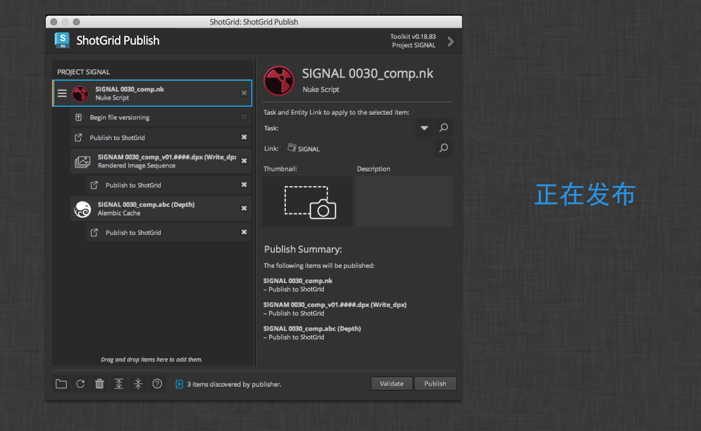

#### 发布项目和任务

在此，您可以在左侧看到已收集的发布项目。有三个发布项目：选定的项目是工作文件本身，其下方则是两个子项目。此外，还有一个图像文件序列和一个 Alembic 缓存。这些项目都附有一个**“Publish to ”**任务，执行该任务时，将在  中创建发布条目以跟踪各个文件或图像序列。

显示 Nuke 脚本的父项目都附有一个 **Begin file versioning** 插件。工作文件的路径中没有版本号时，将显示此插件。如果选中此任务，将在文件名中插入版本号，然后再进行发布。在本例中，文件将从 `bunny_010_0010.nk` 重命名为 `bunny_010_0010.v001.nk`。这促使人们保留美工人员工作文件的历史记录。此任务并非默认选中，并且也不一定要运行。如果项目已发布且任务处于启用状态，则下次发布工作文件时，由于文件名中包含版本号，任务将不显示。

可以根据需要启用或禁用发布任务。项目上的复选框反映和控制其子任务的选中状态。例如，取消选中一个项目将取消选中其所有任务。取消选中多个任务中的一个会使项目处于半选中状态。要切换特定类型的所有任务（例如所有**“Publish to ”**任务）的选中状态，只需在选中复选框时按住 `Shift` 键。

选择发布任务将显示任务内容相关信息。

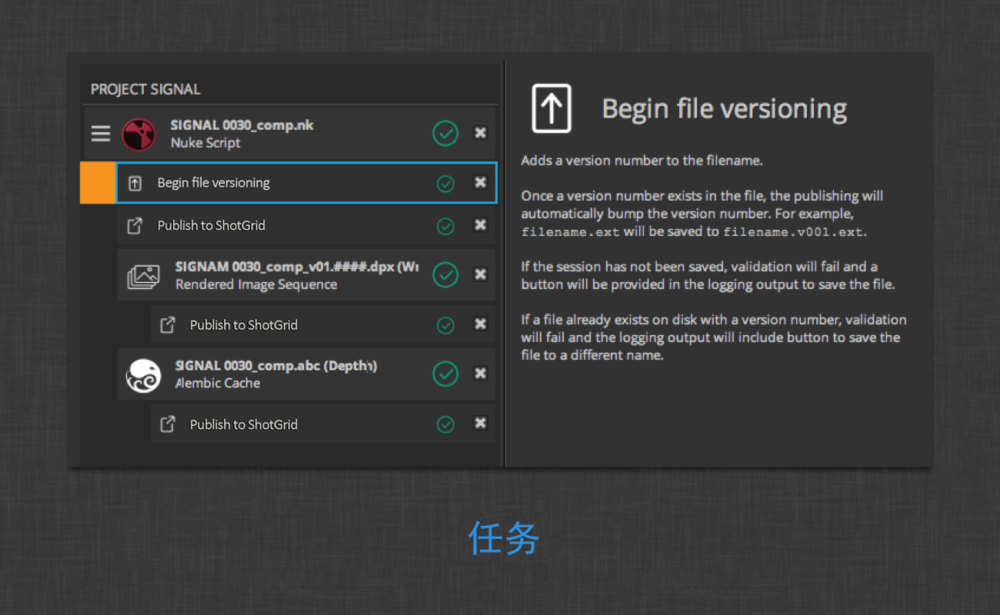

##### 上下文

在 Nuke 脚本项目之上，可以看到已发布项目将在  中关联的上下文的名称。可通过更改界面右侧的“任务”(Task)和/或“链接”(Link)字段来修改这一名称。如果有多个项目要发布，这些项目可能会出现在不同的上下文中。发布项目左侧标有三条水平线的图标是拖动控制柄，可将项目从一个上下文移至另一个。

“任务”(Task)输入字段旁还有一个菜单下拉按钮。该菜单显示您可能感兴趣的多组任务。它将显示分配给当前用户的所有任务、当前上下文相关任务（例如分配给相同镜头的其他任务）和最近浏览的所有任务。

要搜索任务或实体链接，只需单击其中一个字段或单击搜索图标并开始键入您感兴趣的上下文名称。字段将显示匹配的任务或实体链接，然后您可以单击或导航到所需的上下文。

对于每个发布项目，均可通过单击摄影机图标，选择屏幕的一部分作为  中的发布的缩略图。对于有子项目的情况，子项目默认从父项目继承该缩略图。您可以通过选择子项目并单击其缩略图来覆盖子项目的缩略图。

输入的说明将包含在  中的发布数据内。与缩略图一样，说明继承自父项目，但可以通过在子项目的详细信息中输入新说明来覆盖。

##### 验证

准备好发布项目之后，可以单击“验证”(Validate)按钮，确保文件和发布项目的状态允许发布按预期完成。

如果所有项目验证正确，则可在右侧看到绿色复选标记。对于任何未验证的项目，则将显示一个警告图标。

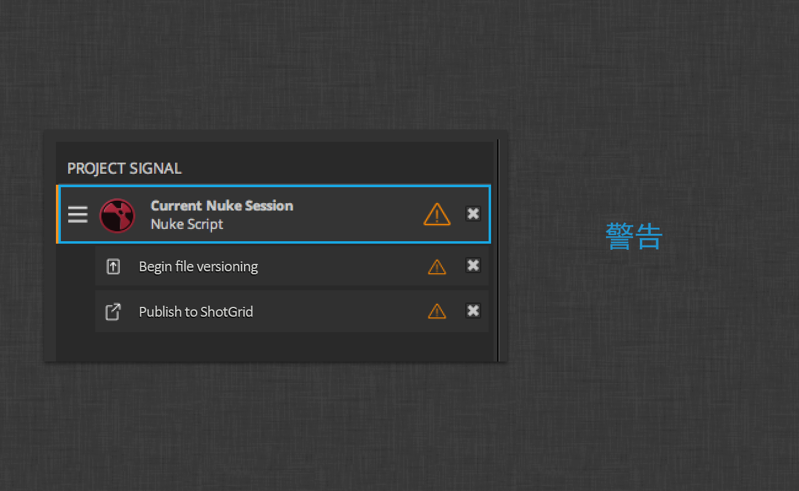

状态也会显示在发布器底部的状态标签区域。

单击项目中的图标或状态标签，将打开“Progress Details”叠加并高亮显示验证问题。

在上面的示例中，Nuke 脚本尚未保存。在某些情况下，将提供动作按钮以快速指导您修复问题或获取更多有关问题的信息。在这里，您可以看到**“另存为...”(Save As…)**动作按钮，该按钮将打开 Nuke 保存对话框。

一旦验证问题得到更正，即可关闭“Progress Details”叠加以返回到发布项目视图。在解决发布任务警告或错误的同时，可根据需要多次运行验证。

在按下**“发布”(Publish)**按钮后，应用将遍历列表中的项目和任务，对每个项目和任务运行另一个验证过程，然后执行发布逻辑以在  中创建条目、上传缩略图、切换工作文件版本等。还将执行最后一个过程以总结每个项目的发布并执行任何必要的清理工作。

通过单击发布器底部的状态标签以显示“Progress Details”叠加，可以查看整个流程的结果。也可以在发布时保持“Progress Details”视图，以查看发布后的输出。您可以看到此处显示的其他动作按钮，以快速跳转到  中新创建的发布条目。

##### 多文档工作流

对于内容创建软件（如 Photoshop 或 Nuke Studio）中的多文档工作流，发布项目列表中将显示多个顶层项目。

只有当前/激活状态的文档将得以展开和选中。要选中待发布的所有文档，只需按住 `Shift` 并单击其中一个未选中项目的复选框。要展开已收拢项目，请使用底部工具栏中的展开按钮。

如果有多个顶层项目，列表顶部也会包含“摘要”(Summary)项目。

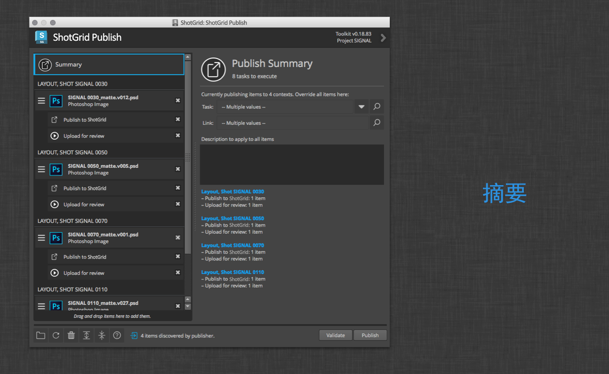

选择此项将显示所有选定项目（供发布）的完整摘要。在上图中总共可以看到四个项目、八个任务，这八个任务要在四个不同的上下文中执行。您可以在该视图中覆盖所有项目的上下文和说明（如果需要）。

在上图中还可以看到**“Upload for review”**任务。此任务不限于 Photoshop 工作流。它可用于任何可以进行转码并作为可审核媒体上传到  的文件类型。

#### 单机发布

发布应用不需要在内容创建软件中运行。

在这里，可以看到发布器可直接从  Desktop 启动。在单机模式下启动时，将出现一个区域，用于浏览或拖放文件。

单击浏览按钮将打开标准文件浏览器，从中可以选择要发布的文件。

从浏览器中选择文件或从文件系统上的某个位置拖放文件后，应用会将其作为顶层项目显示以供发布。

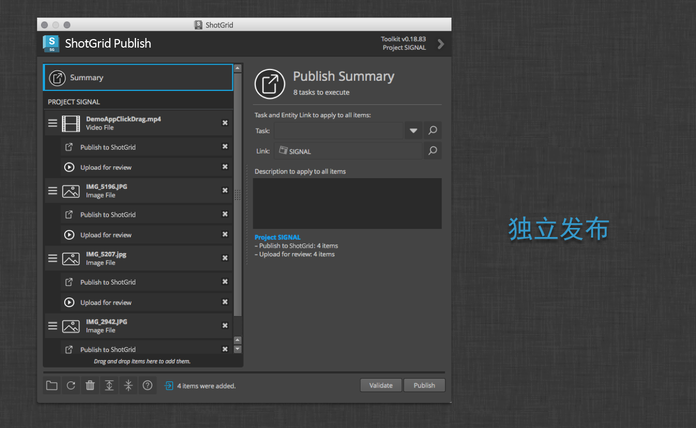

与上述示例一样，您可以选择每个项目的上下文，设置说明，并确定发布时应执行哪些任务。

#### 发布类型

以下各部分介绍了每个基本  集成的自动收集的发布类型。

##### 单机

单机工作流不自动收集文件进行发布。用户必须将文件路径拖动到界面中或浏览到文件才能进行发布。在单击**“发布”(Publish)**按钮之前，发布器将接受在任何点浏览或拖放的文件。基本集成将接受任何使用已知文件类型的文件扩展名，以关联到  发布类型。如果文件扩展名未经识别，将使用文件的 MIME 类型。已识别的图像和视频 MIME 类型可供发布，并附有一个待上传审核的任务。

基本集成假定拖放的文件夹包含图像序列。文件夹中任何已识别的图像序列将显示为待发布项目。如果没有找到序列，将不创建用于发布的项目。

##### 3ds Max

将收集当前 Max 会话以供发布，其发布类型为 **3dsmax 场景**，该类型可以通过加载器合并或参照到其他 Max 会话中。

如果可以确定用于当前会话的项目文件夹，则位于该项目 **export** 文件夹中的所有文件将显示为可发布。同样，位于该项目 **preview** 文件夹中的所有影片文件也将显示为可发布。

##### Houdini

将收集当前 Houdini 会话以供发布，其发布类型为 **Houdini Scene**，该类型可以通过加载器合并到其他 Houdini 会话中。

另外，还将自动收集从以下类型节点写入磁盘的任何文件并显示为发布项目：

* **alembic**
* **comp**
* **ifd**
* **opengl**
* **wren**

##### Maya

将收集当前 Maya 会话以供发布，其发布类型为 **Maya 场景**，该类型可以通过加载器导入或参照到其他 Maya 会话中。

如果可以确定用于当前会话的项目根，则位于该项目 **cache/Alembic** 文件夹中的所有 Alembic 文件将显示为可发布。同样，位于该项目 **movies** 文件夹中的所有影片文件也将显示为可发布。

##### Nuke

将收集当前 Nuke 会话以供发布，其发布类型为 **Nuke 脚本**，该类型可以通过加载器导入到其他 Nuke 会话中或作为新会话打开。

另外，还将自动收集从以下类型节点写入磁盘的任何文件并显示为发布项目：

* **Write**
* **WriteGeo**

##### Nuke Studio

将收集打开的 Nuke Studio 项目以供发布，其发布类型为 **NukeStudio 项目**，该类型可以通过加载器在其他 Nuke Studio 会话中作为新项目打开。

##### Photoshop CC

将收集打开的 Photoshop 文档以供发布，其发布类型为 **Photoshop 图像**，该类型可以通过加载器在其他 Photoshop 会话中作为新图层加载或作为新文档打开。

## 加载器

使用  加载器可以快速简要了解和浏览已发布到  的文件。通过一个可搜索的树视图导航系统可以轻松快速地到达您要查找的任务、镜头或资产，之后，加载器显示相应项目的所有发布的缩略图式概况。通过可配置的挂钩，您便可以轻松地在您的当前场景中引用或导入发布。

发布是  中的记录，每个发布都代表磁盘上的一个文件或一个文件序列（例如图像序列）。发布可以由任何应用程序创建，但通常是通过发布器来创建。

发布创建以后，工作流中的其他人便可加载它们。此时就需要使用加载器。通过加载器，您可以浏览存储在  中的发布，其方式类似于文件系统浏览器。

### 概述

通过加载器应用，可以快速浏览已发布到  的文件。该应用具有可搜索的树视图导航系统，可以轻松查看任务、镜头或资产的缩略图。

### 树视图

使用左侧的树视图可以快速找到您要查找的镜头、资产或任务。如果您知道要查找的项目名称，可以在搜索区域中键入该名称，此时，只有匹配搜索短语的项目才会显示在树中。

一旦您开始键入，树周围将显示一个蓝色条，表示您查看的不再是完整的树，而是树中基于搜索短语的项目子集。在您开始搜索之时，树中的所有节点将自动展开。为了方便起见，如果右键单击树，您将看到用于展开或收拢树中所有节点的选项。

### 导航

在树视图顶部，您将看到三个导航按钮。

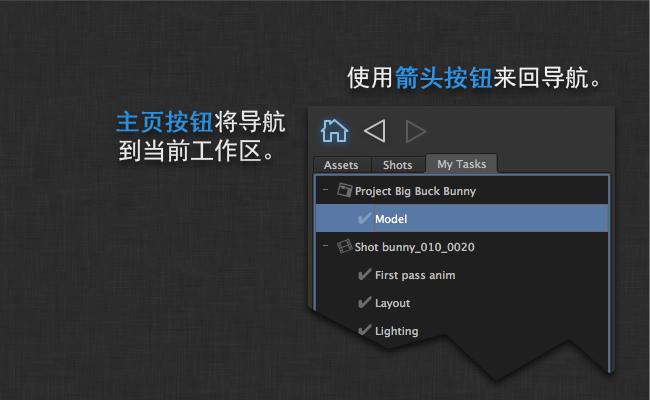

如果单击主页按钮，加载器将自动导航到表示您当前工作区的镜头或资产。如果要快速加载与您当前正在进行的工作相关的内容，该功能将非常有用。启动时，这也是加载器默认显示的位置。当您选择树视图中的不同项目时，将逐渐积累历史记录。与浏览器一样，可以使用后退和前进按钮来导航历史记录。

### 查看发布

一旦您选择树中的一个项目，可供使用的发布将显示在 UI 中间的发布区域。该视图中的每个项目都是发布流中的最新项目，因此，如果您查看版本 15 的纹理，这意味着该项目的版本历史记录中有 14 个先前版本。

除了发布之外，您还将看到代表镜头、场、资产或其他  实体类型的文件夹图标。如果有对象的缩略图，您会看到它叠加在文件夹的顶部，旨在使导航快速直观。双击文件夹将向下导航到位于层次结构中的该文件夹。

有两种查看模式。如果您直观地浏览（例如查找纹理），缩略图模式非常有用。您可以快速查看列表，然后使用缩放控制柄快速放大和缩小。

如果您浏览的内容不像纹理那么直观，例如 Nuke 脚本或 Maya 文件，您可以使用列表视图而非缩略图视图。此模式提供了更多信息，也更紧凑，允许您快速滚动浏览大量项目。

如果您仅希望查看特定类型的项目，可以使用左下方的 _过滤器面板_ 来快速显示或隐藏发布。您还将在列表中的每个类型旁边看到一个摘要，表明为当前选择的树项目找到的每一类型发布数量。

### 将一个或多个发布添加到场景中

如果要将项目添加到场景中，只需双击该项目，之后加载器将执行发布的 _默认动作_ 。可以采用多种方法将项目添加到场景中（例如，在 Maya 中，您可能希望将其他 Maya 文件参照或导入到场景中）。在这种情况下，单击 _“动作”(Actions)_ 下拉菜单或右键单击发布的任意位置即可查看所有可用选项。

如果要将多个项目添加到场景中，请选择多个元素，然后右键单击已选内容中的任意一项以显示 _“动作”(Actions)_ 弹出菜单。请注意，仅显示可应用于已选内容中每一项的动作。

如果您选择镜头或资产文件夹对象而不是发布，将显示用于在  中或在文件系统中显示该项目的选项。

### 使用早期发布

如果您打开右侧详细信息窗格，将看到您选择的发布的所有版本历史记录。这样，您可以加载先前版本的发布。如果希望执行此操作，只需在版本历史记录中选择相应版本并使用动作菜单将其载入，就像在主视图中加载发布一样。

### 相关审核

如果发布具有关联的审核版本，您将在详细信息窗格中看到一个播放按钮。单击该按钮将在网页中打开审片室，您可以快速查看版本或向版本添加注释，以及使用 QuickTime 播放关联的审核版本。

## 高级功能

所有  集成都是基于可高度自定义和扩展的工作流构建平台（名为 Toolkit）而建。有关如何访问和配置该功能的详细信息，请参见我们的[管理员手册](https://developer.shotgridsoftware.com/zh_CN/8085533c/)。

## 致谢

* PySide 的错误修复版本随  Desktop 一起分发，可在[此处](http://www.autodesk.com/content/dam/autodesk/www/Company/files/PySide-1.2.2.sgtk.zip)下载。
* 动画电影“Big Buck Bunny”（大雄兔）由 (CC) Blender Foundation (www.blender.org) 提供

通过添加 TANK_NO_HEADER 这个特殊标记，指示文档生成系统不需要生成标题。
