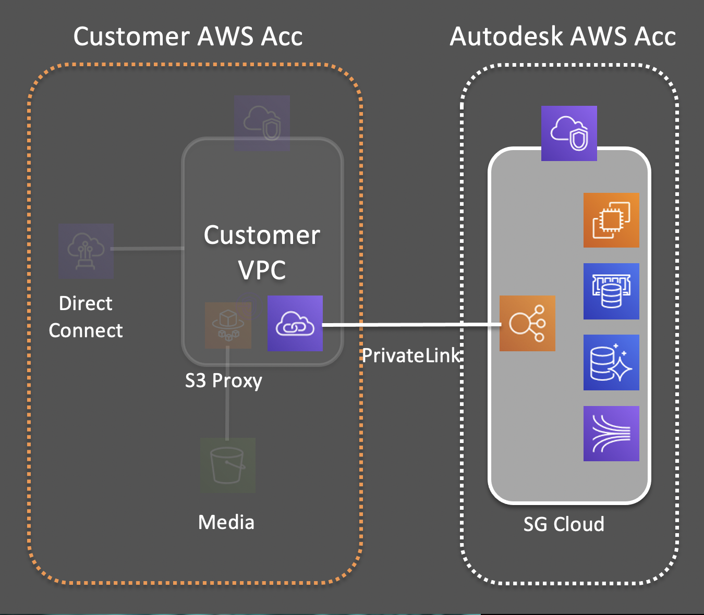
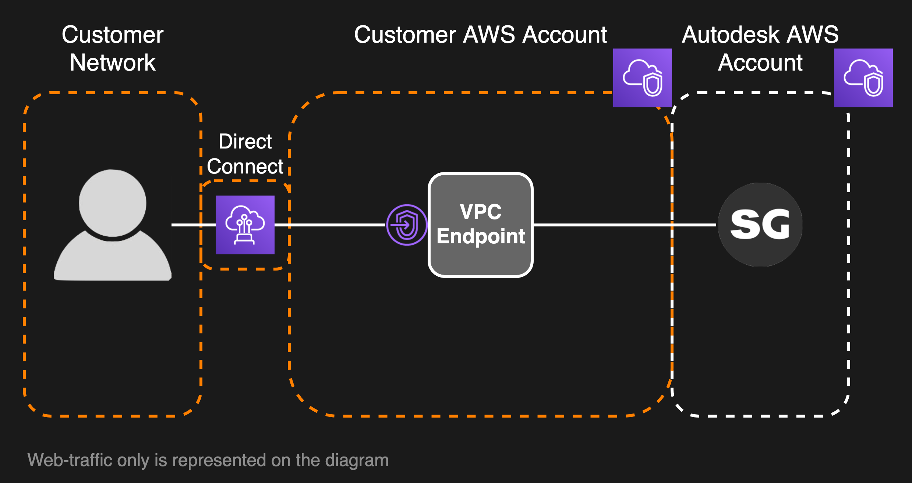

# Web Traffic Isolation

Communication between your client systems and your  site will traverse the open Internet by default. Web Traffic Isolation allows you to restrict access to your  site from the public Internet entirely and ensure that all traffic transits directly between your AWS VPC and Autodesk's AWS VPC.

## Configuration
A unique VPC endpoint is provided by Autodesk. Access to the endpoint must be configured from your VPC, and the relevant DNS configuration must be completed to allow your client systems to reach the new endpoint.

## How it works
By using the provided VPC endpoint, web traffic is isolated from the public Internet completely. All web traffic transits between your AWS VPC and Autodesk's AWS VPC, rather than the public Internet.

## Costs
The only cost associated with Web Traffic Isolation are those related to web traffic transiting to/from your AWS VPC. See [AWS VPC Pricing](https://aws.amazon.com/vpc/pricing) for more details.

## Next Steps
See [Web Traffic Isolation](../setup/traffic_segregation.md) for setup instructions.
