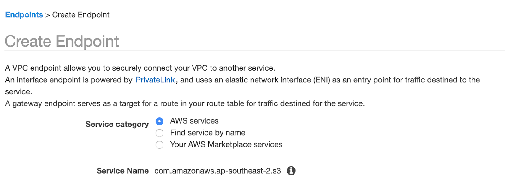



# Media Traffic Isolation using an S3 proxy (DEPRECATED)



The media traffic isolation feature allows your users to access media in your AWS S3 bucket privately (not transiting over the public Internet). Please note that if you have a multi-region setup and that leverages the ShotGrid Transcoding service there may still be instances where media transits across the public Internet. Reach out to our support team for more details.

Media Isolation activation is a pre-requisite to enable this feature. If you haven't done so already, see [Media Isolation](./s3_bucket.md).

## Set up a VPC in your S3 bucket AWS region



You will need to deploy a VPC with the required VPC endpoints. We provide both [private VPC](https://sg-shotgunsoftware.s3-us-west-2.amazonaws.com/tier1/cloudformation_templates/sg-private-vpc.yml) and [public VPC](https://sg-shotgunsoftware.s3-us-west-2.amazonaws.com/tier1/cloudformation_templates/sg-private-vpc.yml) CloudFormation templates as starting points. These template create the necessary VPCs, subnets and VPC endpoints.

* Create a [new CloudFormation stack](https://console.aws.amazon.com/cloudformation/home?#/stacks/create/template)
* Select Template is ready
* Set Amazon S3 URL depending upon your desired configuration
  * Private VPC (default):
    [`https://sg-shotgunsoftware.s3-us-west-2.amazonaws.com/tier1/cloudformation_templates/sg-private-vpc.yml`](https://sg-shotgunsoftware.s3-us-west-2.amazonaws.com/tier1/cloudformation_templates/sg-private-vpc.yml)
  * Public VPC:
    [`https://sg-shotgunsoftware.s3-us-west-2.amazonaws.com/tier1/cloudformation_templates/sg-public-vpc.yml`](https://sg-shotgunsoftware.s3-us-west-2.amazonaws.com/tier1/cloudformation_templates/sg-public-vpc.yml)
* Click Next
* Set a stack name. Eg. `shotgun-vpc`
* Choose network ranges that doesn't conflict with your studio network and set subnet CIDR values accordingly
* Set your S3 bucket name
* Click Next
* Click Next

## Set up access from your site network to your AWS VPC

Options provided by AWS:
* [AWS Site-to-Site VPN](https://docs.aws.amazon.com/vpn/latest/s2svpn/VPC_VPN.html)
* [AWS Direct Connect](https://aws.amazon.com/directconnect/)



## Add an S3 endpoint to your VPC






## Set up S3 proxy

You will need to deploy an S3 proxy in your VPC to forward traffic to the S3 VPC endpoint. We provide both [private](https://sg-shotgunsoftware.s3-us-west-2.amazonaws.com/tier1/cloudformation_templates/sg-s3-proxy.yml) and [public](https://sg-shotgunsoftware.s3-us-west-2.amazonaws.com/tier1/cloudformation_templates/sg-s3-proxy-public.yml) S3 proxy CloudFormation templates as starting points for this purpose. These will create the necessary Elastic Container Service (ECS) cluster and other resources to run the S3 proxy on AWS Fargate behind an AWS Application Load Balancer (ALB).

### Make the Docker image available from a private AWS ECR repository

* Create a [new Elastic Container Registry (ECR) repository](https://console.aws.amazon.com/ecr/create-repository)
* Name the repository `s3-proxy`
* Upload the s3-proxy Docker image to the newly created ECR repository
  * [Install Docker](https://docs.docker.com/get-docker/) on your workstation
  * Follow the `docker login` instructions shown by clicking the *View push commands* button
  * Run the following commands, substituting the ECR endpoint in the example for yours:
    ```
    docker pull quay.io/shotgun/s3-proxy:1.0.6
    docker tag quay.io/shotgun/s3-proxy:1.0.6 627791357434.dkr.ecr.us-west-2.amazonaws.com/s3-proxy:1.0.6
    docker push 627791357434.dkr.ecr.us-west-2.amazonaws.com/s3-proxy:1.0.6
    ```

### Create S3 proxy CloudFormation stack

Create a new stack in AWS Console using either the [private](https://sg-shotgunsoftware.s3-us-west-2.amazonaws.com/tier1/cloudformation_templates/sg-s3-proxy.yml) or [public](https://sg-shotgunsoftware.s3-us-west-2.amazonaws.com/tier1/cloudformation_templates/sg-s3-proxy-public.yml) CloudFormation template.

* Create a [new CloudFormation stack](https://console.aws.amazon.com/cloudformation/home?#/stacks/create/template)
* Select Template is ready
* Set Amazon S3 URL depending upon your desired configuration
  * Private S3 proxy (default):
    [`https://sg-shotgunsoftware.s3-us-west-2.amazonaws.com/tier1/cloudformation_templates/sg-s3-proxy.yml`](https://sg-shotgunsoftware.s3-us-west-2.amazonaws.com/tier1/cloudformation_templates/sg-s3-proxy.yml)
  * Public S3 proxy:
    [`https://sg-shotgunsoftware.s3-us-west-2.amazonaws.com/tier1/cloudformation_templates/sg-s3-proxy-public.yml`](https://sg-shotgunsoftware.s3-us-west-2.amazonaws.com/tier1/cloudformation_templates/sg-s3-proxy-public.yml)
* Click Next
* Set a stack name up to 32 characters in length. Eg. `shotgun-s3-proxy`
* Set the parameters that do not have default values with those used when creating the ECR repository, VPC and S3 bucket previously
* Click Next
* Accept `I acknowledge that AWS CloudFormation might create IAM resources`
* Click Next

### Configure HTTPS

ShotGrid requires that the S3 proxy be accessed via HTTPS, therefore the AWS ALB handling requests for your newly created S3 proxy stack must be configured to accept HTTPS requests.

* Create a DNS entry pointing to your S3 proxy, depending upon whether public or private
  * Private S3 proxy (default):
    * Go to the [EC2 Load Balancers dashboard](https://console.aws.amazon.com/ec2/home?#LoadBalancers), select your S3 proxy's ALB and make a note of the DNS name
    * Add a DNS CNAME record pointing to the DNS name of the ALB
      Eg. `s3-proxy.mystudio.com. 300 IN CNAME s3proxy-12R1MXX0MFFAV-2025360147.us-east-1.elb.amazonaws.com.`
  * Public S3 proxy:
    * Go to the [AWS Global Accelerator dashboard](https://console.aws.amazon.com/ec2/v2/home?#GlobalAcceleratorDashboard:) and make a note of the DNS name associated with your S3 proxy's accelerator
    * Add a DNS CNAME record pointing to the DNS name of the Global Accelerator
      Eg. `s3-proxy.mystudio.com. 300 IN CNAME a48a2a8de7cfd28d3.awsglobalaccelerator.com.`
* Obtain an SSL certificate for your chosen URL, we recommend using [AWS Certificate Manager (ACM)](https://aws.amazon.com/certificate-manager/) for this
* Configure HTTPS for the S3 proxy by adding a new HTTPS listener to the AWS ALB
  * Go to the [EC2 Load Balancers dashboard](https://console.aws.amazon.com/ec2/home?#LoadBalancers), select your S3 proxy's ALB and click on the Listeners tab
  * Click Add listener
  * Select HTTPS from the Protocol dropdown menu
  * Click Add action -> Forward to...
  * Select your S3 proxy's target group from the Target group dropdown menu
  * Select the Security policy you'd like to use. Eg. `TLS-1-2-Ext-2018-06` (See [AWS documentation](https://docs.aws.amazon.com/elasticloadbalancing/latest/application/create-https-listener.html#describe-ssl-policies) for more information)
  * Select the SSL certificate you'd like to use from ACM or import a new certificate
  * Click Save

### Add S3 proxy VPC to S3 bucket policy

In order for the S3 proxy to communicate with your S3 bucket your bucket policy must allow access from the S3 proxy's VPC. You can find instructions on how to configure the policy in the [Fine Tuning](./tuning.md#s3-bucket-policy) step.

## Validation

### Test the S3 proxy

Try to access your S3 proxy using the ping route. Eg. `https://s3-proxy.mystudio.com/ping`

### Configure your test site to use the S3 proxy

* Navigate to the Site Preferences menu within ShotGrid and expand the Isolation section
* Set S3 Proxy Host Address to the S3 proxy url. Eg. `https://s3-proxy.mystudio.com` then click Save changes
* Confirm that you are still able to access existing media
* Attempt to upload new media

## Next Steps

See [Web Traffic Isolation](./traffic_segregation.md) to activate the Web Traffic Isolation feature.

See [Media Replication](./s3_replication.md) to activate the Web Traffic Isolation feature.

Go to [Setup](./setup.md) for an overview of the possible next steps.
