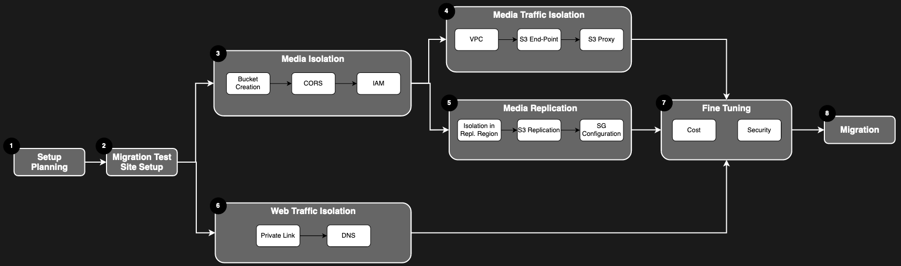

#  Isolation Feature Set - Setup

Isolation the isolation features are independent of each other, and can be activated independently of each other. Media replication have as pre-requisite for Media Isolation to be implemented.

The setup process will depend on which feature you want to activate for your site. 

## In This Section
<!-- When updating this, also update tier1.md -->
* [Planning your Setup](./planning.md)
* [Media Isolation](./s3_bucket.md)
* [Media Traffic Isolation](./media_segregation.md)
* [Media Replication](./s3_replication.md)
* [Isolation Fine Tuning](./tuning.md)
* [Activation](./activation.md)

# Setup Overview

## [Understand your responsibilities](../getting_started/responsibilities.md)

Make sure that you understand the [client responsibilities and the implication](../getting_started/responsibilities.md) of activating any of the Isolation feature.

## [Start the onboarding process](../getting_started/onboarding.md)

Leveraging the isolation features requires adopters to become AWS users. The features activation also requires Autodesk Support intervention. In order to ensure that this joint venture between Autodesk, AWS, and our clients is as streamlined as possible, we decided to work closely with AWS to define a cooperative onboarding process that would meet client expectations for a premium offering. [Kick-start the onboarding process](../getting_started/onboarding.md) before going further.

## [Planning your Setup](./planning.md)

Before you start working on your setup, [put a plan in place](./planning.md). Choose the features you need and get the required security/legal approval from your team to get started with the Isolation feature set.

## [Media Isolation](./s3_bucket.md)

This feature allow you to use a S3 Bucket owned by your studio to store media.

## [Media Traffic Isolation](./media_segregation.md)

This feature allows for private routing of the media through the AWS Backbone and your studio network, isolating the media traffic from the public internet.

## [Media Replication](./s3_replication.md)

This feature allows the media to be replicated between AWS Regions, for faster access in your world wide studios. Media Isolation is required.

## [Fine Tuning](./tuning.md)

Once the isolation features you need are activated, make sure that you everything is properly configured for security and cost-efficiency by reviewing this fine tuning guide.

## [Activation](./activation.md)

Once everything is ready, it's now time to migrate your production site to use the isolation features.
