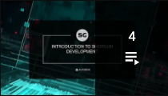

#  Toolkit 网络讲座

*更新日期：2020/5/8*

##  Toolkit 网络讲座播放列表

##  Toolkit 网络讲座视频

1： Toolkit 网络讲座：即时可用的集成*（60 分钟）*

在新的 Toolkit 网络讲座系列的第一个讲座中，Rob Blau 和 Manne Öhrström 将为您解答有关即时可用的集成的问题。

2： Toolkit 网络讲座：揭秘新的默认配置*（60 分钟）*

在此网络讲座中，Josh Tomlinson 和 Rob Blau 将为您介绍 Toolkit 项目的新默认配置中发生了哪些变化（以及变化原因）。

3： Toolkit 网络讲座：自定义发布工作流 - 现场演示*（60 分钟）*

在此网络讲座中，Josh Tomlinson 分步演练了在 Maya 中创建自定义发布工作流的过程。了解发布应用的构造、发布应用的配置方式以及如何编写用于收集和发布数据的自定义挂钩。

*补充材料*

[工作流教程](https://developer.shotgridsoftware.com/zh_CN/cb8926fc/)

4： Toolkit 网络讲座：远程服务配置和多位置工作流*（60 分钟）*

在此网络讲座中，Manne Ohrstrom 探讨了所属艺术家位于多个位置的工作室的工作流。

*补充材料*

[有关 Toolkit 初始化和配置管理的开发人员文档](https://developer.shotgridsoftware.com/tk-core/initializing.html)

[Manne 在视频中提及的描述符类型的列表](https://developer.shotgridsoftware.com/tk-core/descriptor.html#descriptor-types)

5： 生态系统网络讲座：REST API*（60 分钟）*

在此网络讲座中，Brandon Ashworth 将为我们演练一些有用的演示、示例和模板，以展示 REST API 是什么、它重要的原因以及它的使用方式。

*补充材料*

[REST API 参考文档](https://developer.shotgridsoftware.com/rest-api/)

6： Toolkit 网络讲座：新的 Publisher API*（35 分钟）*

最新的集成发布包括经过改进的 Publish API，此 API 允许您将发布逻辑与 GUI 应用分离，并通过您自己的工具、甚至在渲染农场上运行发布。在此网络讲座中，Jean-Francois Boismenu 将演示如何使用此 API 将发布项目树从 Publisher UI 传递到渲染农场作业。

*补充材料*

[包含配置的 Github 库](https://github.com/shotgunsoftware/tk-config-publish_api_webinar)

[31:00 - Pull 请求](https://github.com/shotgunsoftware/tk-config-publish_api_webinar/pull/1)

[Publish API 文档](https://developer.shotgridsoftware.com/tk-multi-publish2/)

7： Toolkit 网络讲座：After Effects 集成*（38 分钟）*

Adobe After Effects 是我们最新的  集成。在此网络讲座中，Rob Blau 将深入剖析 After Effects 集成并现场演示相关功能，而后讨论我们如何通过 Photoshop 集成推动为任何 Adobe 集成开发可重复使用的框架。

此外，Tannaz Sassooni 为我们导览了新的开发人员文档站点，并展示我们如何让用户更轻松地了解与  的集成方式。

*补充材料*

[After Effects 集成文档](https://developer.shotgridsoftware.com/zh_CN/1eca509c/)

[开发人员文档门户](https://developer.shotgridsoftware.com/zh_CN/)

##  开发人员日播放列表

##  开发人员日视频

在 SIGGRAPH 2018 和 2019 上， 团队展示了  开发人员日：这是一系列课程，旨在使开发人员熟悉可用于实现任务自动化、编写自定义应用等的各种资源。在 SIGGRAPH 之后，我们举办了一系列以开发人员日的内容为专题的网络讲座。此播放列表包含这些网络讲座的录像。

完整幻灯片、代码示例以及与此内容相关的其他资源位于[此处 (2019)](https://github.com/shotgunsoftware/sg-siggraph-2019) 和[此处 (2018)](https://github.com/shotgunsoftware/sg-devday-2018/)。

1：2019 SIGGRAPH 开发人员日： 开发简介*（83 分钟）*

在此网络讲座中，Tannaz Sassooni 和 Patrick Boucher 对  开发进行了介绍，其中讨论了  的自动化入口点、 的 Python 和 REST API，以及  的 API 如何自动化工作室的任务和数据跟踪。

[0:56](https://www.youtube.com/watch?v=i0aVJepZw8Y&list=PLEOzU2tEw33r4yfX7_WD7anyKrsDpQY2d&index=1&t=56s) 欢迎和情况介绍

[3:00](https://www.youtube.com/watch?v=i0aVJepZw8Y&list=PLEOzU2tEw33r4yfX7_WD7anyKrsDpQY2d&index=1&t=180s)  开发简介：有关常见工作流需求以及如何使用  API 和开发框架解决这些需求的高级概述。[Tannaz Sassooni]

[25:59](https://www.youtube.com/watch?v=i0aVJepZw8Y&list=PLEOzU2tEw33r4yfX7_WD7anyKrsDpQY2d&index=1&t=1559s) 介绍使用  API 管理数据的过程：深入剖析使用简单 Python 和 REST 脚本的  API，以及用于创建动作菜单项的框架。[Patrick Boucher]

2：2019 SIGGRAPH 开发人员日：高级  开发*（78 分钟）*

在此网络讲座中，Brandon Ashworth 和 Manne Öhrström 深入剖析  如何使用事件进程和新 Webhook 响应  中的数据变更，并介绍如何使用  Toolkit 编写简单的工作流工具。

[0:39](https://www.youtube.com/watch?v=xUeY1pECHdI&list=PLEOzU2tEw33r4yfX7_WD7anyKrsDpQY2d&index=2&t=39s) 欢迎和情况介绍

[2:33](https://www.youtube.com/watch?v=xUeY1pECHdI&list=PLEOzU2tEw33r4yfX7_WD7anyKrsDpQY2d&index=2&t=153s) 处理  事件 [Brandon Ashworth]

[41:25](https://www.youtube.com/watch?v=xUeY1pECHdI&list=PLEOzU2tEw33r4yfX7_WD7anyKrsDpQY2d&index=2&t=2485s) 开发在多个艺术家应用中运行的  工具 [Manne Öhrström]

3：SIGGRAPH 开发人员日：Toolkit 管理*（1 小时 15 分钟）*

在此网络讲座中，Josh Tomlinson、Tannaz Sassooni 和 Phil Scadding 演示了如何掌管集成并创建自定义目录结构和挂钩以在工作室中实现更多数据流的自动化。

[0:00](https://www.youtube.com/watch?v=7qZfy7KXXX0&list=PLEOzU2tEw33r4yfX7_WD7anyKrsDpQY2d&index=2&t=0s) 欢迎和情况介绍

[1:04](https://www.youtube.com/watch?v=7qZfy7KXXX0&list=PLEOzU2tEw33r4yfX7_WD7anyKrsDpQY2d&index=2&t=64s)  Toolkit 管理：了解如何通过我们的  Desktop 应用启动常用内容创建软件，并弄清艺术家如何在不离开其工作会话的情况下使用我们的默认工作流集成与  交互。[Phil Scadding]

[32:41](https://www.youtube.com/watch?v=7qZfy7KXXX0&list=PLEOzU2tEw33r4yfX7_WD7anyKrsDpQY2d&index=2&t=1961s) Toolkit 配置简介：掌握 Toolkit 工作流配置导航过程，了解如何使用它自定义您的工作流。[Tannaz Sassooni]

[56:20](https://www.youtube.com/watch?v=7qZfy7KXXX0&list=PLEOzU2tEw33r4yfX7_WD7anyKrsDpQY2d&index=2&t=3380s) 管理挂钩：学习使用  Toolkit 的大量挂钩将自定义逻辑添加到配置并根据工作室的需求定制 Toolkit 工作流。[Josh Tomlinson]

4：SIGGRAPH 开发人员日：高级  开发*（1 小时 15 分钟）*

Manne Ohrstrom、Jeff Beeland 和 Rob Blau 演示了源控制和基于远程服务的工作流部署的最佳实践，并深入剖析了应用构建以及使用 Toolkit 的标准框架快速设计 UI 和处理数据的过程。

[0:00](https://www.youtube.com/watch?v=bT2WlQaJVmY&list=PLEOzU2tEw33r4yfX7_WD7anyKrsDpQY2d&index=3&t=0s) 欢迎和情况介绍

[2:31](https://www.youtube.com/watch?v=bT2WlQaJVmY&list=PLEOzU2tEw33r4yfX7_WD7anyKrsDpQY2d&index=3&t=151s) Toolkit 平台：开发和部署模式：了解设置和部署 Toolkit 工作流配置的各种方式，包括开发工作流、版本控制最佳实践以及将工作流配置分发给远程用户（通过将工作流配置上传到  站点）。[Manne Ohrstrom]

[30:23](https://www.youtube.com/watch?v=bT2WlQaJVmY&list=PLEOzU2tEw33r4yfX7_WD7anyKrsDpQY2d&index=3&t=1823s) Toolkit 平台：编写您自己的应用：演练编写简单的 Toolkit 应用、利用提供的 API 和框架快速创建功能强大的 UI 的过程。[Jeff Beeland]

[1:02:22](https://www.youtube.com/watch?v=bT2WlQaJVmY&list=PLEOzU2tEw33r4yfX7_WD7anyKrsDpQY2d&index=3&t=3742s) Autodesk Forge 简介：了解 Forge（由 API 驱动的 Autodesk 远程服务系列）以及如何利用它们延伸  体验。[Rob Blau]

